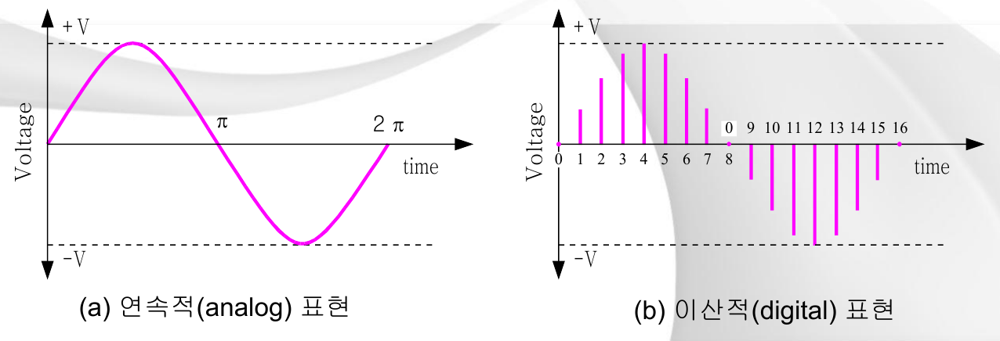
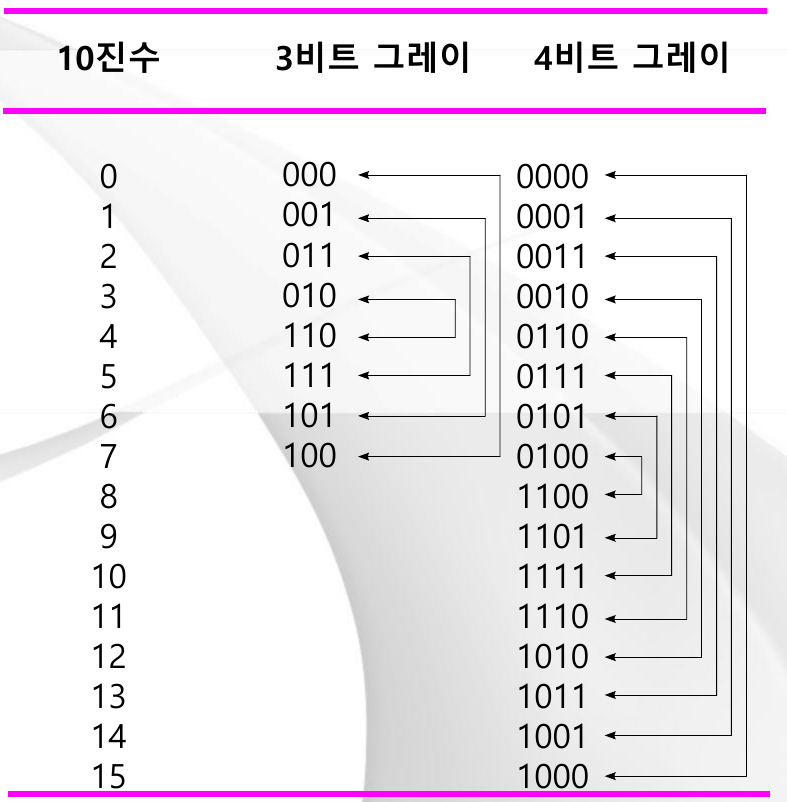
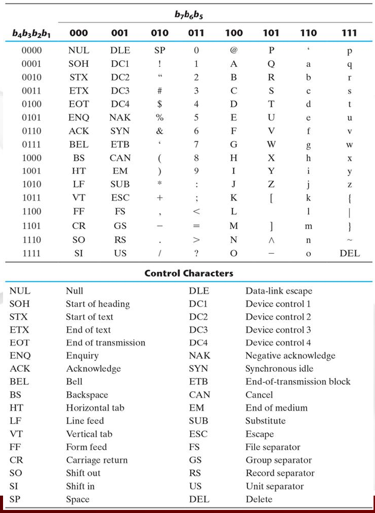
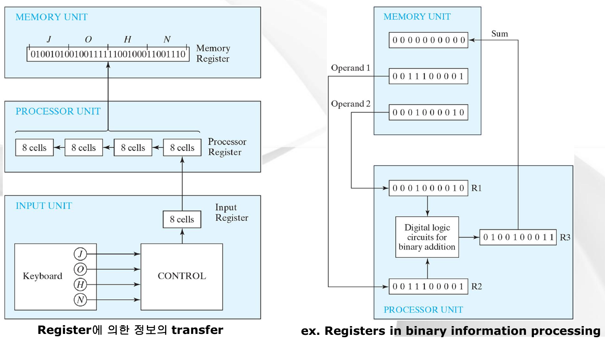
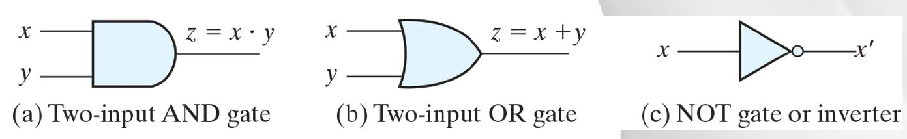
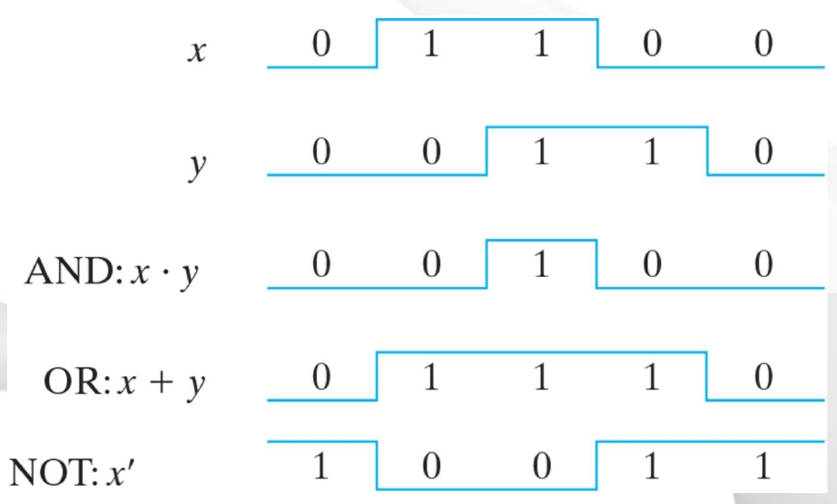

# 강의 02 — 디지털 시스템과 2진수 체계

> **최종 수정일:** 2026-10-08
>
> Digital Design, Mano and Ciletti - Ch 1

> **학습 목표**:
> 1. 아날로그 신호와 디지털 신호를 구분하고, 샘플링, 양자화, 디지털 기술의 장점을 설명할 수 있다
> 2. 위치 표기법으로 임의의 r진수를 표현하고, 2진수의 덧셈, 뺄셈, 곱셈을 수행할 수 있다
> 3. 소수를 포함하여 10진수, 2진수, 8진수, 16진수 사이를 변환할 수 있다
> 4. r의 보수와 (r-1)의 보수를 계산하고, 이를 이용하여 뺄셈을 수행할 수 있다
> 5. 부호 있는 수를 부호 크기, 부호 1의 보수, 부호 2의 보수 형식으로 표현하고 덧셈할 수 있다
> 6. BCD, 그레이 코드, ASCII를 설명하고, +6 보정을 이용한 BCD 덧셈을 수행할 수 있다
> 7. 레지스터를 설명하고, AND, OR, NOT 게이트의 진리표, 기호, 타이밍도를 설명할 수 있다

---

## 목차

- [1. 디지털 시스템](#1-디지털-시스템)
  - [1.1 아날로그 신호와 디지털 신호](#11-아날로그-신호와-디지털-신호)
  - [1.2 아날로그 디지털 변환: 샘플링과 양자화](#12-아날로그-디지털-변환-샘플링과-양자화)
  - [1.3 디지털 기술의 특징](#13-디지털-기술의-특징)
- [2. 2진수](#2-2진수)
  - [2.1 수 체계와 위치 표기법](#21-수-체계와-위치-표기법)
  - [2.2 2의 거듭제곱](#22-2의-거듭제곱)
  - [2.3 2진 연산](#23-2진-연산)
- [3. 진수 변환](#3-진수-변환)
  - [3.1 진수 변환이 필요한 이유](#31-진수-변환이-필요한-이유)
  - [3.2 10진 정수를 2진수로: 반복 나눗셈](#32-10진-정수를-2진수로-반복-나눗셈)
  - [3.3 10진 정수를 8진수로](#33-10진-정수를-8진수로)
  - [3.4 10진 소수를 2진수로: 반복 곱셈](#34-10진-소수를-2진수로-반복-곱셈)
  - [3.5 8진수와 16진수](#35-8진수와-16진수)
- [4. 보수](#4-보수)
  - [4.1 r의 보수와 (r-1)의 보수](#41-r의-보수와-r-1의-보수)
  - [4.2 2진수의 보수](#42-2진수의-보수)
  - [4.3 보수를 이용한 뺄셈](#43-보수를-이용한-뺄셈)
- [5. 부호화 2진수](#5-부호화-2진수)
  - [5.1 부호 있는 수의 세 가지 표현](#51-부호-있는-수의-세-가지-표현)
  - [5.2 산술 덧셈과 뺄셈](#52-산술-덧셈과-뺄셈)
- [6. 2진 코드](#6-2진-코드)
  - [6.1 BCD(2진화 10진수)](#61-bcd2진화-10진수)
  - [6.2 BCD 덧셈](#62-bcd-덧셈)
  - [6.3 그레이 코드](#63-그레이-코드)
  - [6.4 ASCII 문자 코드](#64-ascii-문자-코드)
- [7. 레지스터](#7-레지스터)
- [8. 2진 논리](#8-2진-논리)
  - [8.1 AND, OR, NOT](#81-and-or-not)
  - [8.2 논리 게이트의 입출력 신호](#82-논리-게이트의-입출력-신호)
- [요약](#요약)
- [점검 문제](#점검-문제)

---

<br>

## 1. 디지털 시스템

### 1.1 아날로그 신호와 디지털 신호

- **아날로그(analog) 신호**는 **연속적으로** 표현된 신호이다. 값이 매끄럽게 변하며, 일정 범위 안의 어떤 값이든 가질 수 있다.
- **디지털(digital) 신호**는 **이산적으로** 표현된 신호이다. 떨어진 (시간) 지점에서만 존재하며, 제한된 개수의 값만 갖는다.
- **부호화(encoding)** 는 신호의 표현 방식을 바꾸어 나타내는 것이다. 예를 들어 전압을 2진 코드의 나열로 바꾸는 것이 부호화이다.



*그림 1. 신호의 아날로그 표현과 디지털 표현 (슬라이드 2)*

(a)에서 사인파는 0에서 +V까지 매끄럽게 올라갔다가 π에서 0을 지나 -V까지 내려간 뒤, 2π에서 다시 0으로 돌아온다. 전압은 모든 순간에 정의되어 있다. (b)에서는 같은 파형을 0부터 16까지 번호가 붙은 같은 간격의 17개 시점에서만 세로 막대로 나타낸다. 막대와 막대 사이에서는 아무 값도 기록되지 않는다. 연속적인 곡선을 유한한 개수의 수로 대신하는 것, 이것이 디지털 표현의 본질이다.

### 1.2 아날로그 디지털 변환: 샘플링과 양자화

아날로그 신호를 디지털 신호로 변환하는 과정은 두 단계로 이루어진다.

| 단계 | 의미 |
|:-----|:--------|
| **샘플링(sampling)** | 신호를 **일정한 시간 간격**으로 측정하여, 연속적인 시간 축을 이산적인 시점으로 분해하는 것이다. |
| **양자화(quantization)** | 측정한 각 **값**을 유한한 개수의 이산 준위 중 하나로 표현하여, 2진 코드로 쓸 수 있게 하는 것이다. |

슬라이드는 사인파 $V_c = 10\sin\theta$를 22.5°마다 샘플링하며, 그러면 한 주기에 16개의 시간 간격이 생긴다. 아래 표는 각 시간 간격에서의 이산 전압값이다.

| 각(°) | $V_c$ (V) | 시간 간격 |
|:---------:|:---------:|:-------------:|
| 0.0 | 0.00 | 0 |
| 22.5 | 3.83 | 1 |
| 45.0 | 7.07 | 2 |
| 67.5 | 9.23 | 3 |
| 90.0 | 10.0 | 4 |
| 112.5 | 9.23 | 5 |
| 135.0 | 7.07 | 6 |
| 157.5 | 3.83 | 7 |
| 180.0 | 0.00 | 8 |
| 202.5 | -3.83 | 9 |
| 225.0 | -7.07 | 10 |
| 247.5 | -9.23 | 11 |
| 270.0 | -10.0 | 12 |
| 292.5 | -9.23 | 13 |
| 315.0 | -7.07 | 14 |
| 337.5 | -3.83 | 15 |
| 360.0 | 0.00 | 16 |

> **참고:** 슬라이드는 시간 간격 2의 각을 45.5로 표기하지만 이는 오타이다. 각은 22.5°씩 증가하므로 올바른 값은 45.0°이다. 각 전압은 $10\sin\theta$로 구하며, 예를 들어 $10\sin 22.5° = 10 \times 0.383 = 3.83$이다.

이어서 슬라이드는 처음 몇 개의 샘플로 양자화의 개념을 보여 준다.

- **아날로그 값:** 0.00, 3.83, 7.07, 9.23, ...
- **디지털 값:** 0000, 0001, 0010, 0011, ...

각 샘플은 4비트 2진 코드 워드로 표현된다. 모든 샘플이 코드 워드가 되면 신호 전체가 단지 비트의 나열이 되므로, 디지털 시스템은 이를 손실 없이 저장하고, 복사하고, 처리할 수 있다.

> **참고:** 실제 아날로그 디지털 변환기(ADC)에서 코드 워드는 **양자화된 진폭**을 나타낸다. n비트 ADC는 입력 전압 범위를 2ⁿ개의 준위로 나누고, 샘플이 속하는 준위의 번호를 출력한다. 비트 수가 많을수록 준위가 촘촘해지므로 양자화 오차가 작아진다.

### 1.3 디지털 기술의 특징

슬라이드는 아날로그 기술과 디지털 기술을 특징 요소별로 비교한다. "강"은 해당 요소에서 그 기술이 우수하다는 뜻이다.

| 특징 요소 | 아날로그 | 디지털 |
|:--------|:------:|:-------:|
| 잡음(전기, 온도)에 대한 강인성 | 약 | 강 |
| 속도 | 강 | 약 |
| 저장 | 약 | 강 |
| 집적(칩 하나에 많은 회로를 넣는 것) | 약 | 강 |
| 융통성 | 약 | 강 |
| 정확도 | 약 | 강 |
| 프로그램화 | 약 | 강 |

- **잡음:** 디지털 회로는 전압이 "낮음"인지 "높음"인지만 판단하면 되므로, 작은 전기적 잡음이나 열 잡음이 값을 망가뜨리지 않는다.
- **속도:** 아날로그 회로는 들어오는 신호를 그대로 처리하지만, 디지털 시스템은 먼저 샘플링과 양자화를 한 뒤 계산해야 하므로, 일부 작업에서는 아날로그 처리가 더 빠를 수 있다.
- **저장, 정확도, 프로그램화:** 비트는 열화 없이 무기한 저장할 수 있고, 비트 수를 늘리기만 하면 정확도를 높일 수 있으며, 같은 디지털 하드웨어도 프로그램을 바꾸면 다른 작업을 수행할 수 있다.

---

<br>

## 2. 2진수

### 2.1 수 체계와 위치 표기법

**수 체계(number system)** 는 디지털 시스템에서 처리되는 정보를 수량화하는 방법이다. **r진(밑 r) 체계**에서 수는 0부터 r-1 사이의 숫자 $c_i$들의 나열이며, 각 자리는 r의 거듭제곱인 가중치를 갖는다.

$$
(N)_r = c_{n-1}r^{n-1} + c_{n-2}r^{n-2} + \cdots + c_1 r^1 + c_0 r^0 + c_{-1}r^{-1} + c_{-2}r^{-2} + \cdots + c_{-m}r^{-m} = \sum_{i=-m}^{n-1} c_i r^i
$$

- 숫자 $c_{n-1}, \ldots, c_0$은 정수 부분을, $c_{-1}, \ldots, c_{-m}$은 (소수점 뒤의) 소수 부분을 이룬다.
- $i$는 수 N에서 임의의 자리 위치이다.
- **MSB**(최상위 비트 또는 자리)는 가장 왼쪽에 있으며 가중치가 가장 큰 $c_{n-1}$이다.
- **LSB**(최하위 비트 또는 자리)는 가장 오른쪽에 있으며 가중치가 가장 작은 $c_{-m}$이다.

**예제.**

- 10진수: 7392 = 7 × 10³ + 3 × 10² + 9 × 10¹ + 2 × 10⁰
- 2진수: (11010.11)₂ = 1 × 2⁴ + 1 × 2³ + 0 × 2² + 1 × 2¹ + 0 × 2⁰ + 1 × 2⁻¹ + 1 × 2⁻² = 16 + 8 + 0 + 2 + 0 + 0.5 + 0.25 = (26.75)₁₀

> **핵심:** r진수를 10진수로 바꾸려면 각 숫자에 그 자리의 가중치(r의 거듭제곱)를 곱하여 모두 더하면 된다. 이 하나의 규칙이 2진수, 8진수, 16진수를 비롯한 모든 진수에 적용된다.

### 2.2 2의 거듭제곱

2진수의 가중치는 2의 거듭제곱이므로 다음 표를 외워 두면 유용하다.

| n | 2ⁿ | n | 2ⁿ | n | 2ⁿ |
|:-:|---:|:-:|---:|:-:|---:|
| 0 | 1 | 8 | 256 | 16 | 65,536 |
| 1 | 2 | 9 | 512 | 17 | 131,072 |
| 2 | 4 | 10 | 1,024 (1K) | 18 | 262,144 |
| 3 | 8 | 11 | 2,048 | 19 | 524,288 |
| 4 | 16 | 12 | 4,096 (4K) | 20 | 1,048,576 (1M) |
| 5 | 32 | 13 | 8,192 | 21 | 2,097,152 |
| 6 | 64 | 14 | 16,384 | 22 | 4,194,304 |
| 7 | 128 | 15 | 32,768 | 23 | 8,388,608 |

디지털 시스템에서는 2¹⁰ = 1,024를 **K**(킬로), 2²⁰을 **M**(메가), 2³⁰을 **G**(기가)라고 부른다.

### 2.3 2진 연산

2진 연산은 10진 연산과 규칙이 같으며, 다만 각 자리의 합이 10이 아니라 2가 될 때 자리올림이 생긴다.

**덧셈**(피가수 + 가수 = 합). 기본 규칙은 0 + 0 = 0, 0 + 1 = 1, 1 + 1 = 10(합 0, 자리올림 1), 1 + 1 + 1 = 11(합 1, 자리올림 1)이다.

```plaintext
  피가수(Augend):     101101   (45)
  가수(Addend):     + 100111   (39)
                    --------
  합(Sum):           1010100   (84)
```

오른쪽부터 계산하면 다음과 같다. 1 + 1 = 10(0을 쓰고 1을 올림), 0 + 1 + 1 = 10(0을 쓰고 1을 올림), 1 + 1 + 1 = 11(1을 쓰고 1을 올림), 1 + 0 + 1 = 10(0을 쓰고 1을 올림), 0 + 0 + 1 = 1(1을 씀), 1 + 1 = 10(0을 쓰고 1을 올림)이며, 마지막 자리올림이 맨 앞의 1이 된다.

**뺄셈**(피감수 - 감수 = 차). 어떤 자리에서 0에서 1을 빼야 하면 다음 자리에서 1을 빌려 오며, 빌려 온 1은 현재 자리에서 2의 가치를 갖는다.

```plaintext
  피감수(Minuend):     101101   (45)
  감수(Subtrahend):   -100111   (39)
                      -------
  차(Difference):      000110   (6)
```

**곱셈**(피승수 × 승수 = 곱). 승수의 각 비트는 피승수(비트가 1일 때) 또는 0(비트가 0일 때)을 선택하며, 이를 그 비트의 위치만큼 이동시킨 부분곱들을 더한다.

```plaintext
  피승수(Multiplicand):      1011   (11)
  승수(Multiplier):        x  101   (5)
                           ------
                             1011   (1 x 1011)
                            0000    (0 x 1011, 1자리 이동)
                           1011     (1 x 1011, 2자리 이동)
                           ------
  곱(Product):             110111   (55)
```

> **핵심:** 2진 곱셈에는 구구단이 필요 없다. 각 부분곱은 피승수를 그대로 복사한 것이거나 모두 0이기 때문이다. 이것이 하드웨어 곱셈기를 시프터와 가산기만으로 만들 수 있는 이유이다.

---

<br>

## 3. 진수 변환

### 3.1 진수 변환이 필요한 이유

- **인간**은 10진수를 사용한다.
- **디지털 시스템**은 2진수를 사용한다.
- 따라서 정보를 디지털 방식으로 처리하려면 **두 체계 사이에서 정보를 상호 변환**해야 한다.

**변환 방법:**

- **정수 부분:** 목표 진수로 반복하여 나눈다(반복 나눗셈).
- **소수 부분:** 목표 진수를 반복하여 곱한다(반복 곱셈).
- **알고리즘:** 실제로는 이러한 절차를 구현한 컴퓨터 프로그램이 변환을 수행한다.

아래 표는 2진수의 각 자리 위치에 해당하는 10진수 값으로, 2진수를 10진수로 변환할 때 사용한다.

| 2진 자리 위치 | 10진수 값 | 2진 자리 위치 | 10진수 값 |
|:---------------:|--------------:|:---------------:|--------------:|
| 2⁻⁴ | 0.0625 | 2⁴ | 16 |
| 2⁻³ | 0.125 | 2⁵ | 32 |
| 2⁻² | 0.25 | 2⁶ | 64 |
| 2⁻¹ | 0.5 | 2⁷ | 128 |
| 2⁰ | 1 | 2⁸ | 256 |
| 2¹ | 2 | 2⁹ | 512 |
| 2² | 4 | 2¹⁰ | 1024 |
| 2³ | 8 | | |

### 3.2 10진 정수를 2진수로: 반복 나눗셈

10진 정수를 2진수로 변환하려면 그 수를 2로 반복하여 나눈다. 각 **나머지**가 2진수의 한 자리가 되며, **처음 나온 나머지가 LSB**이다.

**예제: (41)₁₀을 2진수로 변환.**

| 나눗셈 | 정수 몫 | 나머지 | 계수 |
|:---------|:----------------:|:---------:|:-----------:|
| 41 / 2 | 20 | 1 | a₀ = 1 |
| 20 / 2 | 10 | 0 | a₁ = 0 |
| 10 / 2 | 5 | 0 | a₂ = 0 |
| 5 / 2 | 2 | 1 | a₃ = 1 |
| 2 / 2 | 1 | 0 | a₄ = 0 |
| 1 / 2 | 0 | 1 | a₅ = 1 |

몫이 0이 되면 나눗셈을 멈춘다. 나머지를 **아래에서 위로** 읽으면 답이 된다.

(41)₁₀ = (a₅a₄a₃a₂a₁a₀)₂ = (101001)₂

슬라이드는 각 단계를 41/2 = 20 + ½처럼 쓰는데, 여기서 "½"은 나머지가 1이라는 뜻(절반이 남음)이다. 슬라이드는 같은 계산을 (정수 | 나머지)의 두 열로 간단히 나타내고 위쪽을 향하는 화살표를 그려, 나머지를 아래에서 위로 읽어야 함을 강조한다.

**검산:** 1 × 32 + 0 × 16 + 1 × 8 + 0 × 4 + 0 × 2 + 1 × 1 = 32 + 8 + 1 = 41

### 3.3 10진 정수를 8진수로

같은 방법이 모든 진수에 적용된다. 목표 진수로 나누고 나머지를 모으면 된다.

**예제: (153)₁₀을 8진수로 변환.**

| 나눗셈 | 몫 | 나머지 |
|:---------|:--------:|:---------:|
| 153 / 8 | 19 | 1 |
| 19 / 8 | 2 | 3 |
| 2 / 8 | 0 | 2 |

위쪽으로 읽으면 (153)₁₀ = (231)₈이다. **검산:** 2 × 64 + 3 × 8 + 1 = 128 + 24 + 1 = 153

### 3.4 10진 소수를 2진수로: 반복 곱셈

10진 소수를 2진수로 변환하려면 소수에 2를 반복하여 곱한다. 매번 나오는 **정수 부분**이 2진수의 한 자리가 되며, **처음 나온 정수 부분이 소수점 바로 다음 자리**이다. 새로 생긴 소수 부분은 다음 단계로 넘긴다.

**예제: (0.6875)₁₀을 2진수로 변환.**

| 곱셈 | 정수 부분 | 소수 부분 | 계수 |
|:---------------|:------------:|:-------------:|:-----------:|
| 0.6875 × 2 = 1.3750 | 1 | 0.3750 | a₋₁ = 1 |
| 0.3750 × 2 = 0.7500 | 0 | 0.7500 | a₋₂ = 0 |
| 0.7500 × 2 = 1.5000 | 1 | 0.5000 | a₋₃ = 1 |
| 0.5000 × 2 = 1.0000 | 1 | 0.0000 | a₋₄ = 1 |

소수 부분이 0이 되면 멈춘다. **위에서 아래로** 읽으면 다음과 같다.

(0.6875)₁₀ = (0.a₋₁a₋₂a₋₃a₋₄)₂ = (0.1011)₂

**검산:** 0.5 + 0.125 + 0.0625 = 0.6875

> **시험 팁:** 읽는 방향을 기억해야 한다. 정수(나눗셈)는 나머지를 **아래에서 위로**, 소수(곱셈)는 정수 부분을 **위에서 아래로** 읽는다. 41.6875처럼 두 부분이 모두 있는 수는 각 부분을 따로 변환한 뒤 이어 붙인다: (101001.1011)₂

> **참고:** 많은 10진 소수는 소수 부분이 끝내 0이 되지 않는다. 예를 들어 10진수 0.1은 2진수로 0.000110011...처럼 무한히 반복된다. 이런 경우에는 필요한 비트 수만큼 구한 뒤 멈추며, 이때 작은 반올림 오차가 생긴다.

### 3.5 8진수와 16진수

8 = 2³이고 16 = 2⁴이므로 8진수와 16진수는 2진수를 간단히 적는 편리한 방법이다. 8진수 한 자리는 정확히 **3비트**에, 16진수 한 자리는 정확히 **4비트**에 대응한다. 16진수는 10부터 15까지의 값을 A부터 F까지의 문자로 나타낸다.

| 10진수 | 2진수 | 8진수 | 16진수 |
|:-------:|:------:|:-----:|:-----------:|
| 0 | 0000 | 00 | 0 |
| 1 | 0001 | 01 | 1 |
| 2 | 0010 | 02 | 2 |
| 3 | 0011 | 03 | 3 |
| 4 | 0100 | 04 | 4 |
| 5 | 0101 | 05 | 5 |
| 6 | 0110 | 06 | 6 |
| 7 | 0111 | 07 | 7 |
| 8 | 1000 | 10 | 8 |
| 9 | 1001 | 11 | 9 |
| 10 | 1010 | 12 | A |
| 11 | 1011 | 13 | B |
| 12 | 1100 | 14 | C |
| 13 | 1101 | 15 | D |
| 14 | 1110 | 16 | E |
| 15 | 1111 | 17 | F |

**2진수를 8진수로:** 소수점에서 시작하여 정수 부분은 **왼쪽으로**, 소수 부분은 **오른쪽으로** 세 비트씩 묶고, 각 묶음을 8진수 한 자리로 바꾼다.

```plaintext
( 10  110  001  101  011 . 111  100  000  110 )₂  =  (26153.7406)₈
   2    6    1    5    3     7    4    0    6
```

**2진수를 16진수로:** 같은 방법으로 네 비트씩 묶는다.

```plaintext
( 10  1100  0110  1011 . 1111  0010 )₂  =  (2C6B.F2)₁₆
   2     C     6     B      F     2
```

가장 왼쪽 묶음은 비트가 모자랄 수 있으며(여기서는 "10"), 앞에 0을 채운 것(010 또는 0010)으로 간주한다. 8진수나 16진수를 다시 2진수로 바꿀 때는 이 과정을 거꾸로 하여 각 자리를 3비트 또는 4비트 패턴으로 바꾸면 된다.

---

<br>

## 4. 보수

### 4.1 r의 보수와 (r-1)의 보수

디지털 컴퓨터에서 보수(complement)는 **뺄셈을 간단하게 하고** **음수를 표현하는** 데 사용된다. 기수 r에 대하여 두 종류의 보수가 있다.

- **r의 보수(radix complement):** 정수 부분이 n자리인 양수 N에 대하여 r의 보수는 $r^n - N$이다(N = 0이면 0).
- **(r-1)의 보수(diminished radix complement):** $(r^n - 1) - N$이다. $r^n - 1$은 n개의 자리가 모두 r-1인 수이므로, 이 보수는 각 자리를 r-1에서 빼서 구한다.
- 따라서 **r의 보수 = (r-1)의 보수 + 1**이다.

**10진수 예제(r = 10, n = 6).** 9의 보수는 각 자리를 9에서 빼고, 10의 보수는 9의 보수에 1을 더한다.

| 수 | 보수 | 계산 | 결과 |
|:------:|:----------:|:------------|:------:|
| 546700 | 9의 보수 | 999999 - 546700 | 453299 |
| 012398 | 9의 보수 | 999999 - 012398 | 987601 |
| 012398 | 10의 보수 | (999999 - 012398) + 1 | 987602 |
| 246700 | 10의 보수 | (999999 - 246700) + 1 | 753300 |

### 4.2 2진수의 보수

2진수(r = 2)의 두 보수는 **1의 보수**와 **2의 보수**이다.

- **1의 보수:** 모든 0을 1로, 모든 1을 0으로 바꾼다(각 비트를 1에서 뺀다).
- **2의 보수:** 1의 보수 + 1이다.

| 수 | 보수 | 결과 | 설명 |
|:------:|:----------:|:------:|:------------|
| 1011000 | 1의 보수 | 0100111 | 모든 비트를 반전 |
| 0101101 | 1의 보수 | 1010010 | 모든 비트를 반전 |
| 1101100 | 2의 보수 | 0010100 | 1의 보수 0010011에 1을 더함 |
| 0110111 | 2의 보수 | 1001001 | 1의 보수 1001000에 1을 더함 |

> **시험 팁:** 손으로 2의 보수를 빠르게 구하는 방법이 있다. 오른쪽부터 훑으면서 끝에 있는 0들과 **처음 만나는 1**까지는 그대로 쓰고, 그보다 왼쪽의 비트는 모두 반전한다. 1101100이라면 "100"은 그대로 두고 "1101"을 "0010"으로 반전하여 0010100을 얻는다.

### 4.3 보수를 이용한 뺄셈

부호 없는 n자리 r진수 두 개의 뺄셈 M - N은 덧셈만으로 수행할 수 있다.

1. 피감수 M에 감수 N의 r의 보수를 더한다: $M + (r^n - N) = M - N + r^n$
2. **M ≥ N이면** 합에서 **끝자리 올림(end carry)**, 즉 여분의 $r^n$이 생긴다. 이를 버리면 남은 자리가 M - N이다.
3. **M < N이면** 끝자리 올림이 생기지 않으며, 합은 N - M의 r의 보수인 $r^n - (N - M)$과 같다. 이때는 합의 r의 보수를 구하고 앞에 음의 부호(-)를 붙인다.

**예제 1: 10의 보수를 이용하여 72532 - 3250 계산.** 두 수의 자릿수가 같아야 하므로 N을 03250으로 쓴다.

```plaintext
  M                          =    72532
  03250에 대한 10의 보수      =  + 96750
                                 ------
  합                         =   169282
  끝자리 올림 10⁵ 버림         =  -100000
                                 ------
  답                         =    69282
```

**예제 2: 10의 보수를 이용하여 (3250 - 72532)₁₀ 계산.**

```plaintext
  M                          =    03250
  72532에 대한 10의 보수      =  + 27468
                                 ------
  합                         =    30718   (끝자리 올림 없음)
```

끝자리 올림이 없으므로 답은 음수이다. 30718의 10의 보수는 69282이므로 답은 **-69282**이다.

**예제 3: 2진수 X = 1010100, Y = 1000011에 대하여 2의 보수를 이용한 뺄셈.**

(a) X - Y:

```plaintext
  X                          =    1010100   (84)
  Y에 대한 2의 보수           =  + 0111101
                                 --------
  합                         =   10010001
  끝자리 올림 2⁷ 버림          =  -10000000
                                 --------
  답: X - Y                  =    0010001   (17)
```

(b) Y - X:

```plaintext
  Y                          =    1000011   (67)
  X에 대한 2의 보수           =  + 0101100
                                 --------
  합                         =    1101111   (끝자리 올림 없음)
```

끝자리 올림이 없으므로 답은 -(1101111의 2의 보수) = **-0010001**, 즉 -17이다.

> **핵심:** 보수를 이용하면 컴퓨터는 **가산기**(와 보수를 만드는 회로)만으로 덧셈과 뺄셈을 모두 수행할 수 있다. 별도의 감산기 회로가 필요 없다.

---

<br>

## 5. 부호화 2진수

### 5.1 부호 있는 수의 세 가지 표현

컴퓨터에서는 수의 부호도 비트로 저장한다. 관례적으로 가장 왼쪽 비트가 **부호 비트(sign bit)** 이며, 양수는 0, 음수는 1이다. 나머지 비트를 표현하는 일반적인 방법은 세 가지이다.

- **부호 크기(signed-magnitude):** 부호 비트 뒤에 크기를 보통의 2진수로 쓴다.
- **부호 1의 보수(signed-1's-complement):** 음수는 대응하는 양수의 1의 보수이다.
- **부호 2의 보수(signed-2's-complement):** 음수는 대응하는 양수의 2의 보수이다.

슬라이드는 5비트 코드를 모두 나열한다. 양수는 세 체계에서 모두 같다.

| 값 | 부호 크기 | 부호 2의 보수 | 부호 1의 보수 |
|:-----:|:----------------:|:---------------------:|:---------------------:|
| +15 | 01111 | 01111 | 01111 |
| +14 | 01110 | 01110 | 01110 |
| +13 | 01101 | 01101 | 01101 |
| +12 | 01100 | 01100 | 01100 |
| +11 | 01011 | 01011 | 01011 |
| +10 | 01010 | 01010 | 01010 |
| +9 | 01001 | 01001 | 01001 |
| +8 | 01000 | 01000 | 01000 |
| +7 | 00111 | 00111 | 00111 |
| +6 | 00110 | 00110 | 00110 |
| +5 | 00101 | 00101 | 00101 |
| +4 | 00100 | 00100 | 00100 |
| +3 | 00011 | 00011 | 00011 |
| +2 | 00010 | 00010 | 00010 |
| +1 | 00001 | 00001 | 00001 |
| +0 | 00000 | 00000 | 00000 |

음수는 체계마다 다르다.

| 값 | 부호 크기 | 부호 2의 보수 | 부호 1의 보수 |
|:-----:|:----------------:|:---------------------:|:---------------------:|
| -0 | 10000 | 00000 (+0과 같음) | 11111 |
| -1 | 10001 | 11111 | 11110 |
| -2 | 10010 | 11110 | 11101 |
| -3 | 10011 | 11101 | 11100 |
| -4 | 10100 | 11100 | 11011 |
| -5 | 10101 | 11011 | 11010 |
| -6 | 10110 | 11010 | 11001 |
| -7 | 10111 | 11001 | 11000 |
| -8 | 11000 | 11000 | 10111 |
| -9 | 11001 | 10111 | 10110 |
| -10 | 11010 | 10110 | 10101 |
| -11 | 11011 | 10101 | 10100 |
| -12 | 11100 | 10100 | 10011 |
| -13 | 11101 | 10011 | 10010 |
| -14 | 11110 | 10010 | 10001 |
| -15 | 11111 | 10001 | 10000 |
| -16 | (없음) | 10000 | (없음) |

표에서 다음을 관찰할 수 있다.

- 부호 크기와 부호 1의 보수는 각각 **0의 표현이 두 개**(+0과 -0)이므로 비교 회로가 복잡해진다.
- 부호 2의 보수는 **0이 하나뿐**이므로 음수를 하나 더 표현할 수 있다. 5비트의 표현 범위는 -16부터 +15까지이다.
- 일반적으로 n비트 부호 2의 보수는 $-2^{n-1}$부터 $2^{n-1} - 1$까지를 표현한다.

> **[C프로그래밍]** 현대의 거의 모든 컴퓨터는 부호 있는 정수(`int`, `long`)를 2의 보수로 저장한다. 따라서 32비트 `int`의 범위는 -2,147,483,648부터 2,147,483,647까지이며, 가장 작은 음수에는 대응하는 양수가 없다. 그래서 `-INT_MIN`은 표현할 수 없으며, C에서 부호 있는 정수의 오버플로는 정의되지 않은 동작이다. C의 비트 연산식 `~x + 1`은 정확히 `x`의 2의 보수, 즉 `-x`를 계산한다.

### 5.2 산술 덧셈과 뺄셈

**덧셈:** 부호 2의 보수에서는 음수가 이미 2의 보수 형태이므로, 두 수를 **부호 비트까지 포함하여** 부호 없는 수처럼 더한다. 부호 비트 자리에서 나가는 자리올림은 버린다. 슬라이드는 8비트 수를 사용한다.

| 경우 | 10진수 | 2진수(8비트) |
|:-----|:--------|:---------------|
| (+6) + (+13) | +19 | 00000110 + 00001101 = 00010011 |
| (-6) + (+13) | +7 | 11111010 + 00001101 = (1)00000111 → 00000111 |
| (+6) + (-13) | -7 | 00000110 + 11110011 = 11111001 |
| (-6) + (-13) | -19 | 11111010 + 11110011 = (1)11101101 → 11101101 |

음수 결과를 읽는 방법은 다음과 같다. 11111001은 부호 비트가 1이므로 음수이며, 그 2의 보수가 00000111 = 7이므로 값은 -7이다. 마찬가지로 11101101의 2의 보수는 00010011 = 19이므로 값은 -19이다.

**뺄셈:** 감수의 2의 보수(부호 비트 포함)를 구하여 피감수에 더한다. 즉, 감수의 부호를 바꾸어 뺄셈을 덧셈으로 바꾼다.

- (±A) - (+B) = (±A) + (-B)
- (±A) - (-B) = (±A) + (+B)

> **참고:** 부호가 같은 두 수를 더했는데 결과의 부호가 반대라면 **오버플로(overflow)** 가 발생한 것이며, 참된 결과가 n비트에 들어가지 않는다는 뜻이다. 예를 들어 8비트에서 (+100) + (+50) = +150은 최댓값 +127을 넘으므로, 덧셈 결과가 음수처럼 보이는 패턴이 된다. 하드웨어는 부호 비트로 들어가는 자리올림과 부호 비트에서 나가는 자리올림이 서로 다른지를 검사하여 이 상황을 감지한다.

> **[컴퓨터구조]** 프로세서의 ALU는 A - B를 A + (~B) + 1로 수행한다. 즉, B의 모든 비트를 반전하고 가산기의 자리올림 입력으로 1을 넣는다. 따라서 하나의 가산기 회로로 덧셈과 뺄셈을 모두 구현하며, 프로세서는 위의 규칙으로 오버플로 플래그(V)를 설정한다.

---

<br>

## 6. 2진 코드

**코드(code)** 는 어떠한 의미를 갖는 기호들의 그룹이다. 디지털 시스템은 10진 숫자, 문자 등의 이산 정보를 2진 코드로 나타낸다.

### 6.1 BCD(2진화 10진수)

**BCD**(Binary-Coded Decimal)는 2진 부호화된 10진수로, **10진수의 각 자리를 4비트로 따로 부호화**한다.

| 10진 숫자 | BCD |
|:-------------:|:---:|
| 0 | 0000 |
| 1 | 0001 |
| 2 | 0010 |
| 3 | 0011 |
| 4 | 0100 |
| 5 | 0101 |
| 6 | 0110 |
| 7 | 0111 |
| 8 | 1000 |
| 9 | 1001 |

**예제:** (185)₁₀ = (0001 1000 0101)_BCD = (10111001)₂

- BCD에서는 숫자 1, 8, 5를 각각 4비트로 쓰므로 12비트가 된다.
- 순수 2진수로는 185 = 128 + 32 + 16 + 8 + 1 = (10111001)₂이므로 8비트면 충분하다.

4비트 패턴 1010부터 1111까지는 BCD에서 사용하지 않는다. 이 패턴들은 10진 숫자가 아닌 10부터 15까지의 값을 나타내기 때문이다.

> **핵심:** BCD는 수를 2진수로 변환하는 것과 다르다. BCD는 비트를 일부 낭비하지만, 코드와 사람에게 보여 주는 10진 숫자 사이의 변환이 매우 쉬우므로 계산기, 시계, 디지털 표시 장치에 사용된다.

### 6.2 BCD 덧셈

두 BCD 숫자를 더할 때, 4비트 합이 9 이하이면 그대로 올바른 결과이다. 합이 **9를 넘거나**(1010부터 1111까지) 4비트 밖으로 **자리올림이 생기면**, **6(0110)을 더하여** 보정한다. 6을 더하면 사용하지 않는 여섯 개의 패턴을 건너뛰어 올바른 10진 자리올림이 만들어진다.

| 10진수 | 2진 합 | 보정 | BCD 결과 |
|:--------|:-----------|:-----------|:-----------|
| 4 + 5 = 9 | 0100 + 0101 = 1001 | 없음(합 ≤ 9) | 1001 |
| 4 + 8 = 12 | 0100 + 1000 = 1100 | 1100 > 1001이므로 0110을 더함: 1100 + 0110 = 1 0010 | 0001 0010 (12) |
| 8 + 9 = 17 | 1000 + 1001 = 1 0001 | 자리올림이 생겼으므로 0110을 더함: 0001 + 0110 = 0111 | 0001 0111 (17) |

마지막 두 행에서 보정으로 생긴 자리올림은 BCD의 십의 자리 숫자 0001이 된다.

### 6.3 그레이 코드

**그레이 코드(Gray code)** 에서는 연속된 두 코드 워드가 **정확히 한 비트만** 다르다. 이 성질은 회전 위치 인코더처럼 값이 연속적으로 변하는 경우에 유용하다. 여러 비트가 한꺼번에 바뀌면 그 비트들이 정확히 같은 순간에 바뀌지 않을 수 있어서, 회로가 잠깐 잘못된 값을 읽을 수 있기 때문이다.

| 10진수 | 4비트 그레이 코드 | 10진수 | 4비트 그레이 코드 |
|:-------:|:---------------:|:-------:|:---------------:|
| 0 | 0000 | 8 | 1100 |
| 1 | 0001 | 9 | 1101 |
| 2 | 0011 | 10 | 1111 |
| 3 | 0010 | 11 | 1110 |
| 4 | 0110 | 12 | 1010 |
| 5 | 0111 | 13 | 1011 |
| 6 | 0101 | 14 | 1001 |
| 7 | 0100 | 15 | 1000 |



*그림 2. 3비트와 4비트 그레이 코드의 반사 구조 (슬라이드 17)*

이 그림은 그레이 코드를 **반사 코드(reflected code)** 라고 부르는 이유를 보여 준다. 화살표는 서로 거울처럼 대칭인 행을 연결한다.

- 3비트 그레이 코드(000, 001, 011, 010, 110, 111, 101, 100)는 2비트 코드(00, 01, 11, 10)로부터 만들어진다. 앞쪽 절반은 2비트 코드 앞에 0을 붙인 것이고, 뒤쪽 절반은 **같은 코드를 역순으로 나열**한 뒤 앞에 1을 붙인 것이다.
- 4비트 코드도 3비트 코드로부터 같은 방법으로 만든다. 코드 0부터 7까지는 3비트 코드 앞에 0을 붙인 것이고, 코드 8부터 15까지는 3비트 코드를 역순으로 나열하고 앞에 1을 붙인 것이다. 예를 들어 코드 7(0100)과 코드 8(1100)은 맨 앞 비트만 다르다.

> **참고:** 2진수 $b_3b_2b_1b_0$을 그레이 코드로 변환하려면 최상위 비트는 그대로 두고, 이웃한 두 비트씩 XOR한다: $g_3 = b_3$, $g_2 = b_3 \oplus b_2$, $g_1 = b_2 \oplus b_1$, $g_0 = b_1 \oplus b_0$. 예를 들어 2진수 0110(6)은 0, 0⊕1 = 1, 1⊕1 = 0, 1⊕0 = 1이 되어 0101이며, 이는 표와 일치한다.

### 6.4 ASCII 문자 코드

컴퓨터에는 문자와 기호를 위한 코드, 즉 **영숫자 코드(alphanumeric code)** 도 필요하다. 문자는 다음 용도로 쓰인다.

- **입력:** 키보드, (예전 시스템의) 천공 카드
- **출력:** 모니터, 프린터, LCD
- **제어:** 입출력 장치와 전송 장치를 제어하는 코드

표준은 **ASCII**(American Standard Code for Information Interchange)이며, 128개의 문자를 나타내는 **7비트 코드**이다. 128개 문자는 인쇄 가능한 94개 문자(영문자, 숫자, 문장 부호), 공백, 제어 문자로 이루어진다.



*그림 3. ASCII 코드표와 제어 문자 (슬라이드 18)*

**코드표 읽는 법:** 상위 세 비트 $b_7b_6b_5$가 열을, 하위 네 비트 $b_4b_3b_2b_1$이 행을 선택한다. 예를 들면 다음과 같다.

| 문자 | $b_7b_6b_5$ | $b_4b_3b_2b_1$ | 7비트 코드 | 16진수 |
|:---------:|:-----------:|:--------------:|:----------:|:-----------:|
| `0` | 011 | 0000 | 011 0000 | 30 |
| `A` | 100 | 0001 | 100 0001 | 41 |
| `a` | 110 | 0001 | 110 0001 | 61 |
| SP(공백) | 010 | 0000 | 010 0000 | 20 |

처음 두 열의 제어 문자는 아무것도 출력하지 않으며, 장치와 데이터 전송을 제어한다.

| 코드 | 의미 | 코드 | 의미 |
|:----:|:--------|:----:|:--------|
| NUL | 널(Null) | DLE | 데이터 링크 이스케이프(Data-link escape) |
| SOH | 헤딩 시작(Start of heading) | DC1 | 장치 제어 1(Device control 1) |
| STX | 텍스트 시작(Start of text) | DC2 | 장치 제어 2(Device control 2) |
| ETX | 텍스트 끝(End of text) | DC3 | 장치 제어 3(Device control 3) |
| EOT | 전송 끝(End of transmission) | DC4 | 장치 제어 4(Device control 4) |
| ENQ | 조회(Enquiry) | NAK | 부정 응답(Negative acknowledge) |
| ACK | 긍정 응답(Acknowledge) | SYN | 동기 유휴(Synchronous idle) |
| BEL | 벨(Bell) | ETB | 전송 블록 끝(End-of-transmission block) |
| BS | 백스페이스(Backspace) | CAN | 취소(Cancel) |
| HT | 수평 탭(Horizontal tab) | EM | 매체 끝(End of medium) |
| LF | 줄 바꿈(Line feed) | SUB | 치환(Substitute) |
| VT | 수직 탭(Vertical tab) | ESC | 이스케이프(Escape) |
| FF | 폼 피드(Form feed) | FS | 파일 구분자(File separator) |
| CR | 캐리지 리턴(Carriage return) | GS | 그룹 구분자(Group separator) |
| SO | 시프트 아웃(Shift out) | RS | 레코드 구분자(Record separator) |
| SI | 시프트 인(Shift in) | US | 단위 구분자(Unit separator) |
| SP | 공백(Space) | DEL | 삭제(Delete) |

> **[C프로그래밍]** C의 `char`는 문자의 ASCII 코드를 담으므로 문자를 산술 연산에 쓸 수 있다. 대문자와 소문자는 비트 $b_6$만 다르므로(차이 32, 즉 0x20) `'a' - 'A'`는 32이다. 또한 숫자 `'0'`부터 `'9'`까지가 연속된 코드 0x30부터 0x39까지를 차지하므로 `c - '0'`은 숫자 문자를 그 숫자 값으로 변환한다. 이스케이프 시퀀스 `'\n'`과 `'\r'`은 각각 제어 문자 LF와 CR이다.

---

<br>

## 7. 레지스터

**2진 셀(binary cell)** 은 한 비트(0 또는 1)를 저장하는 소자이다. **레지스터(register)** 는 2진 셀의 집합체이며, **n개의 셀로 이루어진 레지스터는 n비트**의 2진 정보를 저장한다. 레지스터에 저장된 정보는 어떻게 해석하느냐에 따라서만 의미를 가진다. 같은 8비트가 수일 수도, 문자일 수도, 명령어의 일부일 수도 있다.



*그림 4. 레지스터에 의한 정보의 전송, 그리고 2진 정보 처리에서의 레지스터 (슬라이드 19)*

**왼쪽 그림: 레지스터에 의한 정보의 전송.**

1. 사용자가 **입력 장치(input unit)** 의 키보드로 J, O, H, N을 입력한다.
2. **제어(control)** 회로가 각 키를 8비트 코드로 바꾸어 8셀 **입력 레지스터**에 넣는다.
3. 각 문자는 8셀 묶음 네 개로 이루어진 **프로세서 레지스터**로 전송되므로, 프로세서 레지스터는 네 문자를 모두 담을 수 있다.
4. 32비트는 다시 **메모리 장치(memory unit)** 의 **메모리 레지스터**로 전송되며, "JOHN"은 비트열 01001010 01001111 11001000 11001110(J, O, H, N)으로 저장된다. 각 8비트 묶음은 해당 문자의 7비트 ASCII 코드 앞에 **패리티 비트(parity bit)** 를 붙인 것이다. 여기서는 모든 묶음의 1의 개수가 홀수가 되도록 패리티 비트를 정한다. H(1001000)는 1이 두 개이므로 패리티 비트가 1이 되어 11001000으로 저장되고, J(1001010)는 이미 1이 세 개이므로 패리티 비트가 0이다.

**오른쪽 그림: 2진 정보 처리에서의 레지스터.** 메모리 장치에는 두 피연산자 0011100001(225)과 0001000010(66)이 들어 있다.

1. **프로세서 장치(processor unit)** 에서 피연산자 1은 레지스터 R2로, 피연산자 2는 레지스터 R1으로 전송된다.
2. **2진 덧셈을 위한 디지털 논리회로**가 R1과 R2의 내용을 더한다.
3. 합 0100100011(291)이 레지스터 R3에 저장된다.
4. 합은 다시 메모리 레지스터로 전송된다.

이 예는 모든 계산의 기본 패턴, 즉 **데이터를 레지스터로 옮기고, 논리회로로 처리하고, 결과를 다시 내보내는** 과정을 보여 준다.

> **[컴퓨터구조]** 이것은 로드/스토어 방식의 프로세서(RISC-V나 MIPS 등)가 두 수를 더하는 방식과 정확히 같다. `lw` 명령어가 피연산자를 메모리에서 레지스터로 가져오고, `add` 명령어가 두 레지스터의 값을 ALU에 통과시켜 결과를 세 번째 레지스터에 쓰며, `sw` 명령어가 결과를 메모리에 다시 저장한다. 프로세서의 범용 레지스터는 순차회로의 1비트 기억 소자인 플립플롭으로 만들어진다.

---

<br>

## 8. 2진 논리

### 8.1 AND, OR, NOT

**2진 논리(binary logic)** 는 두 개의 이산 값(0과 1)을 갖는 변수와 그 변수에 대한 논리 연산을 다룬다. 기본 연산은 AND, OR, NOT의 세 가지이다.

| 연산 | 표기 | 의미 |
|:----------|:---------|:--------|
| **AND** | $x \cdot y$ 또는 간단히 xy | x와 y가 **모두** 1일 때만 1 |
| **OR** | x + y | x와 y 중 **적어도 하나**가 1이면 1 |
| **NOT** | x' ($\bar{x}$로도 표기) | x의 **보수**: x가 0이면 1, x가 1이면 0 |

**진리표:**

| x | y | AND: $x \cdot y$ | OR: x + y |
|:-:|:-:|:----------------:|:---------:|
| 0 | 0 | 0 | 0 |
| 0 | 1 | 0 | 1 |
| 1 | 0 | 0 | 1 |
| 1 | 1 | 1 | 1 |

| x | NOT: x' |
|:-:|:-------:|
| 0 | 1 |
| 1 | 0 |

2진 논리는 2진 산술과 다르다는 점에 주의해야 한다. OR에서는 1 + 1 = 1(10이 아님)인데, 여기서 "+"는 "OR"를 뜻하기 때문이다.

**논리 게이트(logic gate)** 는 이러한 연산을 수행하는 전자 회로이다.



*그림 5. 2입력 AND 게이트, 2입력 OR 게이트, NOT 게이트의 기호 (슬라이드 20)*

- (a) **AND 게이트**는 입력 쪽이 평평하고 출력 쪽이 둥글며, $z = x \cdot y$를 출력한다.
- (b) **OR 게이트**는 입력 쪽이 휘어 있고 출력 쪽이 뾰족하며, z = x + y를 출력한다.
- (c) **NOT 게이트**(인버터)는 삼각형 뒤에 작은 원("버블")이 붙은 모양이며, x'을 출력한다. 게이트 기호에서 버블은 항상 반전을 뜻한다.

### 8.2 논리 게이트의 입출력 신호

**타이밍도(timing diagram)** 는 신호가 시간에 따라 어떻게 변하는지 보여 준다. 시간은 왼쪽에서 오른쪽으로 흐르며, 높은 선은 1, 낮은 선은 0을 뜻한다.



*그림 6. 논리 게이트의 입출력 신호 (슬라이드 21)*

타이밍도는 시간을 다섯 구간으로 나눈다. 각 열을 읽으면 위의 진리표가 그대로 적용된다.

| 구간 | 1 | 2 | 3 | 4 | 5 |
|:---------|:-:|:-:|:-:|:-:|:-:|
| x | 0 | 1 | 1 | 0 | 0 |
| y | 0 | 0 | 1 | 1 | 0 |
| AND: $x \cdot y$ | 0 | 0 | 1 | 0 | 0 |
| OR: x + y | 0 | 1 | 1 | 1 | 0 |
| NOT: x' | 1 | 0 | 0 | 1 | 1 |

- AND 출력은 x와 y가 모두 높은 유일한 구간인 3에서만 높다.
- OR 출력은 적어도 하나의 입력이 높은 구간 2, 3, 4에서 높다.
- NOT 출력은 x를 위아래로 뒤집은 모양이다.

> **핵심:** 타이밍도는 진리표를 시간 축을 따라 펼쳐 놓은 것일 뿐이다. 타이밍도를 열 단위로 읽는 방법은 회로 시뮬레이션 결과를 확인하는 주된 방법이기도 하다.

---

<br>

## 요약

| 개념 | 핵심 요약 |
|:--------|:------------|
| 아날로그와 디지털 | 아날로그 신호는 연속적이고 디지털 신호는 이산적이다. 아날로그 디지털 변환은 샘플링(시간)과 양자화(값)로 이루어진다. |
| 디지털 기술 | 잡음에 대한 강인성, 저장, 집적, 융통성, 정확도, 프로그램화에서 강하며, 아날로그는 더 빠를 수 있다. |
| 위치 표기법 | $(N)_r = \sum c_i r^i$이며, MSB는 가장 왼쪽 자리, LSB는 가장 오른쪽 자리이다. |
| 2진 연산 | 밑이 2라는 점만 빼면 10진 연산과 규칙이 같으며, 곱셈은 피승수를 이동시킨 복사본만 사용한다. |
| 진수 변환 | 정수는 반복 나눗셈 후 나머지를 아래에서 위로, 소수는 반복 곱셈 후 정수 부분을 위에서 아래로 읽는다. |
| 8진수와 16진수 | 소수점을 기준으로 2진수를 3비트(8진수) 또는 4비트(16진수)씩 묶는다. |
| 보수 | r의 보수는 $r^n - N$, (r-1)의 보수는 $(r^n - 1) - N$이며, 2의 보수는 1의 보수 + 1이다. |
| 뺄셈 | M + (N의 r의 보수)를 구하여, 끝자리 올림이 있으면 버리고(M ≥ N), 없으면 보수를 취하고 음의 부호를 붙인다. |
| 부호 있는 수 | 부호 크기, 부호 1의 보수, 부호 2의 보수가 있으며, 2의 보수는 0이 하나이고 범위가 $-2^{n-1}$부터 $2^{n-1}-1$까지이다. |
| BCD | 10진수의 각 자리를 4비트로 나타내며, 자리의 합이 9를 넘거나 자리올림이 생기면 0110을 더한다. |
| 그레이 코드 | 연속된 코드가 한 비트만 다르며, 반사 방식으로 만든다. |
| ASCII | 제어 문자를 포함한 128개 문자를 나타내는 7비트 코드이다. |
| 레지스터 | n비트를 저장하는 n개의 2진 셀 묶음이며, 계산은 데이터를 레지스터와 논리회로 사이로 옮기며 이루어진다. |
| 2진 논리 | AND, OR, NOT의 진리표, 게이트 기호, 타이밍도이다. |

---

<br>

## 점검 문제

1. **샘플링과 양자화:** 샘플링과 양자화의 차이는 무엇인가?

   > **정답:** 샘플링은 신호를 일정한 시간 간격으로 측정하여 시간 축을 이산적으로 만드는 것이다. 양자화는 측정한 각 값을 유한한 개수의 준위 중 하나로 표현하여 값을 이산적으로 만들고, 2진 코드로 쓸 수 있게 하는 것이다.

2. **위치 표기법:** (11010.11)₂를 10진수로 변환하라.

   > **정답:** 1 × 16 + 1 × 8 + 0 × 4 + 1 × 2 + 0 × 1 + 1 × 0.5 + 1 × 0.25 = 26.75이므로 (11010.11)₂ = (26.75)₁₀이다.

3. **진수 변환:** (41.6875)₁₀을 2진수, 8진수, 16진수로 변환하라.

   > **정답:** 정수 부분 41은 반복 나눗셈으로 101001이 되고, 소수 0.6875는 반복 곱셈으로 .1011이 되므로 2진수는 (101001.1011)₂이다. 세 비트씩 묶으면 101 001 . 101 100 = (51.54)₈이고, 네 비트씩 묶으면 0010 1001 . 1011 = (29.B)₁₆이다.

4. **보수:** 1101100의 1의 보수와 2의 보수를 구하라.

   > **정답:** 1의 보수는 모든 비트를 반전한 0010011이다. 2의 보수는 여기에 1을 더한 0010100이다.

5. **보수를 이용한 뺄셈:** 10의 보수를 이용하여 3250 - 72532를 계산하고, 부호가 어떻게 결정되는지 설명하라.

   > **정답:** M = 03250으로 쓰고 72532의 10의 보수인 27468을 더하면 03250 + 27468 = 30718이다. 끝자리 올림이 생기지 않았으므로 결과는 음수이며, 그 크기는 30718의 10의 보수인 69282이다. 답은 -69282이다.

6. **부호 있는 수:** 5비트 부호 2의 보수는 -16부터 +15까지 표현하는데, 부호 크기는 -15부터 +15까지만 표현하는 이유는 무엇인가?

   > **정답:** 부호 크기와 부호 1의 보수는 0을 두 개의 패턴(+0과 -0)으로 표현한다. 부호 2의 보수는 0이 하나(00000)뿐이므로 패턴 10000이 남게 되고, 이를 음수 하나, 즉 -16을 표현하는 데 쓸 수 있다.

7. **2의 보수 덧셈:** 8비트 2의 보수로 (-6) + (-13)을 계산하고 결과를 해석하라.

   > **정답:** 11111010 + 11110011 = 1 11101101이다. 부호 비트에서 나가는 자리올림을 버리면 11101101이 남는다. 부호 비트가 1이므로 음수이며, 그 2의 보수가 00010011 = 19이므로 결과는 -19이다.

8. **BCD 덧셈:** 8 + 9를 BCD로 계산하고 보정 단계를 설명하라.

   > **정답:** 1000 + 1001 = 1 0001이 되어 4비트 자리 밖으로 자리올림이 생긴다. 자리의 합이 9를 넘거나 자리올림이 생기면 그 자리에 0110을 더하므로 0001 + 0110 = 0111이 된다. 자리올림과 합치면 BCD 결과는 0001 0111이며, 이는 17을 나타낸다.

9. **그레이 코드:** 그레이 코드를 정의하는 성질은 무엇이며, 왜 반사 코드라고 부르는가?

   > **정답:** 연속된 그레이 코드 워드는 정확히 한 비트만 다르다. (n+1)비트 코드는 n비트 코드 앞에 0을 붙여 나열한 다음, 같은 n비트 코드를 역순(거울 대칭)으로 나열하고 앞에 1을 붙여 만들기 때문에 반사 코드라고 부른다.

10. **타이밍도:** 다섯 구간에서 x = 0, 1, 1, 0, 0이고 y = 0, 0, 1, 1, 0이면 AND와 OR의 출력은 무엇인가?

    > **정답:** AND는 두 입력이 모두 1일 때만 1이므로 0, 0, 1, 0, 0이다. OR는 적어도 하나의 입력이 1이면 1이므로 0, 1, 1, 1, 0이다.

---
