# 강의 03 — 부울 대수와 논리 게이트

> **최종 수정일:** 2026-10-08
>
> Digital Design, Mano and Ciletti - Ch 2

> **학습 목표**:
> 1. 부울 스위칭 대수의 기본 용어를 정의하고, 부울 대수와 일반 대수를 비교할 수 있다
> 2. 쌍대성, 드모르간 정리, 흡수 법칙을 포함한 부울 대수의 공리와 정리를 설명하고, 이를 이용하여 식을 간략화할 수 있다
> 3. 부울 함수를 진리표, 식, 논리도로 나타내고, 함수의 보수를 구할 수 있다
> 4. 함수를 최소항의 합과 최대항의 곱으로 나타내고 두 형식 사이를 변환하며, 정규형과 표준형(SOP, POS)을 구분할 수 있다
> 5. AND, OR, NOT, NAND, NOR, XOR, XNOR 게이트의 기호와 진리표를 설명할 수 있다
> 6. NAND 게이트와 NOR 게이트가 각각 함수적으로 완전한 이유를 설명하고, 이를 이용하여 NOT, AND, OR을 만들 수 있다

---

## 목차

- [1. 부울 스위칭 대수](#1-부울-스위칭-대수)
  - [1.1 기본 용어](#11-기본-용어)
  - [1.2 일반 대수와 부울 대수](#12-일반-대수와-부울-대수)
- [2. 부울 대수의 공리와 정리](#2-부울-대수의-공리와-정리)
  - [2.1 공리](#21-공리)
  - [2.2 공리와 정리의 표](#22-공리와-정리의-표)
  - [2.3 쌍대성과 증명](#23-쌍대성과-증명)
- [3. 부울 함수](#3-부울-함수)
  - [3.1 진리표와 논리도](#31-진리표와-논리도)
  - [3.2 대수적 간략화](#32-대수적-간략화)
  - [3.3 함수의 보수](#33-함수의-보수)
- [4. 정규형과 표준형](#4-정규형과-표준형)
  - [4.1 최소항과 최대항](#41-최소항과-최대항)
  - [4.2 최소항과 최대항으로 함수 표현하기](#42-최소항과-최대항으로-함수-표현하기)
  - [4.3 최소항의 합](#43-최소항의-합)
  - [4.4 최대항의 곱](#44-최대항의-곱)
  - [4.5 정규형 사이의 변환](#45-정규형-사이의-변환)
  - [4.6 표준형: SOP와 POS](#46-표준형-sop와-pos)
- [5. 논리 게이트](#5-논리-게이트)
  - [5.1 AND 게이트](#51-and-게이트)
  - [5.2 OR 게이트](#52-or-게이트)
  - [5.3 NOT 게이트](#53-not-게이트)
  - [5.4 NAND 게이트](#54-nand-게이트)
  - [5.5 NOR 게이트](#55-nor-게이트)
  - [5.6 XOR 게이트](#56-xor-게이트)
  - [5.7 XNOR 게이트](#57-xnor-게이트)
  - [5.8 게이트 한눈에 보기](#58-게이트-한눈에-보기)
- [6. 회로로 본 스위칭 대수](#6-회로로-본-스위칭-대수)
  - [6.1 결합성](#61-결합성)
  - [6.2 분배성](#62-분배성)
- [7. 함수적으로 완전한 연산 세트](#7-함수적으로-완전한-연산-세트)
  - [7.1 인버터로 사용하는 NAND 게이트와 NOR 게이트](#71-인버터로-사용하는-nand-게이트와-nor-게이트)
  - [7.2 NAND 게이트를 사용한 AND 함수와 OR 함수](#72-nand-게이트를-사용한-and-함수와-or-함수)
- [요약](#요약)
- [점검 문제](#점검-문제)

---

 

## 1. 부울 스위칭 대수

### 1.1 기본 용어

| 용어 | 정의 |
|:-----|:-----------|
| **부울 대수** | 논리 연산자 AND, OR, NOT을 사용하여 논리적 기능을 처리하는 논리 수학이다. |
| **부울식** | 논리적 기능을 기호로 나타낸 식이다. 예: F = x + y'z |
| **논리 변수** | 시간에 따라 변하는 논리값(0 또는 1)을 갖는 양이다. 예: 입력 신호 x |
| **논리 연산자** | 논리 시스템을 해석하고 설계하는 데 사용되는 기본적인 기능(AND, OR, NOT)이다. |
| **논리 함수** | 임의의 시스템이 갖고 있는 논리적인 기능, 즉 입력으로부터 출력을 결정하는 규칙이다. |
| **진리표** | **모든 가능한** 입력 조합에 대하여 입력과 출력의 관계를 나타낸 표이다. |

n변수 함수에는 2ⁿ개의 입력 조합이 있으므로 진리표의 행도 2ⁿ개이다. 예를 들어 3변수 함수의 진리표는 2³ = 8행이다.

### 1.2 일반 대수와 부울 대수

| 측면 | 일반 대수 | 부울 대수 |
|:-------|:-----------------|:----------------|
| 값 | 10진수 | 2진 값(0과 1) |
| 연산자 | 덧셈, 뺄셈, 곱셈, 나눗셈 | AND, OR, NOT |
| 구성 요소 | 상수, 변수, 함수 | 논리 상수, 논리 변수, 논리 함수 |

슬라이드는 두 대수를 "산술과 논리의 변환"이라고 표시한 양방향 화살표로 연결한다. 부울 대수의 표기는 산술 기호를 빌려 쓰며(OR는 +, AND는 곱셈), 많은 법칙이 같은 모양이다. 그러나 의미는 다르다. 예를 들어 부울 대수에서는 1 + 1 = 1이고 x + x = x인데, 일반 산술에서는 둘 다 성립하지 않는다.

---

 

## 2. 부울 대수의 공리와 정리

### 2.1 공리

부울 대수는 집합 **B = {0, 1}** 위에서 두 개의 이항 연산자 +(OR)와 $\cdot$(AND), 그리고 하나의 단항 연산자 '(NOT)으로 정의된다. 다음 **공리**(postulate)는 증명 없이 받아들이며, 다른 모든 법칙은 이로부터 유도된다.

1. **요소:** 부울 대수의 요소는 0과 1이다.
2. **닫힘(closure):** x + y와 $x \cdot y$의 결과도 B의 요소이므로, 집합은 +와 $\cdot$에 대하여 닫혀 있다.
3. **항등원(identity element):**
   - 0은 +의 항등원이다: x + 0 = 0 + x = x
   - 1은 $\cdot$의 항등원이다: $x \cdot 1 = 1 \cdot x = x$
4. **교환 법칙(commutative law):**
   - x + y = y + x
   - $x \cdot y = y \cdot x$
5. **분배 법칙(distributive law):**
   - $\cdot$는 +에 대하여 분배된다: $x \cdot (y + z) = (x \cdot y) + (x \cdot z)$
   - +는 $\cdot$에 대하여 분배된다: $x + (y \cdot z) = (x + y) \cdot (x + z)$
6. **보수(complement):** 모든 x에 대하여 x + x' = 1이고 $x \cdot x' = 0$인 x'이 존재한다.
7. **서로 다른 두 요소의 존재:** x ≠ y를 만족하는 x, y ∈ B가 적어도 두 개 존재한다.

> **참고:** 두 번째 분배 법칙 x + yz = (x + y)(x + z)는 일반 대수에는 없는 법칙이다. x = 1을 대입하면 확인할 수 있는데, 좌변은 1이고 우변은 (1)(1) = 1이다. 이 법칙은 간략화와 합의 곱 형태로의 변환에서 가장 유용한 법칙 중 하나이다.

### 2.2 공리와 정리의 표

아래 표에서 기호 없이 붙여 쓴 곱(xy)은 AND를 뜻한다.

| 이름 | (a) | (b) |
|:-----|:----|:----|
| 공리 2 | x + 0 = x | $x \cdot 1 = x$ |
| 공리 5 | x + x' = 1 | $x \cdot x' = 0$ |
| 정리 1(멱등) | x + x = x | $x \cdot x = x$ |
| 정리 2 | x + 1 = 1 | $x \cdot 0 = 0$ |
| 정리 3, 대합(involution) | (x')' = x | |
| 공리 3, 교환 법칙 | x + y = y + x | xy = yx |
| 정리 4, 결합 법칙 | x + (y + z) = (x + y) + z | x(yz) = (xy)z |
| 공리 4, 분배 법칙 | x(y + z) = xy + xz | x + yz = (x + y)(x + z) |
| 정리 5, 드모르간 | (x + y)' = x'y' | (xy)' = x' + y' |
| 정리 6, 흡수 법칙 | x + xy = x | x(x + y) = x |

**정리를 쉬운 말로 읽으면 다음과 같다.**

- **멱등:** 변수를 자기 자신과 결합해도 아무것도 바뀌지 않는다.
- **정리 2:** 1과 OR하면 항상 1이고, 0과 AND하면 항상 0이다.
- **대합:** 두 번 보수를 취하면 원래 값으로 돌아온다.
- **드모르간:** OR의 보수는 보수들의 AND이고, AND의 보수는 보수들의 OR이다.
- **흡수:** x + xy에서 항 xy는 x에 "흡수"된다. xy = 1일 때는 언제나 x가 이미 1이기 때문이다.

### 2.3 쌍대성과 증명

**쌍대성 원리(duality principle).** 표의 (a)열과 (b)열은 서로 **쌍대(dual)** 이다. 식의 쌍대는 OR와 AND를 서로 바꾸고 0과 1을 서로 바꾸어 얻는다(변수와 그 보수는 그대로 둔다). 어떤 항등식이 참이면 그 쌍대도 참이다. 따라서 모든 정리는 한 번만 증명하면 된다.

| 식 | 쌍대 |
|:-----------|:-----|
| x + 0 = x | $x \cdot 1 = x$ |
| x + xy = x | x(x + y) = x |
| (x + y)' = x'y' | (xy)' = x' + y' |

**흡수 법칙(정리 6a)의 대수적 증명:**

| 단계 | 근거 |
|:-----|:--------------|
| x + xy = $x \cdot 1$ + xy | 공리 2(b) |
| = x(1 + y) | 공리 4(a), 분배 법칙 |
| = x(y + 1) | 공리 3(a), 교환 법칙 |
| = $x \cdot 1$ | 정리 2(a) |
| = x | 공리 2(b) |

**진리표를 이용한 드모르간 정리 (x + y)' = x'y'의 증명(완전 귀납법):** 각 변수는 두 값만 가지므로, 모든 조합을 확인하는 방법으로도 항등식을 증명할 수 있다.

| x | y | x + y | (x + y)' | x' | y' | x'y' |
|:-:|:-:|:-----:|:--------:|:--:|:--:|:----:|
| 0 | 0 | 0 | 1 | 1 | 1 | 1 |
| 0 | 1 | 1 | 0 | 1 | 0 | 0 |
| 1 | 0 | 1 | 0 | 0 | 1 | 0 |
| 1 | 1 | 1 | 0 | 0 | 0 | 0 |

(x + y)'열과 x'y'열이 모든 행에서 같으므로 항등식이 성립한다.

> **[이산수학]** 이 공리들은 **헌팅턴 공리(Huntington's postulates)** 라고 하며, 이 공리로 정의되는 2값 부울 대수는 결합자 ∧, ∨, ¬를 갖는 명제 논리와 같은 구조이다. 진리표를 이용한 증명은 정의역이 유한하기 때문에만 유효하다. n변수에는 2ⁿ가지 경우만 있으므로 모두 확인하면 완전한 증명이 된다. 쌍대성 원리는 타당한 동치식에서 ∧와 ∨, 참과 거짓을 서로 바꾸면 또 다른 타당한 동치식이 된다는 사실에 대응한다.

---

 

## 3. 부울 함수

### 3.1 진리표와 논리도

**부울 함수**는 2진 변수, 상수 0과 1, 논리 연산자로 이루어진 대수식으로 기술된다. 입력값의 각 조합에 대하여 함수는 0 또는 1을 출력한다. 슬라이드는 두 함수를 사용한다.

- F₁ = x + y'z
- F₂ = x'y'z + x'yz + xy'

| x | y | z | F₁ | F₂ |
|:-:|:-:|:-:|:--:|:--:|
| 0 | 0 | 0 | 0 | 0 |
| 0 | 0 | 1 | 1 | 1 |
| 0 | 1 | 0 | 0 | 0 |
| 0 | 1 | 1 | 0 | 1 |
| 1 | 0 | 0 | 1 | 1 |
| 1 | 0 | 1 | 1 | 1 |
| 1 | 1 | 0 | 1 | 0 |
| 1 | 1 | 1 | 1 | 0 |

**F₁열을 채우는 방법:** F₁은 x = 1일 때(마지막 네 행), 또는 y' z = 1, 즉 y = 0이고 z = 1일 때(001행) 1이다. 나머지 모든 행에서 F₁ = 0이다.

F₂는 대수적으로 간략화할 수 있다.

| 단계 | 근거 |
|:-----|:--------------|
| F₂ = x'y'z + x'yz + xy' | 원래 식 |
| = x'z(y' + y) + xy' | 앞의 두 항에서 x'z를 묶어 냄(분배 법칙) |
| = $x'z \cdot 1$ + xy' | y' + y = 1(보수) |
| = x'z + xy' | 항등원 |

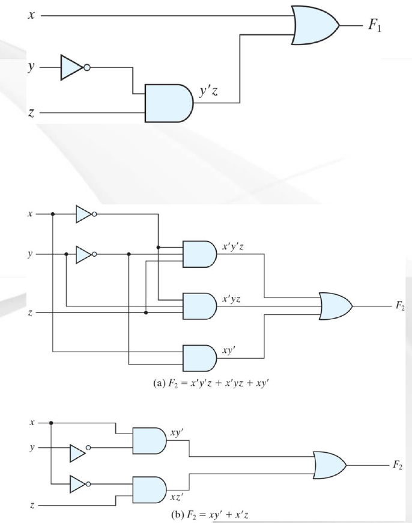

*그림 1. F₁ = x + y'z의 게이트 구현과 간략화 전후의 F₂ 게이트 구현 (슬라이드 6)*

- **위:** F₁에는 인버터 하나(y'을 만들기 위함), AND 게이트 하나(y'z), OR 게이트 하나가 필요하다.
- **(a) F₂ = x'y'z + x'yz + xy':** 인버터 두 개, AND 게이트 세 개(그중 두 개는 3입력), 3입력 OR 게이트가 필요하다.
- **(b) F₂ = xy' + x'z:** 인버터 두 개, 2입력 AND 게이트 두 개, 2입력 OR 게이트가 필요하다.

> **핵심:** 하나의 부울 함수에는 진리표는 **하나**이지만 대수식은 **여러 개**가 있다. 식을 간략화하면 게이트 수와 게이트 입력 수가 적은 회로를 얻으며, 이 회로는 정확히 같은 진리표를 계산하면서도 더 저렴하고, 작고, 대개 더 빠르다.

### 3.2 대수적 간략화

**예제 2-1.** 다음 부울 함수를 리터럴의 개수가 최소가 되도록 간략화하라. **리터럴(literal)** 은 항 안에 있는 하나의 변수로, 보수 형태이든 아니든 상관없다(예: x와 x'은 모두 리터럴이다).

1. x(x' + y) = xx' + xy = 0 + xy = **xy**
   - 분배한 다음 xx' = 0을 사용한다.
2. x + x'y = (x + x')(x + y) = 1(x + y) = **x + y**
   - 두 번째 분배 법칙 x + yz = (x + y)(x + z)를 쓴 다음 x + x' = 1을 사용한다.
3. (x + y)(x + y') = x + xy + xy' + yy' = x(1 + y + y') = **x**
   - 전개하고(xx = x, yy' = 0) x로 묶은 뒤, 1 + (무엇이든) = 1을 사용한다. 예제 2의 쌍대이다.
4. xy + x'z + yz = xy + x'z + yz(x + x') = xy + x'z + xyz + x'yz = xy(1 + z) + x'z(1 + y) = **xy + x'z**
   - yz에 1 = x + x'을 곱하고 다시 묶은 뒤 흡수한다. 항 yz는 불필요하며, 이 항등식을 **합의 정리(consensus theorem)** 라고 한다.
5. (x + y)(x' + z)(y + z) = **(x + y)(x' + z)**
   - 예제 4로부터 쌍대에 의해 성립한다.

> **시험 팁:** 합의 정리 xy + x'z + yz = xy + x'z는 자주 필요하지만 놓치기 쉽다. 한 변수가 한 항에서는 그대로, 다른 항에서는 보수로 나타나는 두 항(여기서는 x와 x')을 찾아야 한다. 나머지 부분들(y와 z)의 곱은 불필요한 항이므로 제거할 수 있다.

### 3.3 함수의 보수

함수 F의 보수 F'은 진리표에서 0과 1을 서로 바꾸어 얻거나, 대수적으로 **드모르간 정리**를 적용하여 얻는다. 슬라이드는 3변수에 대한 정리를 단계적으로 유도한다.

| 단계 | 근거 |
|:-----|:--------------|
| (A + B + C)' = (A + x)' | B + C = x로 놓음 |
| = A'x' | 정리 5(a), 드모르간 |
| = A'(B + C)' | B + C = x를 대입 |
| = A'(B'C') | 정리 5(a), 드모르간 |
| = A'B'C' | 정리 4(b), 결합 법칙 |

**일반화된 드모르간 정리:**

- (A + B + C + D + ... + F)' = A'B'C'D' ... F'
- (ABCD ... F)' = A' + B' + C' + D' + ... + F'

**예제.** 함수 F₁ = x'yz' + x'y'z와 F₂ = x(y'z' + yz)의 보수를 구하라.

방법 1, 드모르간 정리를 반복하여 적용한다.

- F₁' = (x'yz' + x'y'z)' = (x'yz')'(x'y'z)' = **(x + y' + z)(x + y + z')**
- F₂' = [x(y'z' + yz)]' = x' + (y'z' + yz)' = x' + (y'z')'(yz)' = **x' + (y + z)(y' + z')**

방법 2, 함수의 **쌍대**를 구한 뒤 **각 리터럴을 보수화**한다.

- F₁ = x'yz' + x'y'z이다. F₁의 쌍대는 (x' + y + z')(x' + y' + z)이다. 각 리터럴을 보수화하면 (x + y' + z)(x + y + z') = F₁'이다.
- F₂ = x(y'z' + yz)이다. F₂의 쌍대는 x + (y' + z')(y + z)이다. 각 리터럴을 보수화하면 x' + (y + z)(y' + z') = F₂'이다.

> **핵심:** 두 방법의 결과는 같다. 방법 2는 기계적인 절차이다. AND와 OR를 바꾼 다음, 프라임이 없는 변수에는 프라임을 붙이고 프라임이 있는 변수에서는 프라임을 뗀다.

---

 

## 4. 정규형과 표준형

### 4.1 최소항과 최대항

- **최소항(minterm)**(표준 곱)은 n개의 변수가 보수 형태이든 아니든 각각 정확히 한 번씩 나타나는 **AND** 항이다. n변수에는 **2ⁿ개의 최소항**이 있다.
- **최대항(maxterm)**(표준 합)은 n개의 변수가 각각 정확히 한 번씩 나타나는 **OR** 항이다. n변수에는 **2ⁿ개의 최대항**이 있다.

| x | y | z | 최소항 | 기호 | 최대항 | 기호 |
|:-:|:-:|:-:|:-------------|:-----------:|:-------------|:-----------:|
| 0 | 0 | 0 | x'y'z' | m₀ | x + y + z | M₀ |
| 0 | 0 | 1 | x'y'z | m₁ | x + y + z' | M₁ |
| 0 | 1 | 0 | x'yz' | m₂ | x + y' + z | M₂ |
| 0 | 1 | 1 | x'yz | m₃ | x + y' + z' | M₃ |
| 1 | 0 | 0 | xy'z' | m₄ | x' + y + z | M₄ |
| 1 | 0 | 1 | xy'z | m₅ | x' + y + z' | M₅ |
| 1 | 1 | 0 | xyz' | m₆ | x' + y' + z | M₆ |
| 1 | 1 | 1 | xyz | m₇ | x' + y' + z' | M₇ |

**작성하는 방법:**

- **최소항 m_j:** 비트가 **0인 변수에는 프라임**을 붙이고, 1인 변수는 그대로 쓴다. 최소항 m_j는 j행에서**만** 1이다.
- **최대항 M_j:** 비트가 **1인 변수에는 프라임**을 붙이고, 0인 변수는 그대로 쓴다. 최대항 M_j는 j행에서**만** 0이다.
- 첨자 j는 그 행의 2진 입력을 10진수로 나타낸 값이다. 예를 들어 101행은 5행이므로 m₅ = xy'z이고 M₅ = x' + y + z'이다.
- 각 최대항은 같은 번호의 최소항의 보수이다: **M_j = m_j'**. 예를 들어 드모르간 정리에 의해 (xy'z)' = x' + y + z'이다.

### 4.2 최소항과 최대항으로 함수 표현하기

| x | y | z | 함수 f₁ | 함수 f₂ |
|:-:|:-:|:-:|:-----------:|:-----------:|
| 0 | 0 | 0 | 0 | 0 |
| 0 | 0 | 1 | 1 | 0 |
| 0 | 1 | 0 | 0 | 0 |
| 0 | 1 | 1 | 0 | 1 |
| 1 | 0 | 0 | 1 | 0 |
| 1 | 0 | 1 | 0 | 1 |
| 1 | 1 | 0 | 0 | 1 |
| 1 | 1 | 1 | 1 | 1 |

모든 함수는 **함수가 1이 되는 최소항들의 OR**로 쓸 수 있다.

- f₁ = x'y'z + xy'z' + xyz = m₁ + m₄ + m₇
- f₂ = x'yz + xy'z + xyz' + xyz = m₃ + m₅ + m₆ + m₇

또한 모든 함수는 **함수가 0이 되는 최대항들의 AND**로도 쓸 수 있다.

- f₁ = (x + y + z)(x + y' + z)(x + y' + z')(x' + y + z')(x' + y' + z) = M₀M₂M₃M₅M₆
- f₂ = (x + y + z)(x + y + z')(x + y' + z)(x' + y + z) = M₀M₁M₂M₄

> **참고:** 슬라이드에는 f₁의 세 번째 인수가 (x' + y + z')로 인쇄되어 네 번째 인수와 중복된다. f₁은 011행에서 0이므로, 세 번째 인수는 M₀M₂M₃M₅M₆이라는 표기와 일치하도록 M₃ = (x + y' + z')이어야 한다.

**이 방법이 성립하는 이유:** 각 최소항은 한 행에서만 1이므로, 최소항들의 OR는 정확히 그 최소항들의 행에서만 1이다. 마찬가지로 최대항들의 AND는 정확히 그 최대항들의 행에서만 0이다. 따라서 두 식은 모두 진리표를 정확히 재현한다.

### 4.3 최소항의 합

**예제.** F = A + B'C를 최소항의 합으로 나타내라. 각 항은 세 변수를 모두 포함해야 하므로, 빠진 변수는 (X + X') = 1을 곱하여 넣는다.

1. 항 A에는 두 변수(B와 C)가 빠져 있다.
   - A = A(B + B') = AB + AB'
   - = AB(C + C') + AB'(C + C')
   - = ABC + ABC' + AB'C + AB'C'
2. 항 B'C에는 A가 빠져 있다.
   - B'C = B'C(A + A') = AB'C + A'B'C
3. 모든 항을 합치고 중복된 AB'C를 제거한다(x + x = x).
   - F = A'B'C + AB'C' + AB'C + ABC' + ABC
   - = m₁ + m₄ + m₅ + m₆ + m₇
   - = **Σ(1, 4, 5, 6, 7)**

| A | B | C | F |
|:-:|:-:|:-:|:-:|
| 0 | 0 | 0 | 0 |
| 0 | 0 | 1 | 1 |
| 0 | 1 | 0 | 0 |
| 0 | 1 | 1 | 0 |
| 1 | 0 | 0 | 1 |
| 1 | 0 | 1 | 1 |
| 1 | 1 | 0 | 1 |
| 1 | 1 | 1 | 1 |

기호 Σ는 나열된 최소항들의 OR(합)를 뜻한다. 진리표에서 F가 1, 4, 5, 6, 7행에서 1이므로 결과가 확인된다.

> **시험 팁:** 최소항 목록을 구하는 가장 빠른 방법은 대수보다 진리표인 경우가 많다. 각 행에서 F를 계산하고 F = 1인 행 번호를 나열하면 된다.

### 4.4 최대항의 곱

**예제.** F = xy + x'z를 최대항의 곱으로 나타내라.

1. 분배 법칙 x + yz = (x + y)(x + z)를 이용하여 식을 OR 항들로 바꾼다.
   - F = xy + x'z = (xy + x')(xy + z)
   - = (x + x')(y + x')(x + z)(y + z)
   - = (x' + y)(x + z)(y + z)
2. 각 OR 항에는 변수가 하나씩 빠져 있으므로 XX' = 0을 더하여 넣는다.
   - x' + y = x' + y + zz' = (x' + y + z)(x' + y + z')
   - x + z = x + z + yy' = (x + y + z)(x + y' + z)
   - y + z = y + z + xx' = (x + y + z)(x' + y + z)
3. 합치고 중복된 (x + y + z)를 제거한다.
   - F = (x + y + z)(x + y' + z)(x' + y + z)(x' + y + z')
   - = M₀M₂M₄M₅
   - F(x, y, z) = **Π(0, 2, 4, 5)**

기호 Π는 나열된 최대항들의 AND(곱)를 뜻한다.

### 4.5 정규형 사이의 변환

함수의 보수는 정확히 함수에서 빠진 최소항들로 이루어진다. M_j = m_j'을 이용하면 다음과 같다.

- F(A, B, C) = Σ(1, 4, 5, 6, 7)
- F'(A, B, C) = Σ(0, 2, 3) = m₀ + m₂ + m₃
- F = (m₀ + m₂ + m₃)' = m₀'m₂'m₃' = M₀M₂M₃ = **Π(0, 2, 3)**

**규칙:** Σ에서 Π로(또는 그 반대로) 변환하려면 원래 목록에서 **빠진** 번호를 나열하면 된다.

**예제:** F = xy + x'z

| x | y | z | F |
|:-:|:-:|:-:|:-:|
| 0 | 0 | 0 | 0 |
| 0 | 0 | 1 | 1 |
| 0 | 1 | 0 | 0 |
| 0 | 1 | 1 | 1 |
| 1 | 0 | 0 | 0 |
| 1 | 0 | 1 | 0 |
| 1 | 1 | 0 | 1 |
| 1 | 1 | 1 | 1 |

- F(x, y, z) = Σ(1, 3, 6, 7)
- F(x, y, z) = Π(0, 2, 4, 5)

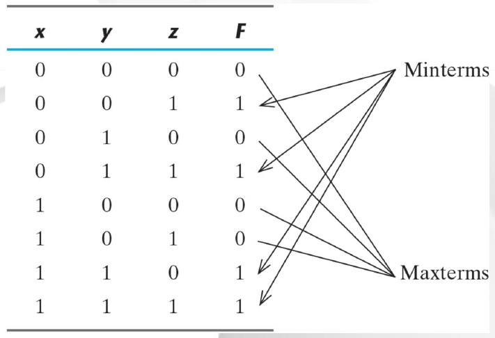

*그림 2. 진리표에서 읽은 F = xy + x'z의 최소항과 최대항 (슬라이드 13)*

그림에서는 화살표가 F = 1인 진리표의 각 행을 "Minterms"(최소항)에, F = 0인 각 행을 "Maxterms"(최대항)에 연결하여, 두 목록이 함께 여덟 행을 정확히 한 번씩 덮는다는 것을 보여 준다.

### 4.6 표준형: SOP와 POS

정규형은 모든 항에 모든 변수를 포함하므로 가장 간단한 형태인 경우가 드물다. **표준형(standard form)** 은 이 조건을 완화하여, 항에 몇 개의 리터럴이든 포함할 수 있다.

- **곱의 합(SOP, sum of products):** AND 항들의 OR이다. 예: F₁ = y' + xy + x'yz'
- **합의 곱(POS, product of sums):** OR 항들의 AND이다. 예: F₂ = x(y' + z)(x' + y + z')

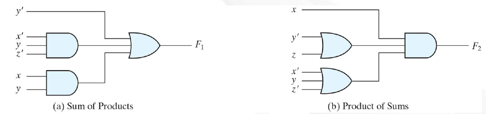

*그림 3. 곱의 합과 합의 곱의 2단계 구현 (슬라이드 14)*

- (a) **곱의 합:** 첫 단계의 AND 게이트들(x'yz'과 xy)이 단일 리터럴 y'과 함께 두 번째 단계의 OR 게이트로 들어간다.
- (b) **합의 곱:** 첫 단계의 OR 게이트들(y' + z와 x' + y + z')이 단일 리터럴 x와 함께 두 번째 단계의 AND 게이트로 들어간다.

두 회로는 모두 **2단계 구현(two-level implementation)** 이다. 입력에서 출력까지의 모든 경로가 (보수 입력을 위한 인버터를 제외하면) 최대 두 개의 게이트를 지난다.

**예제:** F₃ = AB + C(D + E) = AB + CD + CE

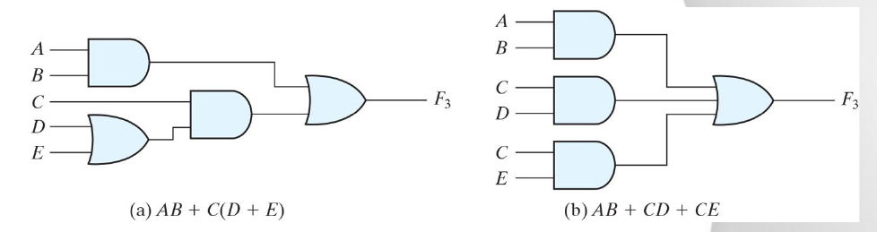

*그림 4. F₃의 3단계 구현과 2단계 구현 (슬라이드 14)*

- (a) AB + C(D + E)는 **3단계** 구현이다. OR 게이트(D + E), C와의 AND 게이트, 마지막 OR 게이트를 차례로 지난다.
- (b) AB + CD + CE는 분배 법칙을 적용하여 얻은, 같은 함수의 **2단계** SOP 구현이다.

> **핵심:** 2단계 형식(SOP와 POS)을 선호하는 이유는 신호가 지나는 게이트 단계가 가장 적어 전파 지연이 최소가 되기 때문이다. 대신 F₃에서 (b)가 (a)보다 게이트를 하나 더 쓰는 것처럼, 2단계 형식은 게이트나 게이트 입력이 더 많이 필요할 수 있다.

---

 

## 5. 논리 게이트

### 5.1 AND 게이트

AND 게이트는 **모든** 입력이 1일 때만 1을 출력한다.

| x | y | s |
|:-:|:-:|:-:|
| 0 | 0 | 0 |
| 0 | 1 | 0 |
| 1 | 0 | 0 |
| 1 | 1 | 1 |

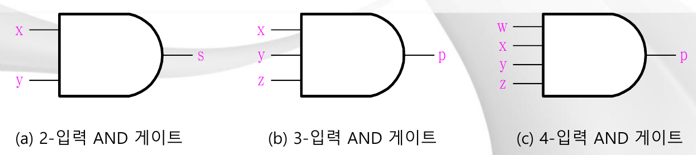

*그림 5. 2입력, 3입력, 4입력 AND 게이트 (슬라이드 15)*

AND 게이트는 입력이 두 개보다 많을 수 있다. 3입력 AND 게이트는 p = xyz를, 4입력 AND 게이트는 p = wxyz를 출력하며, 어느 경우든 모든 입력이 1일 때만 출력이 1이다.

### 5.2 OR 게이트

OR 게이트는 **적어도 하나의** 입력이 1이면 1을 출력한다.

| x | y | s |
|:-:|:-:|:-:|
| 0 | 0 | 0 |
| 0 | 1 | 1 |
| 1 | 0 | 1 |
| 1 | 1 | 1 |

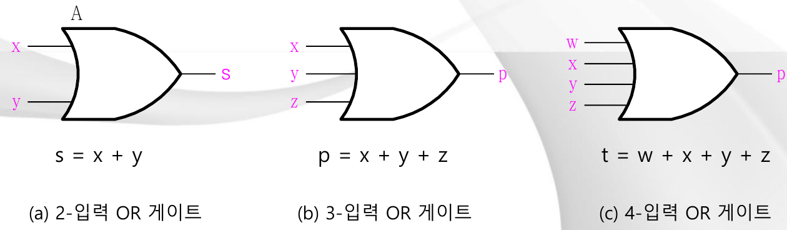

*그림 6. 2입력, 3입력, 4입력 OR 게이트 (슬라이드 16)*

2입력 OR 게이트는 s = x + y를, 3입력 게이트는 p = x + y + z를, 4입력 게이트는 t = w + x + y + z를 출력한다.

### 5.3 NOT 게이트

NOT 게이트(인버터)는 입력의 보수를 출력한다.

| x | y |
|:-:|:-:|
| 0 | 1 |
| 1 | 0 |

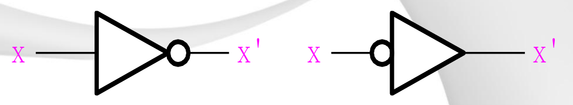

*그림 7. NOT 게이트의 두 가지 동등한 기호 (슬라이드 17)*

반전을 나타내는 버블은 출력 쪽(왼쪽 기호)에 그려도 되고 입력 쪽(오른쪽 기호)에 그려도 된다. 두 기호는 출력이 X'인 같은 인버터를 나타낸다. 입력 쪽에 버블을 그리는 방식은 입력 신호가 액티브 로우(active-low)임을 강조하고 싶을 때 유용하다.

### 5.4 NAND 게이트

**NAND**는 NOT-AND라는 뜻으로, 출력은 입력들의 AND의 보수이다. 모든 입력이 1일 때만 0을 출력한다.

| x | y | s = (xy)' |
|:-:|:-:|:---------:|
| 0 | 0 | 1 |
| 0 | 1 | 1 |
| 1 | 0 | 1 |
| 1 | 1 | 0 |

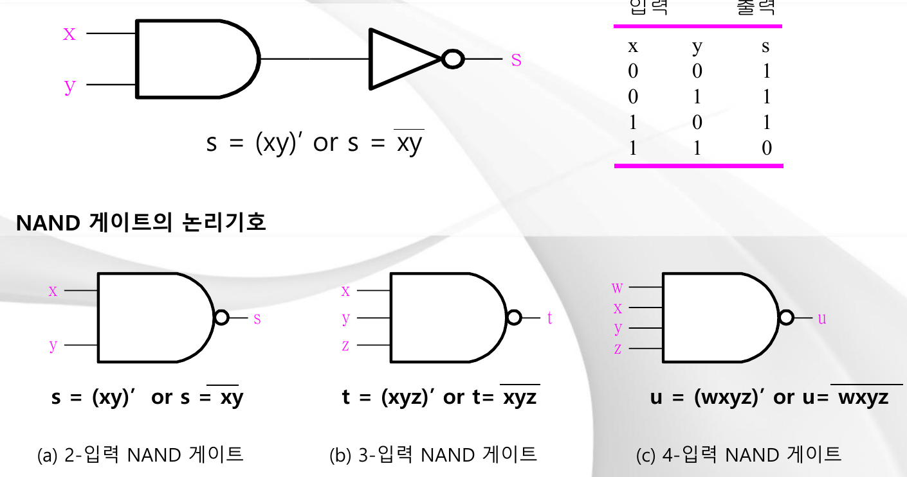

*그림 8. AND와 NOT 기호로 표현한 NAND 함수와 NAND 게이트의 기호 (슬라이드 18)*

- 슬라이드 위쪽은 NAND 함수를 AND 게이트 뒤에 인버터를 붙인 모양으로 그린다: s = (xy)'이며, xy 위에 윗줄을 그어 표기하기도 한다.
- NAND 게이트의 기호는 AND 기호의 출력 쪽에 버블을 붙인 것이다. 2입력 NAND 게이트는 s = (xy)', 3입력 게이트는 t = (xyz)', 4입력 게이트는 u = (wxyz)'을 출력한다.

### 5.5 NOR 게이트

**NOR**는 NOT-OR라는 뜻으로, 출력은 입력들의 OR의 보수이다. 모든 입력이 0일 때만 1을 출력한다.

| x | y | s = (x + y)' |
|:-:|:-:|:------------:|
| 0 | 0 | 1 |
| 0 | 1 | 0 |
| 1 | 0 | 0 |
| 1 | 1 | 0 |

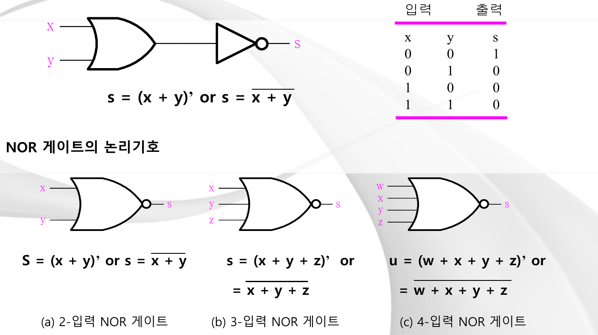

*그림 9. OR와 NOT 기호로 표현한 NOR 함수와 NOR 게이트의 기호 (슬라이드 19)*

NOR 게이트의 기호는 OR 기호의 출력 쪽에 버블을 붙인 것이다. 2입력 NOR 게이트는 s = (x + y)', 3입력 게이트는 s = (x + y + z)', 4입력 게이트는 u = (w + x + y + z)'을 출력한다.

### 5.6 XOR 게이트

**XOR**(배타적 OR, exclusive-OR)는 두 입력이 **서로 다를 때** 1을 출력한다. 기호는 ⊕이다.

| x | y | z = x ⊕ y |
|:-:|:-:|:---------:|
| 0 | 0 | 0 |
| 0 | 1 | 1 |
| 1 | 0 | 1 |
| 1 | 1 | 0 |

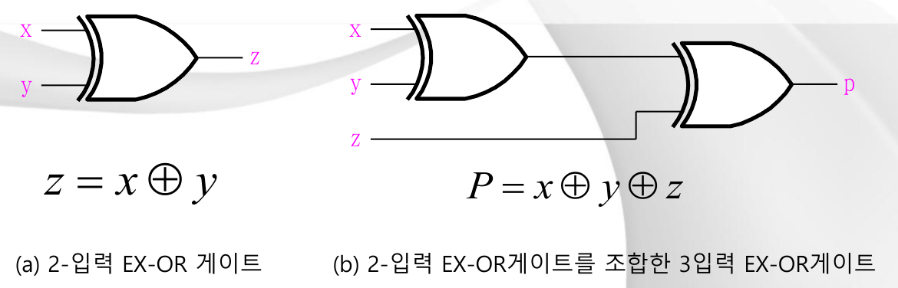

*그림 10. 2입력 XOR 게이트와 2입력 XOR 게이트를 조합한 3입력 XOR 게이트 (슬라이드 20)*

- (a) XOR 기호는 OR 기호의 입력 쪽에 곡선을 하나 더 그은 것이다: z = x ⊕ y
- (b) 3입력 XOR는 2입력 XOR의 출력(x ⊕ y)과 세 번째 입력 z를 두 번째 XOR에 넣어 만든다: P = x ⊕ y ⊕ z. 결과는 입력 중 **홀수 개**가 1일 때 1이다.

### 5.7 XNOR 게이트

**XNOR**(배타적 NOR, exclusive-NOR)는 XOR의 보수로, 두 입력이 **같을 때** 1을 출력하므로 동치(equivalence) 게이트라고도 한다.

| x | y | z = (x ⊕ y)' |
|:-:|:-:|:------------:|
| 0 | 0 | 1 |
| 0 | 1 | 0 |
| 1 | 0 | 0 |
| 1 | 1 | 1 |

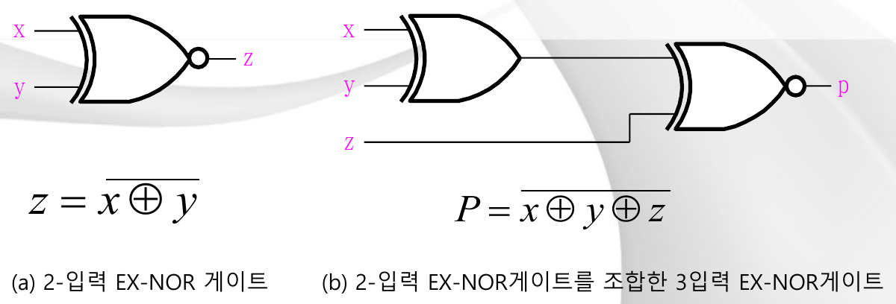

*그림 11. 2입력 XNOR 게이트와 XOR 게이트 및 XNOR 게이트를 조합한 3입력 XNOR 게이트 (슬라이드 21)*

- (a) XNOR 기호는 XOR 기호의 출력 쪽에 버블을 붙인 것이다: z = (x ⊕ y)'
- (b) 3입력 XNOR는 x ⊕ y와 z를 XNOR 게이트에 넣는다: P = (x ⊕ y ⊕ z)'. 반전은 **마지막** 게이트에만 있다. 두 단계를 모두 반전하면 서로 상쇄되기 때문이다.

### 5.8 게이트 한눈에 보기

| 게이트 | 식 | 출력이 1인 경우 | 2입력 진리표의 출력(00, 01, 10, 11) |
|:-----|:-----------|:-----------------|:-------------------------------------------:|
| AND | xy | 모든 입력이 1 | 0, 0, 0, 1 |
| OR | x + y | 적어도 하나의 입력이 1 | 0, 1, 1, 1 |
| NOT | x' | 입력이 0 | (1입력) 1, 0 |
| NAND | (xy)' | 적어도 하나의 입력이 0 | 1, 1, 1, 0 |
| NOR | (x + y)' | 모든 입력이 0 | 1, 0, 0, 0 |
| XOR | x ⊕ y = xy' + x'y | 입력이 서로 다름(1이 홀수 개) | 0, 1, 1, 0 |
| XNOR | (x ⊕ y)' = xy + x'y' | 입력이 서로 같음 | 1, 0, 0, 1 |

> **[C프로그래밍]** C는 같은 연산을 워드 전체에 대하여 비트 단위로 제공한다: `&`(AND), `|`(OR), `~`(NOT), `^`(XOR). 예를 들어 `0b1100 & 0b1010`은 `0b1000`이고 `0b1100 ^ 0b1010`은 `0b0110`이다. 이러한 **비트 단위** 연산자를 값 전체를 하나의 참 또는 거짓으로 취급하는 **논리** 연산자 `&&`, `||`, `!`와 혼동하면 안 된다. 특히 XOR는 `x ^ x == 0`이고 `x ^ 0 == x`이므로 비트를 토글하거나 패리티를 계산하는 데 사용된다.

---

 

## 6. 회로로 본 스위칭 대수

### 6.1 결합성

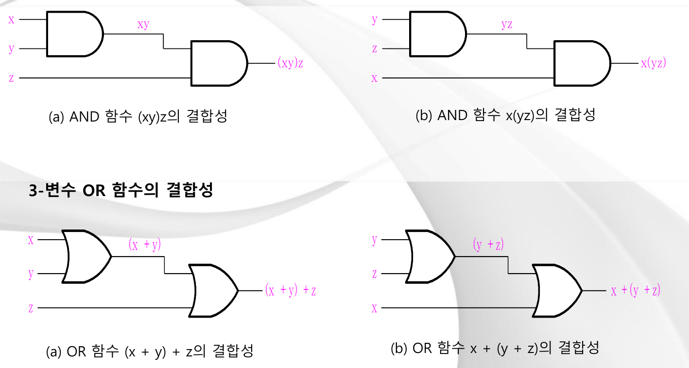

*그림 12. 3변수 AND 함수와 OR 함수의 결합성 (슬라이드 22)*

- **AND:** xy를 먼저 계산하고 z와 AND하면 (xy)z가 되고, yz를 먼저 계산하고 x와 AND하면 x(yz)가 된다. 두 회로는 같은 출력을 낸다.
- **OR:** (x + y) + z와 x + (y + z)도 마찬가지로 같은 출력을 낸다.

결합성 덕분에 묶는 순서는 중요하지 않다. 이것이 바로 하나의 **다입력** AND 게이트나 OR 게이트(예: 3입력 게이트)가 잘 정의되는 이유이다.

> **참고:** NAND와 NOR는 결합 법칙이 성립하지 **않는다**. 예를 들어 ((xy)'z)'은 (x(yz)')'과 같지 않다. 그래서 다입력 NAND 게이트는 2입력 NAND 게이트를 이어 붙인 것이 아니라, 모든 입력의 AND의 보수 (xyz)'으로 직접 정의한다.

### 6.2 분배성

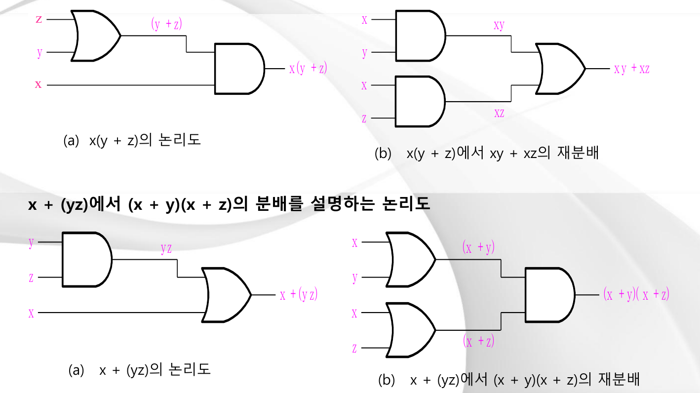

*그림 13. 두 분배 법칙을 설명하는 논리도 (슬라이드 23)*

- **x(y + z) = xy + xz:** 논리도 (a)는 OR 게이트로 y + z를 계산하고 그 결과를 x와 AND한다. 논리도 (b)는 식을 재분배하여 AND 게이트 두 개(xy와 xz)와 그 뒤의 OR 게이트로 구성한다.
- **x + yz = (x + y)(x + z):** 논리도 (a)는 AND 게이트로 yz를 계산하고 그 결과를 x와 OR한다. 논리도 (b)는 식을 재분배하여 OR 게이트 두 개(x + y와 x + z)와 그 뒤의 AND 게이트로 구성한다.

각 쌍에서 두 회로는 동등하지만, 한쪽은 게이트가 더 적고 다른 쪽은 규칙적인 2단계 구조(SOP 또는 POS)를 갖는다.

---

 

## 7. 함수적으로 완전한 연산 세트

어떤 연산 집합만으로 **모든** 부울 함수를 표현할 수 있으면 그 집합은 **함수적으로 완전(functionally complete)** 하다고 한다. 모든 함수는 최소항의 합으로 쓸 수 있으므로 집합 {AND, OR, NOT}은 함수적으로 완전하다. 놀랍게도 **NAND 하나만으로**, 또 **NOR 하나만으로**도 함수적으로 완전하다. 각각으로 NOT, AND, OR을 모두 만들 수 있기 때문이다.

### 7.1 인버터로 사용하는 NAND 게이트와 NOR 게이트

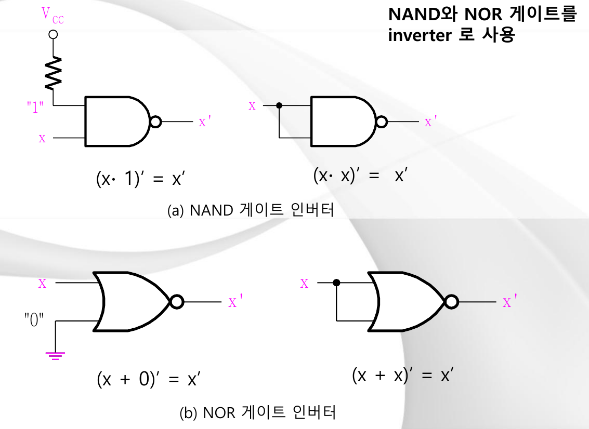

*그림 14. 인버터로 사용하는 NAND 게이트와 NOR 게이트 (슬라이드 24)*

- **(a) 인버터로 사용하는 NAND.**
  - 한 입력을 논리 "1"(저항을 통해 전원 전압 $V_{CC}$)에 연결한다: $(x \cdot 1)' = x'$
  - 또는 두 입력을 모두 x에 연결한다: $(x \cdot x)' = x'$
- **(b) 인버터로 사용하는 NOR.**
  - 한 입력을 논리 "0"(접지)에 연결한다: (x + 0)' = x'
  - 또는 두 입력을 모두 x에 연결한다: (x + x)' = x'

### 7.2 NAND 게이트를 사용한 AND 함수와 OR 함수

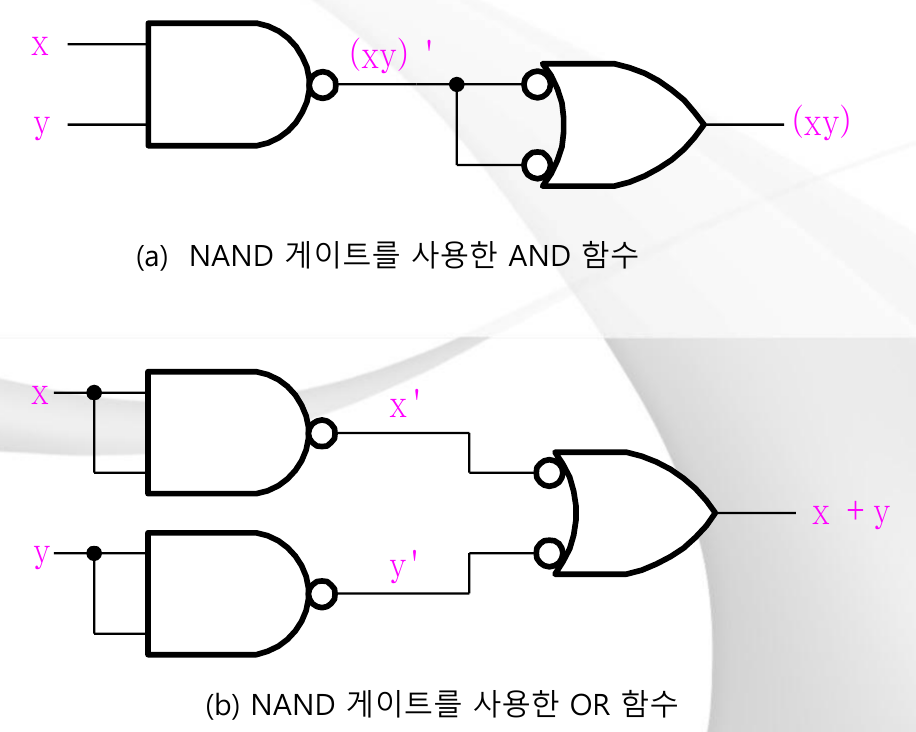

*그림 15. NAND 게이트로 만든 AND 함수와 OR 함수 (슬라이드 25)*

- **(a) AND:** 첫 번째 NAND 게이트가 (xy)'을 만든다. 두 입력을 모두 (xy)'에 연결한 두 번째 NAND 게이트는 인버터로 동작하여 ((xy)')' = xy를 만든다. 슬라이드는 이 두 번째 게이트를 두 입력에 버블이 있는 OR 게이트로 그리는데, 드모르간 정리 x' + y' = (xy)'에 의해 이는 NAND와 같은 게이트이다.
- **(b) OR:** 인버터로 사용한 두 NAND 게이트가 x'과 y'을 만든다. 세 번째 NAND 게이트(역시 반전 OR 모양으로 그림)는 드모르간 정리에 의해 (x'y')' = x + y를 만든다.

NOT, AND, OR을 모두 NAND 게이트로 만들 수 있으므로, 모든 부울 함수를 NAND 게이트만으로 만들 수 있다. 쌍대 연산으로 같은 논리를 적용하면 NOR 게이트만으로도 충분함을 보일 수 있다.

> **[컴퓨터구조]** CMOS 기술에서 2입력 NAND 게이트나 NOR 게이트는 트랜지스터 네 개만으로 만들 수 있지만, AND 게이트나 OR 게이트는 NAND나 NOR 뒤에 인버터를 붙여 만들기 때문에 트랜지스터 여섯 개가 필요하다. 따라서 NAND와 NOR 게이트가 집적회로의 자연스러운 기본 게이트이며, 함수적 완전성 덕분에 이것만으로 프로세서 전체를 만들어도 잃는 것이 없다.

---

 

## 요약

| 개념 | 핵심 요약 |
|:--------|:------------|
| 부울 대수 | 두 값(0, 1)과 세 연산자(AND, OR, NOT)로 이루어지며, 법칙이 일반 대수와 비슷하지만 다르다(1 + 1 = 1, x + yz = (x + y)(x + z)). |
| 공리 | 닫힘, 항등원(+에는 0, AND에는 1), 교환 법칙, (양방향) 분배 법칙, 보수, 서로 다른 두 요소의 존재이다. |
| 주요 정리 | 멱등, x + 1 = 1, 대합, 결합 법칙, 드모르간, 흡수 법칙, 합의 정리이다. |
| 쌍대성 | AND와 OR, 0과 1을 서로 바꾸며, 타당한 항등식의 쌍대도 타당하다. |
| F의 보수 | 드모르간 정리를 적용하거나, 쌍대를 구한 뒤 모든 리터럴을 보수화한다. |
| 최소항과 최대항 | 최소항 m_j는 j행에서만 1이고, 최대항 M_j는 j행에서만 0이며, M_j = m_j'이다. |
| 정규형 | 최소항의 합 Σ(F = 1인 행)와 최대항의 곱 Π(F = 0인 행)이며, 빠진 번호를 취하여 변환한다. |
| 표준형 | SOP와 POS는 지연이 최소인 2단계 구현을 준다. |
| 게이트 | AND, OR, NOT, NAND, NOR, XOR(입력이 다름), XNOR(입력이 같음)이며, 다입력 AND/OR는 결합성으로부터 정의된다. |
| 함수적 완전성 | {AND, OR, NOT}, {NAND}, {NOR}는 각각 완전하며, NAND와 NOR로 인버터, AND, OR을 만들 수 있다. |

---

 

## 점검 문제

1. **쌍대성:** x + x'y = x + y의 쌍대를 쓰고, 그것도 참임을 확인하라.

   > **정답:** +와 AND를 바꾸면 x(x' + y) = xy이다. x(x' + y) = xx' + xy = 0 + xy = xy이므로 참이며, 이는 예제 2-1의 1번과 같다.

2. **드모르간:** 진리표로 (xy)' = x' + y'을 증명하라.

   > **정답:** (x, y) = 00, 01, 10, 11에 대하여 xy는 0, 0, 0, 1이므로 (xy)'은 1, 1, 1, 0이다. x' + y'의 값은 1 + 1 = 1, 1 + 0 = 1, 0 + 1 = 1, 0 + 0 = 0, 즉 1, 1, 1, 0이다. 두 열이 같으므로 항등식이 성립한다.

3. **간략화:** xy + x'z + yz를 간략화하고, 사용한 정리의 이름을 쓰라.

   > **정답:** xy + x'z + yz = xy + x'z + yz(x + x') = xy + x'z + xyz + x'yz = xy(1 + z) + x'z(1 + y) = xy + x'z이다. 이것이 합의 정리이며, 항 yz는 불필요하다.

4. **보수:** 쌍대를 이용하는 방법으로 F = x(y'z' + yz)의 보수를 구하라.

   > **정답:** F의 쌍대는 x + (y' + z')(y + z)이다. 모든 리터럴을 보수화하면 F' = x' + (y + z)(y' + z')이다.

5. **최소항:** F = A + B'C를 최소항의 합과 최대항의 곱으로 나타내라.

   > **정답:** 빠진 변수가 있는 각 항을 전개하면 F = A'B'C + AB'C' + AB'C + ABC' + ABC = Σ(1, 4, 5, 6, 7)이다. 빠진 번호는 0, 2, 3이므로 F = Π(0, 2, 3) = (A + B + C)(A + B' + C)(A + B' + C')이다.

6. **정규형과 표준형:** 정규형과 표준형의 차이는 무엇인가?

   > **정답:** 정규형(최소항의 합 또는 최대항의 곱)에서는 모든 항이 모든 변수를 정확히 한 번씩 포함한다. 표준형(SOP 또는 POS)에서는 항이 몇 개의 리터럴이든 포함할 수 있으므로, 2단계 구조를 유지하면서도 식이 대개 훨씬 짧다.

7. **XOR:** 3입력 XOR 게이트의 출력은 언제 1인가?

   > **정답:** 입력 중 홀수 개가 1일 때, 즉 한 개 또는 세 개의 입력이 1일 때 1이다. x ⊕ y ⊕ z는 1인 입력마다 한 번씩 값이 뒤집히기 때문이다.

8. **함수적 완전성:** NAND 게이트만으로 OR 게이트를 만드는 방법을 보여라.

   > **정답:** 입력을 서로 묶은 NAND 게이트 두 개를 인버터로 사용하여 x'과 y'을 얻고, 이를 세 번째 NAND 게이트에 넣는다. 그 출력은 드모르간 정리에 의해 (x'y')' = x + y이다.

---
