# Lecture 04 — Gate-Level Minimization

> **Last Updated:** 2026-10-08
>
> Digital Design, Mano and Ciletti - Ch 3

> **Learning Objectives**:
> 1. Apply De Morgan's theorem, including its n-variable form, and recognize the equivalent gate symbols it produces
> 2. Construct two-, three-, four-, and five-variable Karnaugh maps and simplify Boolean functions into minimal sum-of-products form
> 3. Identify prime implicants and essential prime implicants, and find all minimal solutions of a function
> 4. Simplify functions into product-of-sums form by grouping the 0s of a map, and use don't-care conditions to obtain simpler results
> 5. Implement two-level and multilevel circuits with NAND gates only or NOR gates only
> 6. Use the exclusive-OR function to build odd and even functions and parity generators and checkers

---

## Table of Contents

- [1. De Morgan's Theorem](#1-de-morgans-theorem)
  - [1.1 Two-Variable Form and Equivalent Gates](#11-two-variable-form-and-equivalent-gates)
  - [1.2 n-Variable Form](#12-n-variable-form)
- [2. Gate-Level Minimization and the Map Method](#2-gate-level-minimization-and-the-map-method)
- [3. Two-Variable Map](#3-two-variable-map)
- [4. Three-Variable Map](#4-three-variable-map)
  - [4.1 Structure of the Map](#41-structure-of-the-map)
  - [4.2 Grouping Rules](#42-grouping-rules)
  - [4.3 Examples](#43-examples)
- [5. Four-Variable Map](#5-four-variable-map)
  - [5.1 Structure of the Map](#51-structure-of-the-map)
  - [5.2 Examples](#52-examples)
- [6. Prime Implicants](#6-prime-implicants)
- [7. Five-Variable Map](#7-five-variable-map)
- [8. Product-of-Sums Simplification](#8-product-of-sums-simplification)
- [9. Don't-Care Conditions](#9-dont-care-conditions)
- [10. Characteristics of the Karnaugh Map](#10-characteristics-of-the-karnaugh-map)
- [11. NAND and NOR Implementation](#11-nand-and-nor-implementation)
  - [11.1 NAND Circuits](#111-nand-circuits)
  - [11.2 Two-Level NAND Implementation](#112-two-level-nand-implementation)
  - [11.3 Implementing a Function with NAND Gates](#113-implementing-a-function-with-nand-gates)
  - [11.4 Multilevel NAND Circuits](#114-multilevel-nand-circuits)
  - [11.5 NOR Circuits](#115-nor-circuits)
  - [11.6 Implementations with NOR Gates](#116-implementations-with-nor-gates)
- [12. Exclusive-OR Function](#12-exclusive-or-function)
  - [12.1 Identities and Implementations](#121-identities-and-implementations)
  - [12.2 Odd and Even Functions](#122-odd-and-even-functions)
  - [12.3 Parity Generation and Checking](#123-parity-generation-and-checking)
- [Summary](#summary)
- [Self-Check Questions](#self-check-questions)

---

 

## 1. De Morgan's Theorem

### 1.1 Two-Variable Form and Equivalent Gates

Augustus **De Morgan** was a logician and mathematician who proposed two theorems that form an important part of Boolean algebra.

$$
\text{(a)}\quad \overline{A \cdot B} = \overline{A} + \overline{B} \qquad\qquad \text{(b)}\quad \overline{A + B} = \overline{A} \cdot \overline{B}
$$

(a) **"The complement of a product equals the sum of the complements."** The complement of two or more ANDed variables is equivalent to the OR of the complements of the individual variables.

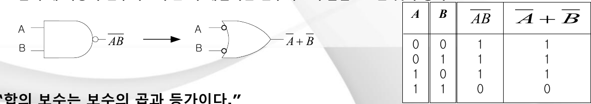

*Figure 1. De Morgan's theorem (a): a NAND gate is equivalent to an OR gate with inverted inputs (slide 2)*

| A | B | (AB)' | A' + B' |
|:-:|:-:|:-----:|:-------:|
| 0 | 0 | 1 | 1 |
| 0 | 1 | 1 | 1 |
| 1 | 0 | 1 | 1 |
| 1 | 1 | 0 | 0 |

(b) **"The complement of a sum equals the product of the complements."** The complement of two or more ORed variables is equivalent to the AND of the complements of the individual variables.

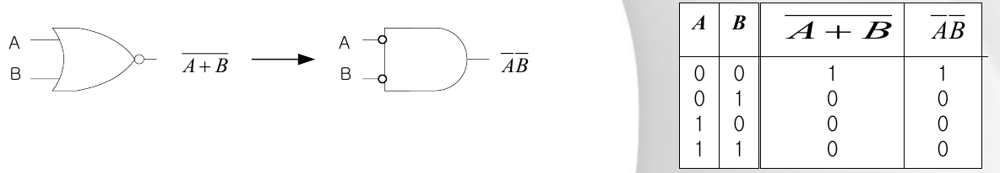

*Figure 2. De Morgan's theorem (b): a NOR gate is equivalent to an AND gate with inverted inputs (slide 2)*

| A | B | (A + B)' | A'B' |
|:-:|:-:|:--------:|:----:|
| 0 | 0 | 1 | 1 |
| 0 | 1 | 0 | 0 |
| 1 | 0 | 0 | 0 |
| 1 | 1 | 0 | 0 |

In both cases the two columns match in every row, which proves the theorem. In circuit terms, **a NAND gate can be drawn as an OR gate with bubbles on its inputs, and a NOR gate can be drawn as an AND gate with bubbles on its inputs.** These alternative symbols are used constantly in Section 11.

> **Exam Tip:** A memory aid for De Morgan's theorem is "break the bar, change the sign": when the overbar over a whole expression is broken into bars over the individual variables, AND changes to OR and OR changes to AND.

### 1.2 n-Variable Form

The theorem extends to any number of variables.

$$
\overline{x_1 x_2 x_3 \cdots x_n} = \overline{x_1} + \overline{x_2} + \overline{x_3} + \cdots + \overline{x_n}
$$

$$
\overline{x_1 + x_2 + x_3 + \cdots + x_n} = \overline{x_1}\,\overline{x_2}\,\overline{x_3} \cdots \overline{x_n}
$$

---

 

## 2. Gate-Level Minimization and the Map Method

**Gate-level minimization** is the design task of finding an **optimal gate-level implementation** of a Boolean function, that is, a circuit with as few gates and gate inputs as possible.

Algebraic simplification works, but it has no fixed procedure: one must guess which theorem to apply next and can never be sure that the result is minimal. The **map method** solves this problem.

- **Truth table → Karnaugh map (K-map).** A K-map is a **rectangular array of squares** in which each square represents one minterm (or maxterm) of the Boolean function.
- The map is arranged so that minterms that differ in only one variable are placed **next to each other**. Adjacent 1s can then be combined visually, which **simplifies the output expression**.

The idea behind every K-map simplification is the identity **xy + xy' = x(y + y') = x**: two minterms that differ in exactly one variable merge into one term without that variable.

---

 

## 3. Two-Variable Map

A function of two variables x and y has four minterms, so the map has four squares.

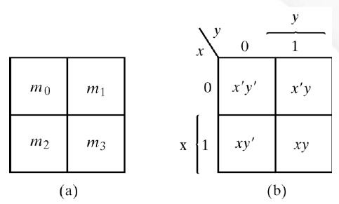

*Figure 3. Two-variable map: minterm positions and the corresponding terms (slide 5)*

- In panel (a), the squares are numbered m₀ to m₃.
- In panel (b), the row shows the value of x (0 or 1) and the column shows the value of y (0 or 1). The square in row x = 1 and column y = 1 is m₃ = xy, and so on: m₀ = x'y', m₁ = x'y, m₂ = xy', m₃ = xy.

**Example:** the function that is 1 for the minterms m₁ + m₂ + m₃ = x'y + xy' + xy.

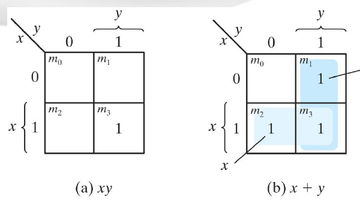

*Figure 4. Representation of xy and x + y in the two-variable map (slide 5)*

- (a) The function xy is a single 1 in square m₃.
- (b) For m₁ + m₂ + m₃, the two squares of the bottom row (m₂, m₃) form the group **x**, because x = 1 in both and y changes. The two squares of the right column (m₁, m₃) form the group **y**. Square m₃ may be used in both groups. Therefore x'y + xy' + xy = **x + y**.

---

 

## 4. Three-Variable Map

### 4.1 Structure of the Map

A three-variable function has eight minterms. The map has two rows (x = 0, 1) and four columns (yz).

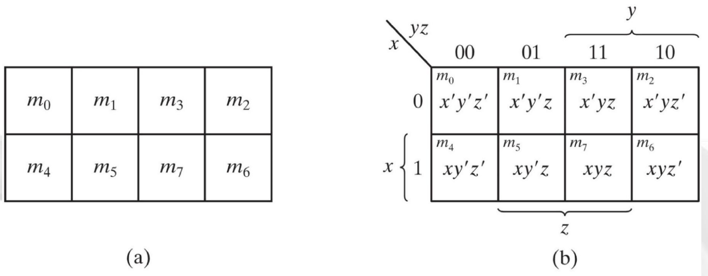

*Figure 5. Three-variable map: minterm positions and the corresponding terms (slide 6)*

The columns are **not** in binary order 00, 01, 10, 11. They follow the order **00, 01, 11, 10**, which is the Gray code, so that **only one bit changes between neighboring columns**. As a result, the minterms in the top row are m₀, m₁, m₃, m₂ and those in the bottom row are m₄, m₅, m₇, m₆.

- The two right columns (yz = 11 and 10) are the region where **y = 1**.
- The two middle columns (yz = 01 and 11) are the region where **z = 1**.
- The bottom row is the region where **x = 1**.

> **Key Point:** The leftmost and rightmost columns (yz = 00 and yz = 10) are also adjacent, because they differ only in y. The map should be imagined as wrapped around a cylinder, so that its left and right edges touch.

### 4.2 Grouping Rules

These rules apply to all K-maps.

1. Mark a 1 in each square of a minterm for which the function is 1.
2. Group adjacent 1s in **rectangles whose size is a power of two**: 1, 2, 4, 8, and so on. Adjacency includes wrapping around the edges.
3. Make each group **as large as possible**, because a larger group eliminates more variables. In an n-variable map, a group of $2^k$ squares produces a term with **n - k literals**.
4. Use **as few groups as possible**, while every 1 is covered by at least one group. A square may belong to several groups.
5. Read each group as a product term: keep the variables that are **constant** throughout the group (plain if the value is 1, primed if it is 0) and drop the variables that change.
6. OR all the product terms together.

| Group Size (3-variable map) | Number of Literals in the Term |
|:---------------------------:|:------------------------------:|
| 1 square | 3 |
| 2 squares | 2 |
| 4 squares | 1 |
| 8 squares | 0 (the function is 1) |

### 4.3 Examples

**Example 1: F(x, y, z) = Σ(2, 3, 4, 5).**

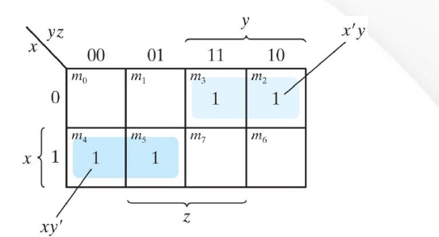

*Figure 6. Map for F(x, y, z) = Σ(2, 3, 4, 5) (slide 7)*

- m₂ and m₃ are in the top row (x = 0) and in the region y = 1, while z changes: the group is **x'y**.
- m₄ and m₅ are in the bottom row (x = 1) and in the region y = 0, while z changes: the group is **xy'**.
- **F = x'y + xy'.**

**Example 2: F(x, y, z) = Σ(3, 4, 6, 7).**

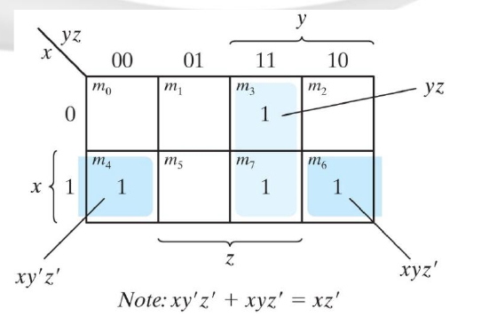

*Figure 7. Map for F(x, y, z) = Σ(3, 4, 6, 7) (slide 7)*

- m₃ and m₇ form the column yz = 11, where y = 1 and z = 1 while x changes: the group is **yz**.
- m₄ and m₆ are in the bottom row at the two outer columns (yz = 00 and 10), which are adjacent by wrap-around. There x = 1 and z = 0 while y changes: the group is **xz'**. Algebraically, xy'z' + xyz' = xz'(y' + y) = xz'.
- **F = yz + xz'.**

**Example 3: F(x, y, z) = Σ(0, 2, 4, 5, 6).**

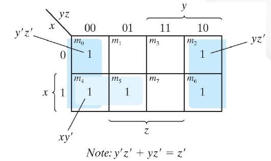

*Figure 8. Map for F(x, y, z) = Σ(0, 2, 4, 5, 6) (slide 8)*

- m₀, m₂, m₄, m₆ occupy the two outer columns in both rows, a four-square group by wrap-around. Only z = 0 is constant: the group is **z'**. (The slide notes y'z' + yz' = z'.)
- m₅ is still uncovered. The largest group containing it is m₄ and m₅ (bottom row, y = 0): **xy'**.
- **F = z' + xy'.**

**Example 4: F = A'C + A'B + AB'C + BC.** First convert the expression into minterms, then plot them.

- A'C covers m₁ and m₃; A'B covers m₂ and m₃; AB'C is m₅; BC covers m₃ and m₇.
- Therefore F(A, B, C) = Σ(1, 2, 3, 5, 7).

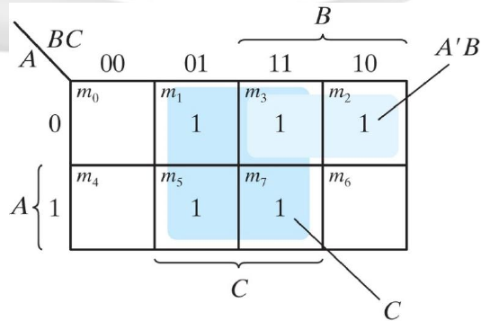

*Figure 9. Map for F = A'C + A'B + AB'C + BC (slide 8)*

- The four squares m₁, m₃, m₅, m₇ form the middle two columns, where C = 1: the group is **C**.
- m₂ remains; together with m₃ it forms **A'B**.
- **F = C + A'B.** The original expression with four terms and ten literals has been reduced to two terms and three literals.

> **Note:** On the slide, the result is labeled F(x, y, z) = Σ(1, 2, 3, 5, 7), although the variables of this example are A, B, and C. The minterm list is the same, only the variable names differ.

---

 

## 5. Four-Variable Map

### 5.1 Structure of the Map

A four-variable function (w, x, y, z) has 16 minterms. Both the rows (wx) and the columns (yz) follow the Gray code order 00, 01, 11, 10.

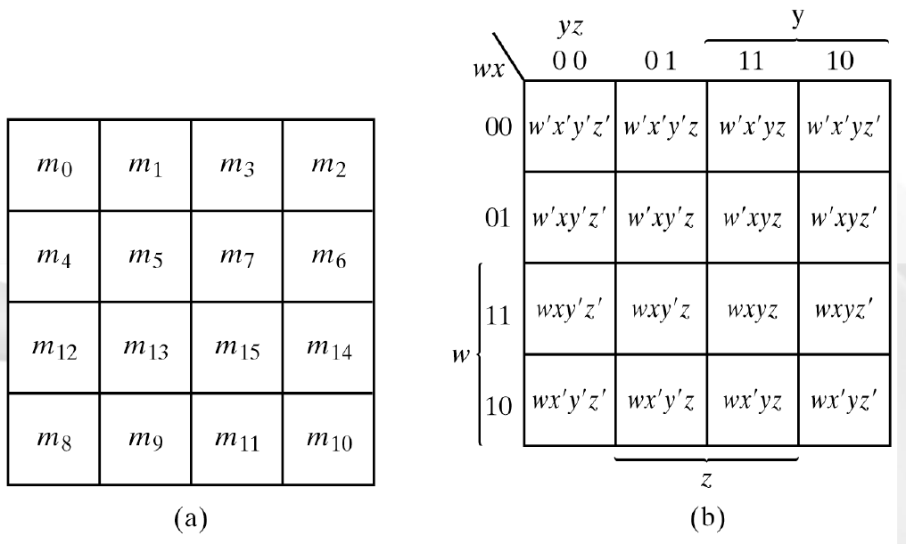

*Figure 10. Four-variable map: minterm positions and the corresponding terms (slide 9)*

| wx \ yz | 00 | 01 | 11 | 10 |
|:-------:|:--:|:--:|:--:|:--:|
| 00 | m₀ | m₁ | m₃ | m₂ |
| 01 | m₄ | m₅ | m₇ | m₆ |
| 11 | m₁₂ | m₁₃ | m₁₅ | m₁₄ |
| 10 | m₈ | m₉ | m₁₁ | m₁₀ |

- The top and bottom rows are adjacent, and the left and right columns are adjacent (the map wraps around in both directions, like the surface of a torus). Consequently, the **four corners** m₀, m₂, m₈, m₁₀ also form a group.
- In a four-variable map, a group of 2 squares gives 3 literals, 4 squares give 2 literals, 8 squares give 1 literal, and 16 squares give the constant 1.

### 5.2 Examples

**Example 1: F(w, x, y, z) = Σ(0, 1, 2, 4, 5, 6, 8, 9, 12, 13, 14).**

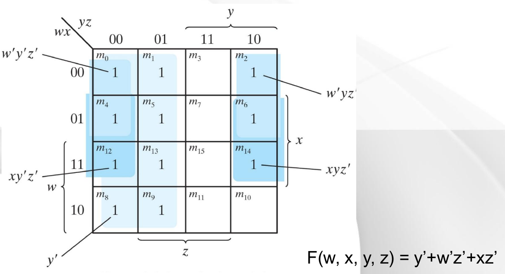

*Figure 11. Map for F(w, x, y, z) = Σ(0, 1, 2, 4, 5, 6, 8, 9, 12, 13, 14) (slide 10)*

- The two left columns (yz = 00 and 01) are entirely 1: eight squares where y = 0, giving **y'**.
- The remaining 1s are m₂, m₆, and m₁₄ in the right column. m₂ and m₆ group with m₀ and m₄ across the wrap-around (rows wx = 00 and 01, columns yz = 00 and 10): **w'z'**.
- m₁₄ groups with m₁₂, m₆, and m₄ (rows wx = 01 and 11, columns yz = 00 and 10): **xz'**.
- **F = y' + w'z' + xz'.**

**Example 2: F(A, B, C, D) = A'B'C' + B'CD' + A'BCD' + AB'C'.**

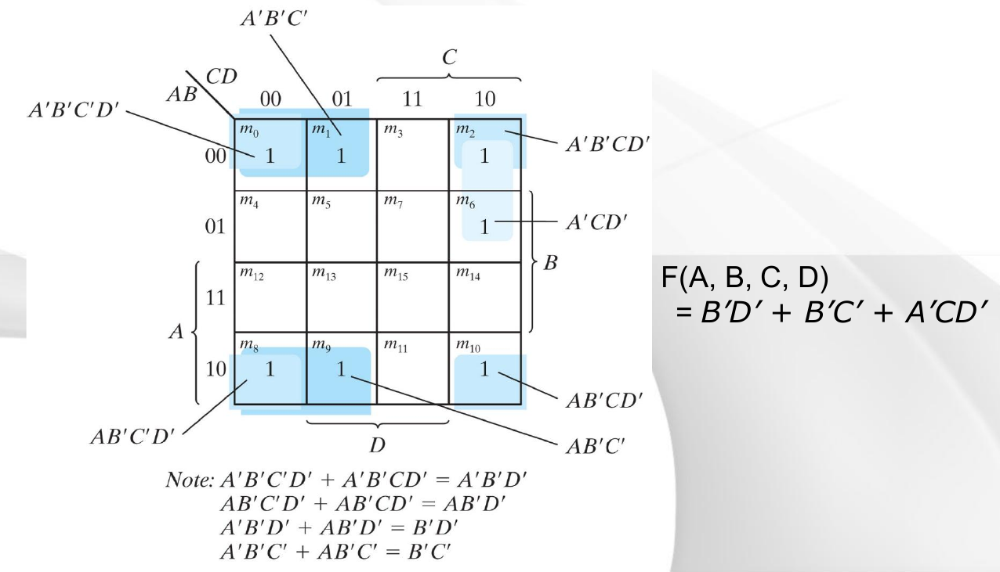

*Figure 12. Map for F = A'B'C' + B'CD' + A'BCD' + AB'C' (slide 11)*

1. Plot each term: A'B'C' covers m₀ and m₁; B'CD' covers m₂ and m₁₀; A'BCD' is m₆; AB'C' covers m₈ and m₉. The 1s are m₀, m₁, m₂, m₆, m₈, m₉, m₁₀.
2. The four corners m₀, m₂, m₈, m₁₀ form **B'D'** (the slide notes A'B'C'D' + A'B'CD' = A'B'D', AB'C'D' + AB'CD' = AB'D', and A'B'D' + AB'D' = B'D').
3. m₀, m₁, m₈, m₉ (top and bottom rows, left two columns) form **B'C'** (A'B'C' + AB'C' = B'C').
4. m₆ is left; with m₂ it forms **A'CD'**.
5. **F = B'D' + B'C' + A'CD'.**

---

 

## 6. Prime Implicants

To choose groups systematically, three terms are defined.

> **Definition:** An **implicant** is a product term that implies the function: whenever the term is 1, the function is 1 (in the map, any valid group of 1s). A **prime implicant** is an implicant obtained by combining the **maximum possible number** of adjacent squares; it cannot be enlarged. An **essential prime implicant** is a prime implicant that covers at least one minterm that **no other prime implicant** covers.

**Procedure:** first select all essential prime implicants, because every minimal expression must contain them. Then cover the remaining 1s with as few additional prime implicants as possible.

**Example: F(A, B, C, D) = Σ(0, 2, 3, 5, 7, 8, 9, 10, 11, 13, 15).**

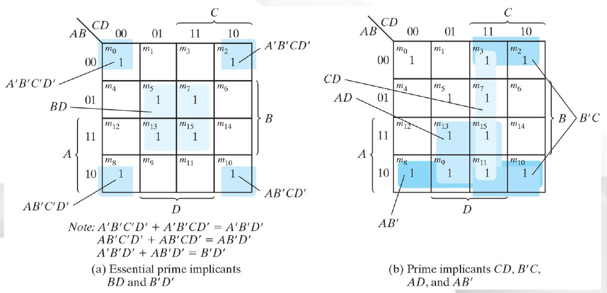

*Figure 13. Essential prime implicants and the remaining prime implicants (slide 12)*

**(a) Essential prime implicants.**

- **BD** = m₅, m₇, m₁₃, m₁₅. Minterm m₅ is covered by no other prime implicant, so BD is essential.
- **B'D'** = m₀, m₂, m₈, m₁₀ (the four corners). Minterm m₀ is covered by no other prime implicant, so B'D' is essential.

**(b) Other prime implicants.** After the essential ones, the minterms m₃, m₉, and m₁₁ remain. The available prime implicants are:

| Prime Implicant | Minterms Covered |
|:---------------:|:-----------------|
| CD | m₃, m₇, m₁₁, m₁₅ |
| B'C | m₂, m₃, m₁₀, m₁₁ |
| AD | m₉, m₁₁, m₁₃, m₁₅ |
| AB' | m₈, m₉, m₁₀, m₁₁ |

- m₃ is covered by **CD** or **B'C**.
- m₉ is covered by **AD** or **AB'**.
- m₁₁ is covered by any of the four.

Choosing one from each pair gives **four equally minimal expressions**:

- F = BD + B'D' + CD + AD
- F = BD + B'D' + CD + AB'
- F = BD + B'D' + B'C + AD
- F = BD + B'D' + B'C + AB'

> **Key Point:** A function may have more than one minimal expression. All of them have the same cost (four terms of two literals each here), and any one of them is a correct answer.

---

 

## 7. Five-Variable Map

A five-variable map (A, B, C, D, E) has 32 squares. It is drawn as **two four-variable maps**: one for A = 0 (minterms 0 to 15) and one for A = 1 (minterms 16 to 31). In each half, the rows are BC and the columns are DE.

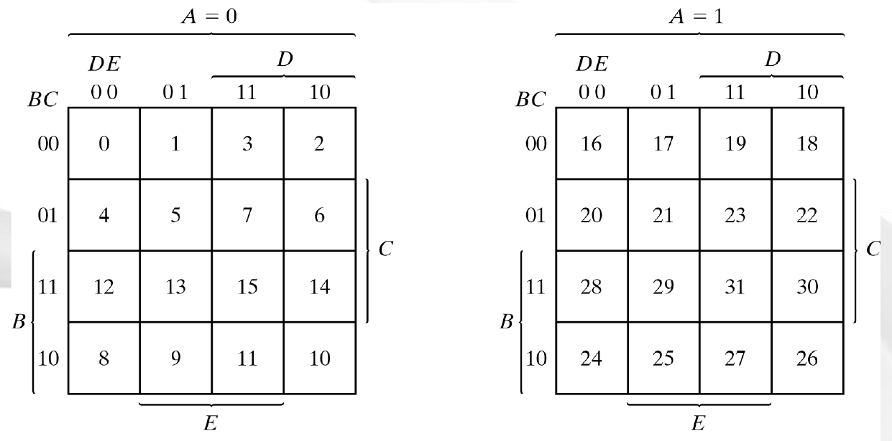

*Figure 14. Five-variable map made of two four-variable maps for A = 0 and A = 1 (slide 13)*

- Within each half, adjacency works exactly as in a four-variable map.
- In addition, **squares in the same position of the two halves are adjacent**, because they differ only in A. For example, minterm 5 (A = 0) and minterm 21 (A = 1) are adjacent.
- A group that includes the same squares in both halves loses the variable A.

> **Note:** For six or more variables, maps become difficult to draw and to read, which is the main limitation of the map method (Section 10).

---

 

## 8. Product-of-Sums Simplification

The 1s of a map give a minimal **sum of products**. The **0s** of the map represent the complement F', so grouping the 0s gives a minimal SOP for **F'**. Applying De Morgan's theorem to F' then gives a minimal **product of sums** for F.

**Example 1: F(A, B, C, D) = Σ(0, 1, 2, 5, 8, 9, 10).**

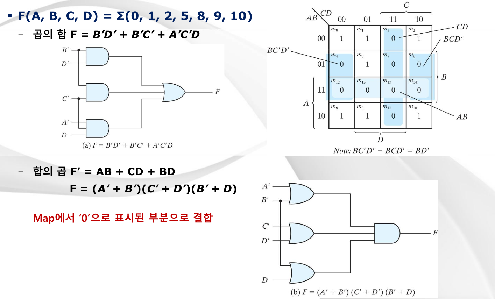

*Figure 15. Simplification of F = Σ(0, 1, 2, 5, 8, 9, 10) as a sum of products and as a product of sums (slide 14)*

**Sum of products (group the 1s).**

- The four corners m₀, m₂, m₈, m₁₀: **B'D'**.
- m₀, m₁, m₈, m₉: **B'C'**.
- m₁ and m₅: **A'C'D**.
- F = B'D' + B'C' + A'C'D, implemented as an AND-OR circuit (panel a).

**Product of sums (group the 0s).** The 0s are m₃, m₄, m₆, m₇, m₁₁, m₁₂, m₁₃, m₁₄, m₁₅.

- The row AB = 11 (m₁₂, m₁₃, m₁₄, m₁₅): **AB**.
- The column CD = 11 (m₃, m₇, m₁₁, m₁₅): **CD**.
- m₄, m₆, m₁₂, m₁₄ (rows 01 and 11, outer columns): **BD'** (the slide notes BC'D' + BCD' = BD').
- F' = AB + CD + BD'.
- Applying De Morgan's theorem: **F = (A' + B')(C' + D')(B' + D)**, implemented as an OR-AND circuit (panel b).

The slide summarizes the method in one line: **combine the squares marked '0' in the map.**

**Example 2: F(x, y, z) = Σ(1, 3, 4, 6) = Π(0, 2, 5, 7).**

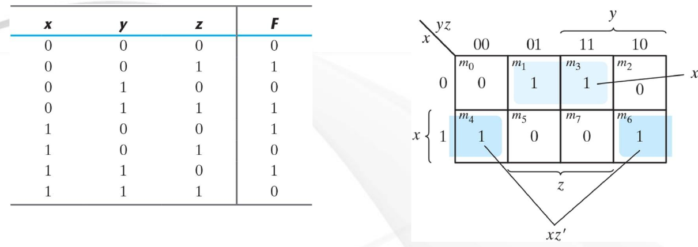

*Figure 16. Truth table and map of F = Σ(1, 3, 4, 6) (slide 15)*

- Grouping the 1s: m₁, m₃ give **x'z**, and m₄, m₆ (wrap-around) give **xz'**. Therefore **F = x'z + xz'**.
- Grouping the 0s: m₀, m₂ give x'z', and m₅, m₇ give xz. Therefore F' = xz + x'z'.
- By De Morgan's theorem: **F = (x' + z')(x + z)**.

> **Exam Tip:** For POS simplification, follow three steps: (1) group the **0s** to obtain F' in SOP form, (2) complement F' with De Morgan's theorem, and (3) check that each factor is the complement of one group. A quick way to read a 0-group directly as a sum term is to take the variables that are constant in the group and **prime those whose value is 1**, then OR them: for the group AB (A = 1, B = 1), the factor is (A' + B').

---

 

## 9. Don't-Care Conditions

In some applications, certain input combinations **never occur**. For example, a circuit that receives a BCD digit never sees the codes 1010 to 1111.

- Depending on the function, there can be input conditions that never occur.
- Inputs that never occur have no effect on the operation of the logic circuit.
- A combination of inputs that is irrelevant to the operation of the circuit is called a **don't-care condition**.
- For these unspecified minterms, it does not matter whether the output is 0 or 1.
- Don't-care conditions are used in the map to **simplify the function further**. They are marked **X**.

**How to use an X:** each X may be treated as **1 if doing so creates a larger group**, and as **0 otherwise**. An X never needs to be covered by itself.

**Example 1: F(w, x, y) = Σ(0, 1, 4, 6), with don't-care conditions d(w, x, y) = Σ(3, 5, 7).**

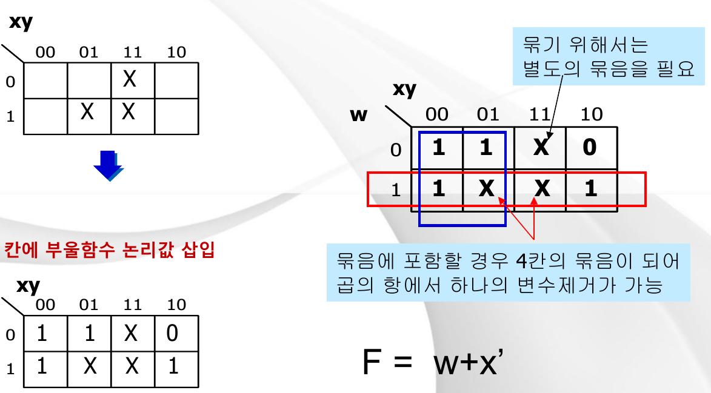

*Figure 17. Simplification of F = Σ(0, 1, 4, 6) with d = Σ(3, 5, 7) (slide 17)*

1. **Insert the don't-care conditions:** write X in squares 3, 5, and 7. Whatever value (1 or 0) these squares take does not matter.
2. **Insert the function values in the remaining squares:** 1 in squares 0, 1, 4, 6 and 0 in square 2. In the map (rows w, columns xy), the top row reads 1, 1, X, 0 and the bottom row reads 1, X, X, 1.
3. **Group:**
   - The whole bottom row (w = 1): 1, X, X, 1. Without the X's, m₆ would need a separate group; with them it joins a four-square group, and **two** variables are eliminated: **w**.
   - The two left columns (xy = 00 and 01, both rows): 1, 1, 1, X. Including the X at m₅ makes a four-square group: **x'**.
   - The X at m₃ is not needed, so it is treated as 0.
4. **F = w + x'.**

**Example 2: F(w, x, y, z) = Σ(1, 3, 7, 11, 15), with d(w, x, y, z) = Σ(0, 2, 5).**

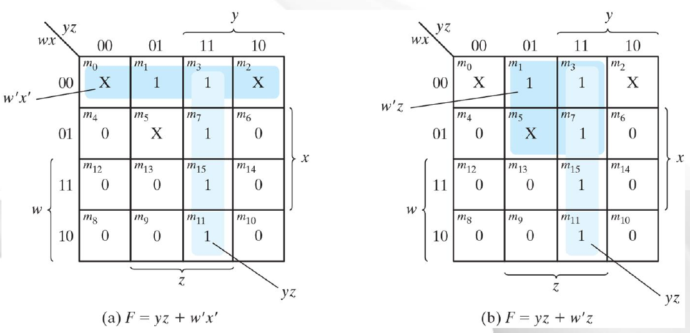

*Figure 18. Two valid simplifications of F = Σ(1, 3, 7, 11, 15) with d = Σ(0, 2, 5) (slide 18)*

- The column yz = 11 (m₃, m₇, m₁₅, m₁₁) is all 1s: **yz**.
- m₁ remains, and there are two equally good ways to cover it.
  - (a) Use the X's at m₀ and m₂ to form the top row: **w'x'**. Then F = yz + w'x' = Σ(0, 1, 2, 3, 7, 11, 15).
  - (b) Use the X at m₅ to form m₁, m₃, m₅, m₇: **w'z**. Then F = yz + w'z = Σ(1, 3, 5, 7, 11, 15).
- The two results are different functions, but they differ **only in the don't-care minterms** (0, 2, and 5), so both satisfy the specification.

---

 

## 10. Characteristics of the Karnaugh Map

**Advantages:**

- Complex Boolean functions can be simplified simply and visually with a picture.
- Even without knowing complex formulas or theorems, one can easily simplify Boolean functions with experience and practice.
- The simplified result can be checked easily.

**Disadvantages:**

- With **six or more variables**, the map is hard to draw, and it becomes difficult to extract the relationship between inputs and outputs.
- The method is **hard to program**, because it relies on visual pattern recognition.
- The designer must simplify every case by hand, and **different designers may obtain different simplified results** (as Section 6 showed, several minimal answers can exist).

> **[Algorithms]** The weaknesses of the K-map are addressed by algorithmic methods. The **Quine-McCluskey (tabulation) method** performs the same merging of adjacent minterms systematically with tables, so it can be programmed for any number of variables. However, exact two-level minimization is computationally hard: finding a minimum cover of the prime implicants is a set cover problem, which is NP-hard. Practical synthesis tools therefore use heuristic minimizers such as **Espresso**, which find near-minimal results quickly.

---

 

## 11. NAND and NOR Implementation

Digital circuits are often built with NAND or NOR gates only, because these gates are easier to fabricate than AND and OR gates. This section shows how to convert a Boolean function into a NAND-only or NOR-only circuit.

### 11.1 NAND Circuits

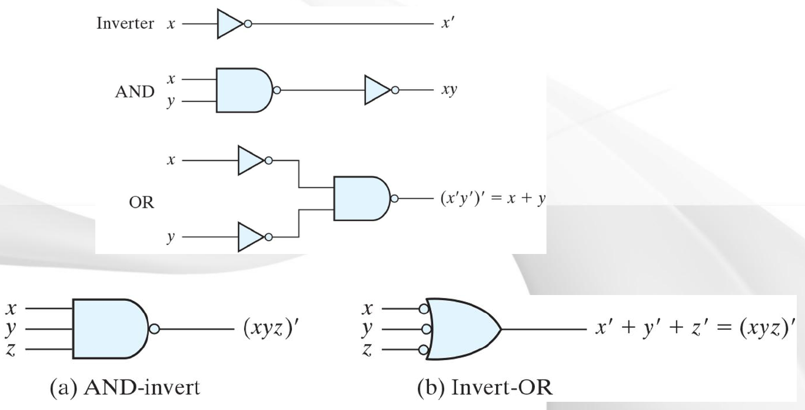

*Figure 19. Logic operations with NAND gates, and the two graphic symbols of the NAND gate (slide 20)*

- **Inverter:** a NAND gate with its inputs tied together outputs x'.
- **AND:** a NAND gate followed by a NAND inverter outputs ((xy)')' = xy.
- **OR:** NAND inverters on each input followed by a NAND gate output (x'y')' = x + y, by De Morgan's theorem.

The NAND gate has two equivalent graphic symbols:

- (a) **AND-invert:** an AND symbol with a bubble at the output, (xyz)'.
- (b) **Invert-OR:** an OR symbol with bubbles at the inputs, x' + y' + z' = (xyz)'.

Both symbols describe exactly the same gate. Choosing the right symbol in each position of a diagram makes the conversion of AND-OR circuits easy.

### 11.2 Two-Level NAND Implementation

**Example:** F = AB + CD = ((AB)'(CD)')'.

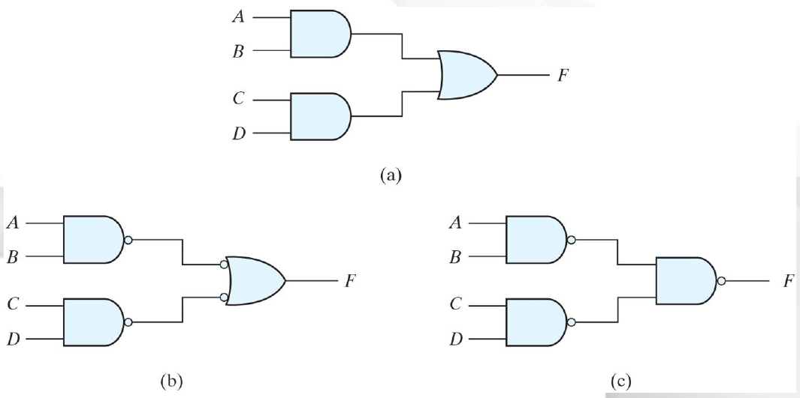

*Figure 20. Three ways to implement F = AB + CD (slide 21)*

- (a) The original **AND-OR** circuit.
- (b) The AND gates are replaced by NAND gates (AND-invert), and the OR gate by an **invert-OR** symbol. The bubble at each NAND output and the bubble at the corresponding OR input cancel each other, so the function is unchanged.
- (c) The invert-OR symbol is redrawn as a NAND symbol. The circuit is now **NAND-NAND**, and it still computes F = AB + CD.

> **Key Point:** **Any SOP expression can be implemented with two levels of NAND gates**: replace every AND gate and the final OR gate with NAND gates, keeping the same connections. The reason is De Morgan's theorem: ((AB)'(CD)')' = AB + CD.

### 11.3 Implementing a Function with NAND Gates

**Example:** F(x, y, z) = Σ(1, 2, 3, 4, 5, 7).

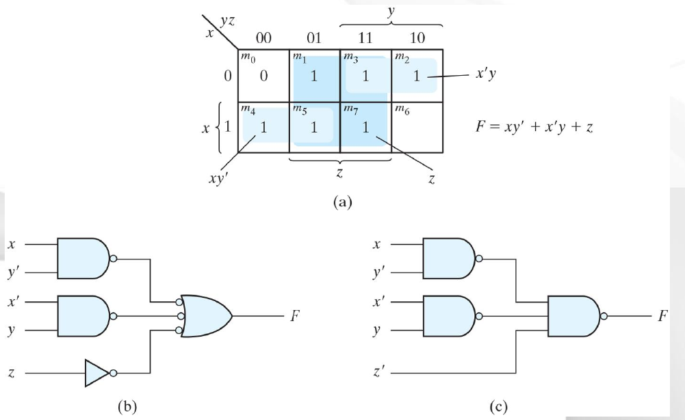

*Figure 21. Simplifying F = Σ(1, 2, 3, 4, 5, 7) and implementing it with NAND gates (slide 22)*

1. **Simplify with the map (a):** m₄, m₅ give **xy'**; m₂, m₃ give **x'y**; m₁, m₃, m₅, m₇ (the columns where z = 1) give **z**. Therefore F = xy' + x'y + z.
2. **Draw with AND-invert and invert-OR symbols (b):** the two product terms go through NAND gates into an invert-OR gate. The single literal z enters the OR level directly, so its input bubble must be compensated by an inverter in front of it.
3. **Pure NAND form (c):** the inverter on z is removed by feeding the complemented literal **z'** directly into the output NAND gate.

> **Exam Tip:** In a NAND-NAND conversion, a **single literal** that goes directly to the second-level gate must be **complemented**. Forgetting this is the most common mistake.

### 11.4 Multilevel NAND Circuits

**Example:** F = A(CD + B) + BC'.

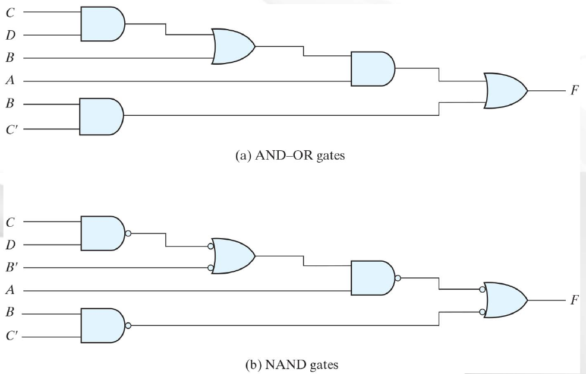

*Figure 22. Multilevel implementation of F = A(CD + B) + BC' with AND-OR gates and with NAND gates (slide 23)*

- (a) **AND-OR gates:** CD is formed by an AND gate, ORed with B, ANDed with A, and finally ORed with BC'. The levels alternate AND, OR, AND, OR.
- (b) **NAND gates:** every AND gate is replaced by an AND-invert (NAND) symbol and every OR gate by an invert-OR (NAND) symbol, so that each output bubble meets an input bubble on the next gate and cancels.
  - The input B goes directly into an invert-OR gate without a preceding bubble, so it is complemented to **B'** to compensate for the input bubble.
  - The result uses only NAND gates and computes the same F.

**General rule:** convert each AND to AND-invert and each OR to invert-OR. Wherever a bubble is not matched by another bubble on the same line, insert an inverter or complement the input literal.

### 11.5 NOR Circuits

The NOR gate is the dual of the NAND gate, so all the procedures are dual.

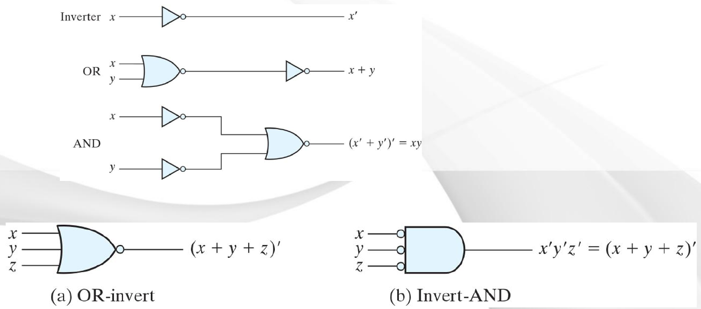

*Figure 23. Logic operations with NOR gates, and the two graphic symbols of the NOR gate (slide 24)*

- **Inverter:** a NOR gate with its inputs tied together outputs x'.
- **OR:** a NOR gate followed by a NOR inverter outputs x + y.
- **AND:** NOR inverters on each input followed by a NOR gate output (x' + y')' = xy.
- The two graphic symbols are (a) **OR-invert**, (x + y + z)', and (b) **invert-AND**, x'y'z' = (x + y + z)'.

> **Key Point:** **Any POS expression can be implemented with two levels of NOR gates** (NOR-NOR), just as any SOP expression can be implemented with NAND-NAND.

### 11.6 Implementations with NOR Gates

**Example 1:** F = (A + B)(C + D)E.

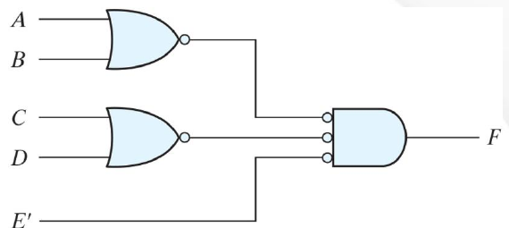

*Figure 24. Implementation of F = (A + B)(C + D)E with NOR gates (slide 25)*

- Two NOR gates produce (A + B)' and (C + D)'.
- The output gate is drawn as **invert-AND** (a NOR gate): its input bubbles turn (A + B)' and (C + D)' back into (A + B) and (C + D), and they turn the third input E' into E.
- Because E enters the output gate directly, it must be supplied **complemented** (E'), just like the single literal in Section 11.3.

**Example 2:** F = (AB' + A'B)(C + D').

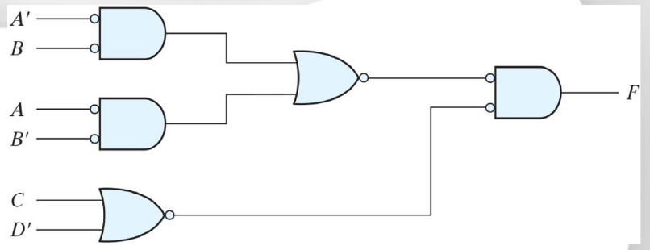

*Figure 25. Implementation of F = (AB' + A'B)(C + D') with NOR gates (slide 25)*

- The two invert-AND gates (NOR gates) with inputs A', B and A, B' produce (A' + B)' = AB' and (A + B')' = A'B.
- A NOR gate combines them into (AB' + A'B)'.
- Another NOR gate with inputs C and D' produces (C + D')'.
- The output invert-AND gate inverts both inputs and ANDs them: F = (AB' + A'B)(C + D').

> **Note:** The slide writes this function as F = (AB' + A'B)(C + D)', but the circuit, which feeds C and D' into the NOR gate, implements F = (AB' + A'B)(C + D'). The latter matches the figure and the textbook.

---

 

## 12. Exclusive-OR Function

### 12.1 Identities and Implementations

The exclusive-OR (XOR) and its complement, the exclusive-NOR, are defined as follows.

- x ⊕ y = xy' + x'y
- (x ⊕ y)' = (xy' + x'y)' = xy + x'y'

**How the expression x ⊕ y = xy' + x'y is obtained:** write the truth table of x and y, mark the result F of the XOR (1 in rows 01 and 10), and write F as the sum of the minterms of those rows: x'y + xy'.

**Identities:**

| Identity | Reason |
|:---------|:-------|
| x ⊕ 0 = x | XOR with 0 leaves x unchanged |
| x ⊕ 1 = x' | XOR with 1 inverts x |
| x ⊕ x = 0 | Equal inputs give 0 |
| x ⊕ x' = 1 | Different inputs give 1 |
| x ⊕ y' = x' ⊕ y = (x ⊕ y)' | Complementing one input complements the output |
| A ⊕ B = B ⊕ A | Commutative |
| (A ⊕ B) ⊕ C = A ⊕ (B ⊕ C) = A ⊕ B ⊕ C | Associative |

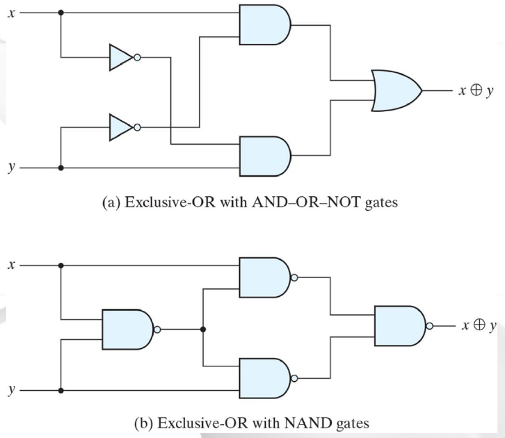

*Figure 26. Exclusive-OR implemented with AND-OR-NOT gates and with NAND gates (slide 26)*

- (a) **AND-OR-NOT:** two inverters produce x' and y', two AND gates produce xy' and x'y, and an OR gate combines them.
- (b) **Four NAND gates:** the first NAND gate produces n = (xy)'. The two middle NAND gates produce (xn)' and (yn)', and the output NAND gate produces ((xn)'(yn)')' = xn + yn = (x + y)(xy)' = (x + y)(x' + y') = xy' + x'y. No separate inverters are needed.

### 12.2 Odd and Even Functions

A three-input XOR, A ⊕ B ⊕ C, equals 1 when an **odd number** of the inputs are 1. It is therefore called the **odd function**. Its complement equals 1 when an **even number** of the inputs are 1 and is called the **even function**.

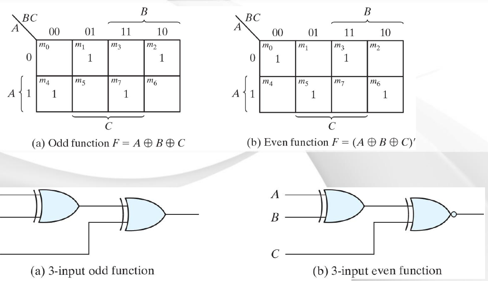

*Figure 27. Maps and circuits of the three-input odd and even functions (slide 27)*

- **Odd function F = A ⊕ B ⊕ C = Σ(1, 2, 4, 7).** The input patterns of these minterms, written as ABC, are 001, 010, 100, and 111: each contains an odd number of 1s.
- **Even function F = (A ⊕ B ⊕ C)' = Σ(0, 3, 5, 6).** The patterns are 000, 011, 101, and 110: each contains an even number of 1s.
- **Circuits:** (a) the odd function is two cascaded XOR gates; (b) the even function is an XOR gate followed by an XNOR gate. Since the operation is a chain of exclusive comparisons, only the **last** gate carries the inversion bubble.

> **Note:** In the maps, the 1s of the odd and even functions form a **checkerboard** pattern: no two 1s are adjacent, because changing any single input changes the number of 1s by one and thus flips the parity. A K-map therefore cannot simplify these functions at all, which is why XOR gates are used to implement them.

### 12.3 Parity Generation and Checking

A **parity bit** is an extra bit attached to a message so that the total number of 1s is even (**even parity**) or odd (**odd parity**). It is used to detect errors during transmission.

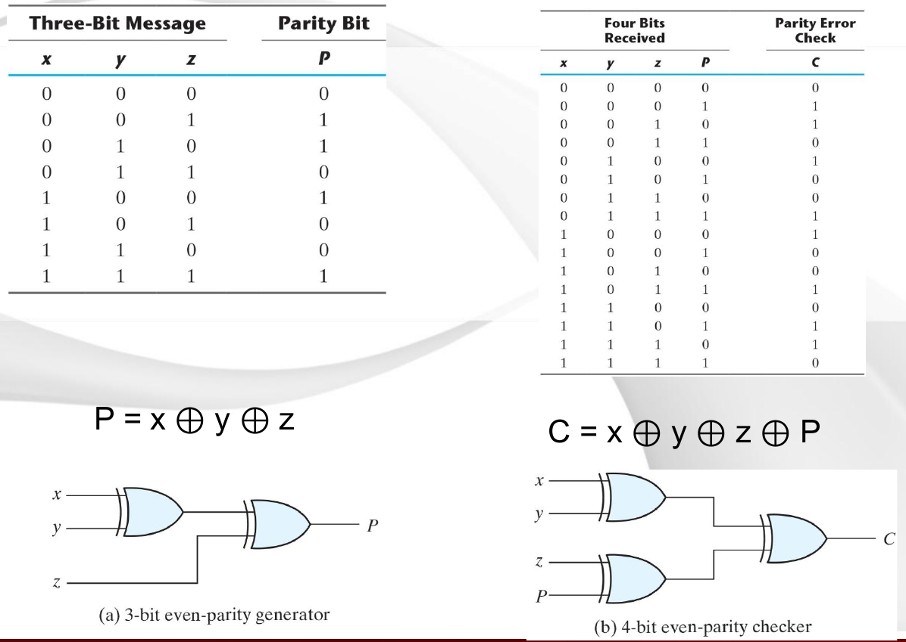

*Figure 28. Three-bit even-parity generator and four-bit even-parity checker (slide 28)*

**Generator.** For a 3-bit message xyz, the even-parity bit P makes the total number of 1s in the four bits even. P must be 1 exactly when the message itself has an odd number of 1s, so **P = x ⊕ y ⊕ z**.

| x | y | z | P |
|:-:|:-:|:-:|:-:|
| 0 | 0 | 0 | 0 |
| 0 | 0 | 1 | 1 |
| 0 | 1 | 0 | 1 |
| 0 | 1 | 1 | 0 |
| 1 | 0 | 0 | 1 |
| 1 | 0 | 1 | 0 |
| 1 | 1 | 0 | 0 |
| 1 | 1 | 1 | 1 |

**Checker.** The receiver gets the four bits x, y, z, P. If no error occurred, the number of 1s is even. The parity error check bit **C = x ⊕ y ⊕ z ⊕ P** is 1 exactly when the received bits contain an odd number of 1s, which signals an error.

| x | y | z | P | C | x | y | z | P | C |
|:-:|:-:|:-:|:-:|:-:|:-:|:-:|:-:|:-:|:-:|
| 0 | 0 | 0 | 0 | 0 | 1 | 0 | 0 | 0 | 1 |
| 0 | 0 | 0 | 1 | 1 | 1 | 0 | 0 | 1 | 0 |
| 0 | 0 | 1 | 0 | 1 | 1 | 0 | 1 | 0 | 0 |
| 0 | 0 | 1 | 1 | 0 | 1 | 0 | 1 | 1 | 1 |
| 0 | 1 | 0 | 0 | 1 | 1 | 1 | 0 | 0 | 0 |
| 0 | 1 | 0 | 1 | 0 | 1 | 1 | 0 | 1 | 1 |
| 0 | 1 | 1 | 0 | 0 | 1 | 1 | 1 | 0 | 1 |
| 0 | 1 | 1 | 1 | 1 | 1 | 1 | 1 | 1 | 0 |

Both circuits share the same structure: the output (P or C) is 1 **only when the number of 1s at the inputs is odd**. The generator is a chain of two XOR gates, and the checker is a tree of three XOR gates.

> **[Computer Networks]** Parity is the simplest error-detecting code. A single parity bit detects any error that flips an **odd** number of bits, but it misses errors that flip two bits, because the parity is unchanged. Network protocols therefore use stronger codes such as the Internet checksum and the CRC (cyclic redundancy check), and memory systems use ECC codes that can also correct single-bit errors. All of these are built from the same XOR operation.

---

 

## Summary

| Concept | Key Summary |
|:--------|:------------|
| De Morgan | (AB)' = A' + B' and (A + B)' = A'B'; NAND equals invert-OR and NOR equals invert-AND. |
| K-map | A grid of minterms in Gray code order so that adjacent squares differ in one variable; edges wrap around. |
| Grouping | Rectangles of 1, 2, 4, 8, ... squares, as large and as few as possible; a group of $2^k$ squares in an n-variable map gives n - k literals. |
| Prime implicants | Essential prime implicants are always included; the remaining 1s are covered with as few prime implicants as possible; several minimal answers may exist. |
| 5-variable map | Two 4-variable maps (A = 0 and A = 1); equal positions in the two halves are adjacent. |
| POS | Group the 0s to get F', then apply De Morgan's theorem. |
| Don't-care | X squares may be treated as 1 or 0, whichever gives larger groups. |
| K-map limits | Hard beyond 5 to 6 variables, hard to program, designer-dependent results. |
| NAND / NOR | SOP becomes NAND-NAND and POS becomes NOR-NOR; single literals entering the second level must be complemented. |
| XOR | x ⊕ y = xy' + x'y; the odd function is A ⊕ B ⊕ C; parity generators and checkers are XOR chains. |

---

 

## Self-Check Questions

1. **Gray Code Order:** Why are the columns of a three-variable map ordered 00, 01, 11, 10?

   > **Answer:** This Gray code order makes neighboring columns differ in exactly one bit, so that physically adjacent squares represent minterms that differ in one variable. Such minterms can be combined by xy + xy' = x, which is the basis of map simplification.

2. **Three-Variable Map:** Simplify F(x, y, z) = Σ(0, 2, 4, 5, 6).

   > **Answer:** m₀, m₂, m₄, m₆ form a four-square group (the outer columns) that gives z'. m₅ groups with m₄ to give xy'. Therefore F = z' + xy'.

3. **Essential Prime Implicants:** For F(A, B, C, D) = Σ(0, 2, 3, 5, 7, 8, 9, 10, 11, 13, 15), which prime implicants are essential, and why?

   > **Answer:** BD and B'D' are essential. Minterm m₅ is covered only by BD, and minterm m₀ is covered only by B'D'. Every minimal expression must therefore contain both of them.

4. **POS Simplification:** Simplify F(x, y, z) = Σ(1, 3, 4, 6) into product-of-sums form.

   > **Answer:** The 0s are m₀, m₂ (giving x'z') and m₅, m₇ (giving xz), so F' = xz + x'z'. By De Morgan's theorem, F = (x' + z')(x + z).

5. **Don't-Care Conditions:** Simplify F(w, x, y) = Σ(0, 1, 4, 6) with d = Σ(3, 5, 7).

   > **Answer:** Treating X at m₅ and m₇ as 1, the bottom row (m₄, m₅, m₆, m₇) gives w and the left two columns (m₀, m₁, m₄, m₅) give x'. The X at m₃ is treated as 0. Therefore F = w + x'.

6. **NAND Implementation:** Implement F = xy' + x'y + z with NAND gates only.

   > **Answer:** Use one NAND gate with inputs x, y' and another with inputs x', y. Feed their outputs, together with the complemented literal z', into a three-input output NAND gate. The output is ((xy')' (x'y)' z')' = xy' + x'y + (z')' = xy' + x'y + z, by De Morgan's theorem.

7. **XOR with NAND Gates:** Show that the four-NAND circuit computes x ⊕ y.

   > **Answer:** Let n = (xy)'. The middle gates produce (xn)' and (yn)', and the output gate produces ((xn)'(yn)')' = xn + yn = (x + y)(xy)' = (x + y)(x' + y') = xy' + x'y = x ⊕ y.

8. **Parity:** A receiver gets x y z P = 1 0 1 1 from an even-parity system. Is there an error?

   > **Answer:** C = 1 ⊕ 0 ⊕ 1 ⊕ 1 = 1. The number of 1s (three) is odd, so C = 1 signals that an error has occurred.

---
