# Lecture 05 — Verilog HDL Design

> **Last Updated:** 2026-10-07
>
> Digital Design, Mano and Ciletti - Ch 3, 4, 7

> **Learning Objectives**:
> 1. Describe how integrated circuit design evolved and explain each step of the typical design flow, including the roles of simulation and synthesis
> 2. Compare digital logic technologies (standard logic, PLDs, CPLDs, FPGAs, ASICs, full custom) and explain how an FPGA is organized
> 3. Explain the advantages of HDL-based design and the history of Verilog HDL
> 4. Write Verilog modules with ports, nets, variables, vectors, constants, and parameters, and connect modules by instantiation
> 5. Distinguish gate-level, register transfer level (dataflow), and behavioral modeling, and use `assign`, `initial`, `always`, `if`, `case`, and `function`
> 6. Explain the difference between blocking and nonblocking assignments and choose the correct one for combinational and sequential circuits
> 7. Use Verilog operators and their precedence, and write test benches with system tasks such as `$display`, `$monitor`, and `$finish`

---

## Table of Contents

- [1. Introduction](#1-introduction)
  - [1.1 Evolution of Integrated Circuit Design](#11-evolution-of-integrated-circuit-design)
  - [1.2 Typical Design Flow of an Integrated Circuit](#12-typical-design-flow-of-an-integrated-circuit)
- [2. Introduction to FPGA](#2-introduction-to-fpga)
  - [2.1 Digital Logic Technologies](#21-digital-logic-technologies)
  - [2.2 Programmable Logic Devices](#22-programmable-logic-devices)
  - [2.3 Technology Trade-offs](#23-technology-trade-offs)
  - [2.4 Examples of FPGAs](#24-examples-of-fpgas)
- [3. HDL-Based Design](#3-hdl-based-design)
  - [3.1 HDL Design Compared with Computer Programming](#31-hdl-design-compared-with-computer-programming)
  - [3.2 Advantages of HDL-Based Design](#32-advantages-of-hdl-based-design)
  - [3.3 History of Verilog HDL](#33-history-of-verilog-hdl)
- [4. Modules](#4-modules)
  - [4.1 Module Hierarchy](#41-module-hierarchy)
  - [4.2 Structure of a Module](#42-structure-of-a-module)
  - [4.3 Basic Syntax Rules](#43-basic-syntax-rules)
  - [4.4 Ports](#44-ports)
- [5. Data Types](#5-data-types)
  - [5.1 Net Data Types](#51-net-data-types)
  - [5.2 Variable Data Types](#52-variable-data-types)
  - [5.3 Declaration Syntax and Vectors](#53-declaration-syntax-and-vectors)
  - [5.4 Logic Values](#54-logic-values)
  - [5.5 Number Constants](#55-number-constants)
  - [5.6 Parameters](#56-parameters)
- [6. Instantiation](#6-instantiation)
  - [6.1 Connecting Ports by Name and by Order](#61-connecting-ports-by-name-and-by-order)
  - [6.2 Example: A 4-Bit Adder Built from Full Adders](#62-example-a-4-bit-adder-built-from-full-adders)
- [7. Levels of Abstraction and Modeling Styles](#7-levels-of-abstraction-and-modeling-styles)
- [8. Gate-Level Modeling](#8-gate-level-modeling)
- [9. Register Transfer Level (Dataflow) Modeling](#9-register-transfer-level-dataflow-modeling)
- [10. Behavioral Modeling](#10-behavioral-modeling)
  - [10.1 Overview](#101-overview)
  - [10.2 The initial Statement](#102-the-initial-statement)
  - [10.3 The always Statement](#103-the-always-statement)
  - [10.4 Examples of always Blocks](#104-examples-of-always-blocks)
  - [10.5 Blocking and Nonblocking Assignments](#105-blocking-and-nonblocking-assignments)
  - [10.6 The if Statement](#106-the-if-statement)
  - [10.7 Example: A Counter That Cycles Through 2, 3, 4, 7, 8, 10, 11](#107-example-a-counter-that-cycles-through-2-3-4-7-8-10-11)
  - [10.8 The case Statement](#108-the-case-statement)
  - [10.9 Comparing case and if: A 4x1 Multiplexer](#109-comparing-case-and-if-a-4x1-multiplexer)
  - [10.10 The function Statement](#1010-the-function-statement)
- [11. Operators](#11-operators)
  - [11.1 Arithmetic Operators](#111-arithmetic-operators)
  - [11.2 Relational and Equality Operators](#112-relational-and-equality-operators)
  - [11.3 Logical and Shift Operators](#113-logical-and-shift-operators)
  - [11.4 Bitwise Operators](#114-bitwise-operators)
  - [11.5 Reduction Operators](#115-reduction-operators)
  - [11.6 Concatenation and Conditional Operators](#116-concatenation-and-conditional-operators)
  - [11.7 Operator Precedence](#117-operator-precedence)
- [12. Summary of a Verilog Module](#12-summary-of-a-verilog-module)
- [13. Test Bench](#13-test-bench)
  - [13.1 Purpose of a Test Bench](#131-purpose-of-a-test-bench)
  - [13.2 Main System Tasks and Functions](#132-main-system-tasks-and-functions)
  - [13.3 A Complete Test Bench Example](#133-a-complete-test-bench-example)
- [Summary](#summary)
- [Self-Check Questions](#self-check-questions)

---

<br>

## 1. Introduction

### 1.1 Evolution of Integrated Circuit Design

As integrated circuits grew from a few hundred gates to hundreds of thousands of gates and beyond, the way they were designed changed completely.

| Aspect | 1960s to 1970s | 1980s | 1990s to Present |
|:-------|:---------------|:------|:-----------------|
| **Design method** | Transistor level, bottom-up | Gate level (top-down combined with bottom-up) | Algorithm and function level, top-down |
| **Design tool** | Layout editor | Schematic editor | HDL synthesizer |
| **Design scale** | Up to 1K gates (gates, counters, MUXes) | 10K to 100K gates (microprocessors) | Over 100K gates (high-performance processors) |

- **Bottom-up** design starts from small parts (transistors, gates) and assembles them into larger blocks.
- **Top-down** design starts from the function of the whole system and refines it step by step into smaller blocks.
- A **layout editor** draws the physical shapes of transistors on the chip; a **schematic editor** draws gate-level circuit diagrams; an **HDL synthesizer** automatically converts a textual hardware description into gates.

> **Key Point:** Modern chips are far too large to draw by hand. Designers describe the **function** in an HDL, and synthesis tools generate the gates automatically, in the same way that a compiler generates machine code from a high-level program.

### 1.2 Typical Design Flow of an Integrated Circuit

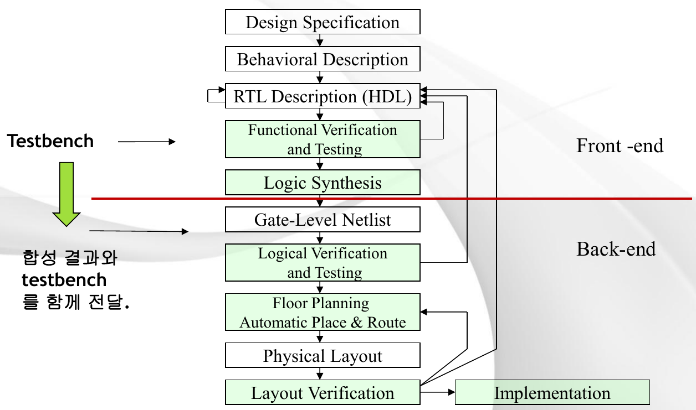

*Lecture 05, Slide 3 — Typical design flow of an integrated circuit*

The flow proceeds from top to bottom.

| Step | What Happens |
|:-----|:-------------|
| 1. Design Specification | The required function, performance, and interfaces are written down. |
| 2. Behavioral Description | The algorithm of the design is described at a high level, without hardware detail. |
| 3. RTL Description (HDL) | The design is written in an HDL at the register transfer level: registers and the data transfers between them. |
| 4. Functional Verification and Testing | A **test bench** applies input patterns to the RTL description in a simulator, and the outputs are compared with the expected behavior. ModelSim plays this role in this course. |
| 5. Logic Synthesis | A synthesis tool converts the RTL description into gates. |
| 6. Gate-Level Netlist | The result of synthesis: a list of gates and the wires (nets) that connect them. |
| 7. Logical Verification and Testing | The synthesized netlist is simulated again with the same test bench, so the **synthesis result and the test bench are passed on together**. |
| 8. Floor Planning, Automatic Place and Route | The gates are placed on the chip area and the wires are routed between them. |
| 9. Physical Layout | The final geometric shapes of the chip are produced. |
| 10. Layout Verification | The layout is checked against design rules and against the netlist. |
| 11. Implementation | The chip is manufactured (or, for an FPGA, the device is programmed). |

- Steps 1 to 5 form the **front-end** (the logical design), and steps 6 to 11 form the **back-end** (the physical design). The red line on the slide marks the boundary just after logic synthesis.
- The arrows that point back upward show **iteration**: if verification fails at any step, the designer returns to the RTL description (or to floor planning) to correct the design.

---

<br>

## 2. Introduction to FPGA

### 2.1 Digital Logic Technologies

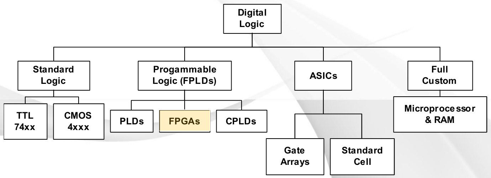

*Lecture 05, Slide 4 — Classification of digital logic technologies*

| Category | Members | Description |
|:---------|:--------|:------------|
| **Standard logic** | TTL 74xx, CMOS 4xxx | Small fixed-function chips (a few gates or flip-flops each) that are wired together on a board. |
| **Programmable logic (FPLDs)** | PLDs, **FPGAs**, CPLDs | Field-programmable logic devices whose function is set by the user after manufacturing. |
| **ASICs** | Gate arrays, standard cell | Application-specific integrated circuits, manufactured for one particular design. |
| **Full custom** | Microprocessors and RAM | Every transistor is designed by hand for maximum performance and density. |

The FPGA, highlighted on the slide, is the technology used in this course.

### 2.2 Programmable Logic Devices

Programmable devices are built from the same two-level structure studied earlier: an array of AND gates (which form product terms) followed by an array of OR gates (which form sums). They differ in which arrays can be programmed.

| Device | Structure | Characteristics |
|:-------|:----------|:----------------|
| **PROM** (Programmable ROM) | Fixed AND array that acts as a decoder, plus a programmable OR array | Mainly used as address-specified memory; because the AND gates are fixed, it is not used as a logic element. |
| **PLA** (Programmable Logic Array) | Both the AND inputs and the OR inputs are programmable | Most flexible, but operating speed and density are lower. |
| **PAL** (Programmable Array Logic) | Only the AND inputs are programmable; the OR inputs are fixed | The most widely used device of this family. |
| **CPLD** (Complex Programmable Logic Device) | Extended blocks of PALs together with programmable registers (EEPROM) | Suitable where fast performance or accurate timing prediction is required. |
| **FPGA** (Field Programmable Gate Array) | A collection of basic cells, each made of a **LUT** (look-up table) and a **D flip-flop** | Excellent for implementing sequential logic; very flexible and highly integrated, with various built-in features such as memory, LVDS, and IP. |

> **Definition:** A **LUT (look-up table)** is a small memory with k address inputs and one data output. By storing the 2ᵏ output values of a truth table, a k-input LUT can implement **any** Boolean function of k variables. **LVDS** (low-voltage differential signaling) is a high-speed signaling standard for input and output pins, and **IP** (intellectual property) cores are pre-designed blocks, such as memory controllers or processors, that can be placed in a design.

> **[Computer Architecture]** The LUT is the reason an FPGA is "universal": instead of building a function from gates, the FPGA simply stores the function's truth table. A 4-input LUT holds 2⁴ = 16 bits, one for each row. Programming an FPGA therefore means filling thousands of small truth tables and setting the switches that connect them.

### 2.3 Technology Trade-offs

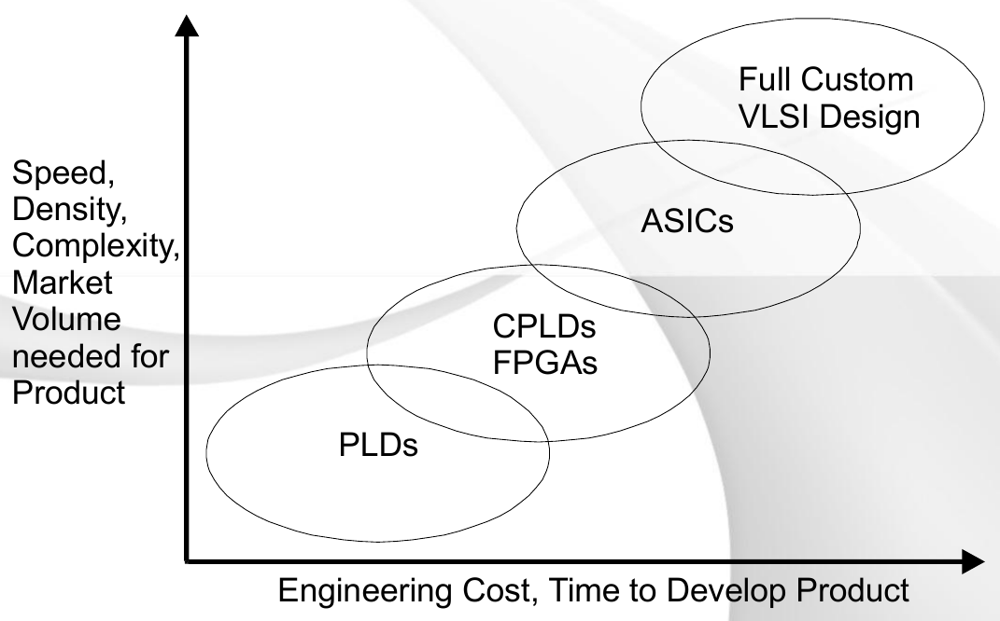

*Lecture 05, Slide 6 — Trade-offs among digital logic technologies*

- The horizontal axis is the **engineering cost and the time needed to develop a product**.
- The vertical axis is **speed, density, complexity, and the market volume needed for the product** to be profitable.
- From the lower left to the upper right, the technologies are PLDs, then CPLDs and FPGAs, then ASICs, and finally full custom VLSI design. ASICs and full custom designs (circled in red) are what is commonly called an **IC**, a chip manufactured for one design.

The trade-off is clear: higher performance and density require more development cost and time, and they only pay off when the product is sold in large volumes. FPGAs sit in the middle: no chip has to be manufactured, so they are ideal for prototyping, education, and products with small volumes.

### 2.4 Examples of FPGAs

The slide shows photographs of commercial FPGA chips: the **Altera Arria V SoC**, the **Xilinx Artix-7** (XC7A100T), the **Microsemi SmartFusion2**, and the **Lattice ECP3**, together with an illustration of the many functional blocks inside an FPGA.

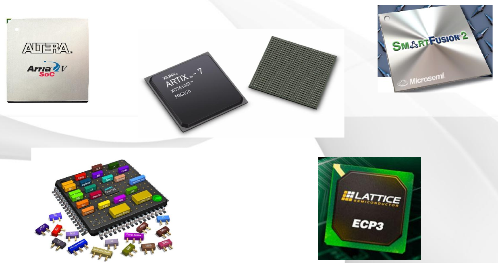

*Lecture 05, Slide 7 — Examples of commercial FPGA chips*

> **Note:** Altera was acquired by Intel in 2015, which is why the Altera FPGA families and the Quartus design software are now distributed under the Intel brand. Xilinx was acquired by AMD in 2022.

---

<br>

## 3. HDL-Based Design

### 3.1 HDL Design Compared with Computer Programming

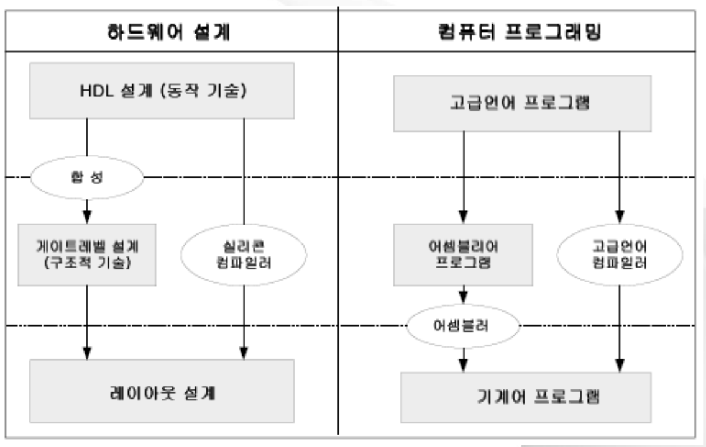

*Lecture 05, Slide 8 — Comparison of HDL design and computer programming*

| Hardware Design | Computer Programming |
|:----------------|:---------------------|
| HDL design (behavioral description) | High-level language program |
| **Synthesis** turns it into a gate-level design (structural description) | An **assembler** path turns it into an assembly program and then machine code |
| A **silicon compiler** can turn it directly into a layout | A **high-level language compiler** turns it directly into machine code |
| Final product: layout design | Final product: machine program |

The two flows are parallel: in both, a description written by a human at a high level is translated automatically into a low-level form that can be executed (by a processor) or manufactured (as a chip).

> **[Programming Languages]** The analogy goes further. Just as a compiler front-end parses source code into an intermediate representation and a back-end generates machine code for a particular processor, a synthesis tool parses the HDL into an internal netlist and then maps it onto the gates of a particular technology library or FPGA. Because of this separation, the same HDL source can be retargeted to different chips, just as the same C program can be compiled for different processors.

### 3.2 Advantages of HDL-Based Design

**1. Shorter design time**

- Design errors are easy to correct in the early design stage, because they are found by simulation before any hardware exists.
- Circuits are generated by synthesis, so design changes are easy: edit the text and synthesize again.

**2. Improved design quality**

- An HDL has excellent and extensive power to describe hardware, so designs can be written at a higher level.
- The designer can explore various design techniques and reach an optimized result.
- Synthesis can apply selective optimization techniques (for example, optimizing for speed or for area).

**3. Design independent of a specific technology or process**

- The design does not depend on a particular ASIC manufacturer or implementation technology.
- The same HDL design can be synthesized with different libraries.
- Rapid hardware **prototyping** (for example, on an FPGA) is possible.

**4. Lower design cost**

- Design productivity increases through the use of high-level design tools.
- Design cost decreases because the design period is shorter.
- Design cost decreases because design assets (previously written modules) can be reused.

**5. Standard HDL and a growing user base**

- The HDL is an IEEE standard and an HDL officially adopted by the U.S. government.
- Its use is expanding worldwide as a means of design and of exchanging design information.

**6. Efficient design management**

- Using the **structured design** features of the HDL, the whole design can be divided by function, and design management and documentation become easy.

> **Note:** The phrase "officially adopted by the U.S. government" historically describes **VHDL**, the other major HDL, which was developed under the U.S. Department of Defense VHSIC program. Both VHDL (IEEE 1076) and Verilog (IEEE 1364) are IEEE standards.

### 3.3 History of Verilog HDL

| Year | Event |
|:-----|:------|
| 1983 | Gateway Design Automation developed Verilog, based on the hardware description language HiLo and on features of the C language. |
| 1991 | Cadence Design Systems formed the organization Open Verilog International (OVI) and opened Verilog HDL to the public. |
| 1993 | An IEEE working group was formed and began standardization. |
| December 1995 | Verilog was standardized as **IEEE Std. 1364-1995**. |
| 2001 | The standard was revised as **IEEE Std. 1364-2001**. |
| Later | **SystemVerilog**, an extension of Verilog HDL, was developed and IEEE standardization was pursued. |

> **Note:** SystemVerilog became IEEE Std. 1800-2005, and in 2009 the Verilog standard was merged into it (IEEE 1800-2009). SystemVerilog adds features mainly for verification, such as classes and assertions, while the synthesizable core remains the Verilog studied here.

---

<br>

## 4. Modules

### 4.1 Module Hierarchy

A **module** is the basic design block used to implement hardware. A design is built from three kinds of modules:

- the **top module**, which represents the whole design,
- **lower (sub) modules**, which are used inside other modules, and
- the **test bench module**, which applies inputs to the design for simulation.

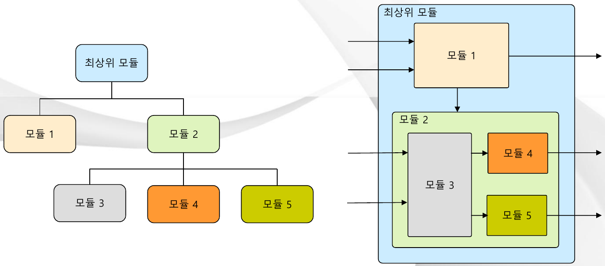

*Lecture 05, Slide 12 — Module hierarchy drawn as a tree and as nested blocks*

The left drawing shows the hierarchy as a tree: the top module contains module 1 and module 2, and module 2 contains modules 3, 4, and 5. The right drawing shows the same design as nested blocks with signals flowing between them: the top-level inputs enter modules 1 and 3, module 3 drives modules 4 and 5, and modules 1, 4, and 5 produce the top-level outputs.

### 4.2 Structure of a Module

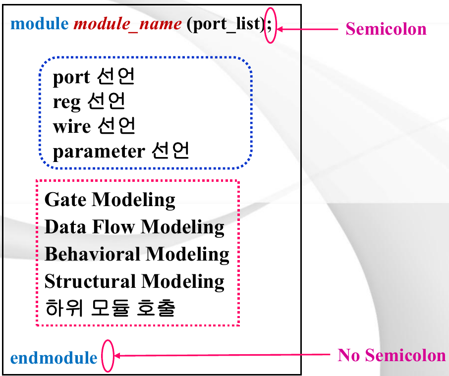

*Lecture 05, Slide 13 — Structure of a Verilog module*

The figure marks two syntax details in red: the module header ends with a **semicolon**, and `endmodule` takes **no semicolon**. The blue box holds the declarations, and the pink box holds the description of the circuit. Written as code, the structure is as follows.

```verilog
module module_name (port_list);   // a semicolon ends the header

  // declarations
  //   port declarations      (input, output, inout)
  //   reg declarations
  //   wire declarations
  //   parameter declarations

  // body: one or more of
  //   gate modeling
  //   data flow modeling
  //   behavioral modeling
  //   structural modeling (instantiation of lower modules)

endmodule                          // no semicolon after endmodule
```

A module starts with the keyword `module`, its name, and a list of its ports, and it ends with `endmodule`. In between come the declarations and then the description of the circuit's function.

### 4.3 Basic Syntax Rules

- A logic circuit described in Verilog HDL must be placed between **`module` and `endmodule`**.
- Every statement ends with a **semicolon (;)**, but reserved words that begin with `end` (such as `endmodule`, `end`, `endcase`, `endfunction`) take **no semicolon**.
- Names and identifiers are **case-sensitive**: `Data` and `data` are different signals.
- Reserved words of Verilog HDL must be written in **lowercase** (`module`, not `MODULE`).
- A module name may begin with a letter or an underscore (`_`).
- **Comments:**
  - A comment that starts with `/*` and ends with `*/` may span several lines.
  - A comment that starts with `//` lasts only until the end of that line.

### 4.4 Ports

Ports are the module's connections to the outside. Each port is declared with the form **[port direction] [name];**.

| Direction | Meaning |
|:----------|:--------|
| `input` | Input port |
| `output` | Output port |
| `inout` | Bidirectional (input and output) port |

```verilog
module module_name (out, ina, inb, clr);
  input  [7:0]  ina, inb;  // two 8-bit inputs
  input         clr;       // one 1-bit input
  output [15:0] out;       // one 16-bit output

  // data type declarations
  // implementation of the circuit function
  // timing information
endmodule
```

The notation `[7:0]` declares an 8-bit bus whose bits are numbered 7 (the MSB) down to 0 (the LSB). A port without a range is a single bit.

---

<br>

## 5. Data Types

### 5.1 Net Data Types

A **net** represents a **physical connection** between hardware blocks, like a wire on a circuit board. A net has no storage: its value is always whatever is driving it.

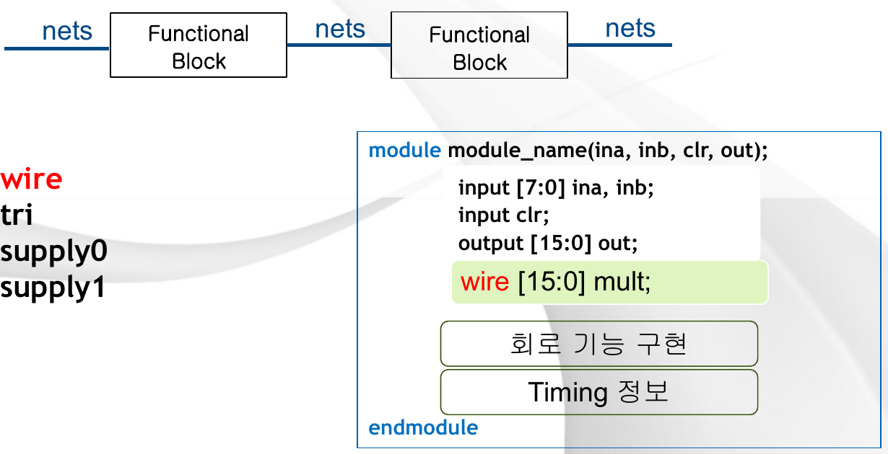

*Lecture 05, Slide 16 — Nets connecting functional blocks, and a wire declared inside a module*

In the upper drawing, nets carry signals into, between, and out of functional blocks. The slide lists four common net types: `wire`, `tri`, `supply0`, and `supply1`. The most frequently used is `wire`, and the code below (the lower part of the figure) declares an internal 16-bit wire.

```verilog
module module_name (ina, inb, clr, out);
  input  [7:0]  ina, inb;
  input         clr;
  output [15:0] out;
  wire   [15:0] mult;   // an internal 16-bit net
  // implementation of the circuit function
  // timing information
endmodule
```

All net types:

| Data Type | Meaning |
|:----------|:--------|
| `wire` | Used only to connect, without any logical behavior or function. |
| `tri` | Same as `wire`, but used to indicate that the net may have a high-impedance state. |
| `supply1` | Connects the net to the power supply (logic 1). |
| `supply0` | Connects the net to ground (logic 0). |
| `tri1` | Pulls the net up (connects it to the supply through a resistor). |
| `tri0` | Pulls the net down (connects it to ground through a resistor). |
| `wor` | Connects the outputs of several devices by a wire so that the net performs an "or" function. |
| `trior` | Same as wired-or, but may also be in the high-impedance state. |
| `wand` | Connects the outputs of several devices by a wire so that the net performs an "and" function. |
| `triand` | Same as wired-and, but may also be in the high-impedance state. |
| `trireg` | A storage-type net that keeps its last value (like a charged capacitor) when it is in the high-impedance state. |

### 5.2 Variable Data Types

A **variable** is a connection that **can store data**.

- **`reg`:** a signal that is assigned inside an `always` statement (or an `initial` statement).
- **`integer`:** a signed 32-bit variable.

```verilog
module module_name (ina, inb, clr, out);
  input  [7:0]  ina, inb;
  input         clr;
  output [15:0] out;
  reg    [15:0] out;    // out is assigned in an always block, so it is declared reg
  // implementation of the circuit function
  // timing information
endmodule
```

> **Key Point:** A `reg` does **not** necessarily become a hardware register (flip-flop). The name only means that the signal holds its value between assignments inside procedural code. A `reg` assigned in a combinational `always` block synthesizes into ordinary gates, while a `reg` assigned on a clock edge synthesizes into flip-flops.

### 5.3 Declaration Syntax and Vectors

Signals are declared with the form **[signal type] [msb:lsb] [list of names];**.

| Declaration | Meaning |
|:------------|:--------|
| `reg` | A 1-bit signal that remembers its value, similar to a variable in software. |
| `wire` | A 1-bit signal whose main role is an electrical connection that delivers a value. |
| `reg [msb:lsb]` | A multi-bit (vectored) `reg` signal. |
| `wire [msb:lsb]` | A multi-bit (vectored) `wire` signal. |
| `reg signed [msb:lsb]` | A multi-bit (vectored) `reg` signal interpreted as a signed (2's complement) number. |
| `wire signed [msb:lsb]` | A multi-bit (vectored) `wire` signal interpreted as a signed number. |

Individual bits and ranges of a vector can be selected: for `wire [7:0] d;`, the expression `d[0]` is the LSB, `d[7]` is the MSB, and `d[3:0]` is the lower 4 bits.

### 5.4 Logic Values

Verilog signals can take four values.

| Value | Meaning |
|:-----:|:--------|
| `1` | Logic value 1, true |
| `0` | Logic value 0, false |
| `Z` | High impedance: the signal is not driven by anything (an open circuit) |
| `X` | Unknown value: the simulator cannot determine whether the value is 0 or 1 |

`X` typically appears at the start of a simulation, before a `reg` has been assigned, or when two drivers drive a net with conflicting values. `Z` appears on a net whose drivers are all disabled, as with a tri-state buffer.

### 5.5 Number Constants

A vector constant is written in the form **[size]'[base][value]**.

| Base Code | Meaning | Signed Base Code | Meaning |
|:---------:|:--------|:----------------:|:--------|
| `h` | Hexadecimal | `sh` | Signed hexadecimal |
| `o` | Octal | `so` | Signed octal |
| `d` | Decimal | `sd` | Signed decimal |
| `b` | Binary | `sb` | Signed binary |

**Examples:**

| Constant | Meaning |
|:---------|:--------|
| `0` | Decimal 0 |
| `8` | Decimal 8 |
| `4'b1010` | A 4-bit binary number 1010 |
| `'ha` | Hexadecimal a (size not specified) |

- The size is the number of **bits**, not the number of digits: `8'hFF` is an 8-bit value, `4'd9` is the decimal value 9 stored in 4 bits.
- A number without a size and base (such as `8`) is a decimal number of at least 32 bits.
- Underscores may be inserted for readability and are ignored: `8'b1010_0011`.

### 5.6 Parameters

A **parameter** defines a named constant: **parameter [range] name = expression;**. Parameters make a module reusable with different sizes or delays.

```verilog
module modXnor (y_out, a, b);
  parameter size = 8, delay = 15;     // default values
  output [size-1:0] y_out;
  input  [size-1:0] a, b;
  wire   [size-1:0] #delay y_out = a ~^ b;  // bitwise XNOR, after "delay" time units
endmodule

module Param;
  wire [7:0] y1_out;
  wire [3:0] y2_out;
  reg  [7:0] b1, c1;
  reg  [3:0] b2, c2;

  modXnor        G1 (y1_out, b1, c1);   // uses the defaults: size = 8, delay = 15
  modXnor #(4, 5) G2 (y2_out, b2, c2);  // overrides: size = 4, delay = 5
endmodule
```

**Line-by-line explanation:**

- `modXnor` computes the bitwise XNOR (`~^`) of two `size`-bit inputs. The declaration `wire [size-1:0] #delay y_out = a ~^ b;` declares the output as a net and continuously assigns it, with a delay of `delay` time units.
- In `Param`, instance `G1` uses the default parameters, so it is an 8-bit XNOR with a delay of 15.
- Instance `G2` is written with `#(4, 5)`, which overrides the parameters in the order they are declared: `size = 4` and `delay = 5`. The same module therefore produces a 4-bit XNOR with a delay of 5, and its port widths match the 4-bit signals `y2_out`, `b2`, and `c2`.

---

<br>

## 6. Instantiation

### 6.1 Connecting Ports by Name and by Order

Using another module or a gate primitive inside a module is called **instantiation**, and each use is called an **instance**. There are two ways to connect the ports of an instance.

- **Connection by port name** (named mapping): written as `.port_name(signal)`.
  - The port names used must exactly match the port names of the lower-level module.
  - The instance name is chosen freely by the user (for example, ADD0, ..., ADD3).
- **Connection by port list order** (positional mapping): the signals are listed in the same order as the ports in the lower module's declaration.

**Example: a full adder built from two half adders.**

```verilog
module full_adder(fco, fsum, cin, a, b);
  output fco, fsum;
  input  cin, a, b;

  wire c1, s1, c2;                    // internal nets between the instances

  half_adder u1 (c1, s1, a, b);                          // positional mapping
  half_adder u2 (.a(s1), .b(cin), .sum(fsum), .co(c2));  // named mapping
  or         u3 (fco, c1, c2);                           // gate primitive instance
endmodule
```

The lower module `half_adder` is not shown on the slide; for the instance `u1` to work, its ports must be declared in the order (carry, sum, a, b). A matching definition is:

```verilog
module half_adder(co, sum, a, b);
  output co, sum;
  input  a, b;
  assign co  = a & b;   // carry = AND
  assign sum = a ^ b;   // sum   = XOR
endmodule
```

**How the full adder works:** `u1` adds a and b, producing the partial sum s1 and the carry c1. `u2` adds s1 and the carry-in cin, producing the final sum fsum and a second carry c2. The carry-out fco is 1 if either half adder produced a carry, so `u3` ORs c1 and c2.

> **Exam Tip:** Named mapping is safer than positional mapping, because the connections stay correct even if the order of ports in the lower module changes, and a missing or misspelled port name produces an error instead of a silent wrong connection.

### 6.2 Example: A 4-Bit Adder Built from Full Adders

An instance is a block made by calling a module that has already been made. Four instances of a 1-bit full adder (FA) form a 4-bit adder.

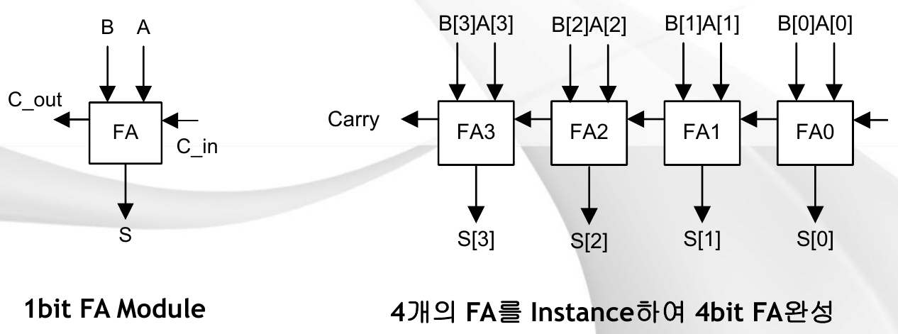

*Lecture 05, Slide 25 — A 1-bit full adder module and four instances forming a 4-bit adder*

- The 1-bit FA module has inputs A, B, and C_in and outputs S and C_out.
- In the 4-bit adder, FA0 adds A[0] and B[0]; its carry-out feeds the carry-in of FA1, and so on up to FA3, whose carry-out is the final carry. This chain is called a **ripple-carry adder**.

```verilog
module FA4(s, c_out, a, b, c_in);   // the completed 4-bit full adder
  output [3:0] s;
  output       c_out;
  input  [3:0] a, b;
  input        c_in;

  wire c1, c2, c3;                  // carries between the stages

  FA fa0(s[0], c1,    a[0], b[0], c_in);
  FA fa1(s[1], c2,    a[1], b[1], c1);
  FA fa2(s[2], c3,    a[2], b[2], c2);
  FA fa3(s[3], c_out, a[3], b[3], c3);
endmodule
```

> **Note:** On the slide, the instance `fa2` is written as `FA fa2(s[2], c2, a[2], b[2], c2);`, which connects the carry-out of stage 2 to `c2` (the same net as its own carry-in) and leaves `c3` undriven. The correct carry-out of `fa2` is `c3`, as shown above. The positional order of `FA` here is (sum, carry-out, a, b, carry-in).

> **[Computer Architecture]** In a ripple-carry adder, each stage must wait for the carry from the previous stage, so the delay grows linearly with the number of bits. For a 32-bit or 64-bit ALU this is too slow, and processors use a **carry-lookahead adder**, which computes all carries in parallel from "generate" (aᵢbᵢ) and "propagate" (aᵢ ⊕ bᵢ) signals.

---

<br>

## 7. Levels of Abstraction and Modeling Styles

A Verilog module can be described at several levels of abstraction.

| Level | Abstraction | Logic Synthesis | Meaning |
|:------|:-----------:|:---------------:|:--------|
| Architecture level | High | No | Expresses functions within a system, such as a pipeline or a cache. |
| Behavior level | ↑ | Partially | Expresses the operation (movement) of the circuit; there is no concept of blocks. |
| Register transfer level (RTL) | | Yes | Expresses the operations between registers; there is a concept of blocks. |
| Gate level | ↓ | Yes | Expresses the circuit with flip-flops and gates. |
| Switch level | Low | No | Expresses the circuit at the transistor level (PMOS, NMOS). |

> **Note:** The slide spells "register" as "Resister" and "transistor" as "Transister"; both are typos.

- "Partially" synthesizable means that only a subset of behavioral constructs (for example, `always` blocks without explicit delays) can be turned into hardware. Constructs such as `#10` delays and `initial` blocks are for simulation only.

The modeling styles used in practice are grouped as follows.

| Group | Modeling Style |
|:------|:---------------|
| **Structural modeling** | Gate-level modeling |
| **Functional modeling** | Register transfer level (RTL) modeling, behavioral modeling |

---

<br>

## 8. Gate-Level Modeling

Gate-level modeling implements hardware with logic gates (AND, OR, NOT, NAND, and so on). Verilog provides the gates as built-in **gate primitives**. In every primitive, **the output comes first**, followed by the inputs.

```verilog
and and_test(out, in0, in1);   // out = in0 AND in1
or  or_test (x, a, b);         // x   = a OR b
```

| Primitive | Function | Remarks |
|:----------|:---------|:--------|
| `and` | Logical AND | |
| `or` | Logical OR | |
| `nand` | Logical NAND | |
| `nor` | Logical NOR | |
| `xor` | Logical exclusive-OR | |
| `xnor` | Logical exclusive-NOR | |
| `buf` | Buffer | |
| `not` | Inverter | |
| `bufif1` | Tri-state buffer (active-high enable) | Three ports: the first is the output, the second the input, and the third the control signal. |
| `bufif0` | Tri-state buffer (active-low enable) | Same as above |
| `notif1` | Inverted tri-state buffer (active-high enable) | Same as above |
| `notif0` | Inverted tri-state buffer (active-low enable) | Same as above |

- The primitives `and`, `or`, `nand`, `nor`, `xor`, and `xnor` accept any number of inputs: `and g1(y, a, b, c);` is a three-input AND gate.
- A **tri-state buffer** passes its input to its output when enabled and drives the output to high impedance (`Z`) when disabled. "Active-high enable" means that the control signal must be 1 to enable the buffer; "active-low" means that it must be 0.

---

<br>

## 9. Register Transfer Level (Dataflow) Modeling

- RTL modeling is a method for designing complex circuits.
- It is also called **dataflow modeling**.
- It requires a design at the level of a detailed block diagram.
- The designer designs the blocks that make up the circuit and expresses the connections between them and the state of data transfers.
- Signals are connected with the **`assign`** statement (a continuous assignment).

**Example: half adder.**

```verilog
module HADD(C, S, in1, in2);
  input  in1, in2;         // input ports
  output C, S;             // output ports

  assign C = in1 & in2;    // AND in1 and in2 and store the result in C
  assign S = in1 ^ in2;    // XOR in1 and in2 and store the result in S
endmodule
```

**Rules of the `assign` statement:**

- The **left side** is an output vector or a concatenated vector (a net).
- The **right side** may contain registers, nets, function calls, and so on.
- **When a value on the right side changes, the left side changes immediately.** An `assign` is not executed once; it describes a permanent connection.

```verilog
assign out = in1 & in2;
assign addr[15:0] = a[15:0] ^ b[15:0];
assign {c_out, sum[3:0]} = a[3:0] + b[3:0] + c_in;
assign out[4:0] = {c_out, sum[3:0]};
```

- The third line adds two 4-bit numbers and a carry. The result needs 5 bits, so it is assigned to the concatenation `{c_out, sum[3:0]}`: the MSB goes to `c_out` and the lower 4 bits go to `sum`.
- The fourth line does the reverse: it joins `c_out` and `sum` into a single 5-bit output.

**Example: 4-bit adder with `assign`.**

```verilog
module ADD_4bit(s, c, in1, in2, c_in);  // 4-bit full adder
  output [3:0] s;
  output       c;
  input  [3:0] in1, in2;
  input        c_in;

  assign {c, s} = in1 + in2 + c_in;
endmodule
```

Compared with the structural `FA4` of Section 6.2, this version describes the **function** (addition) in one line and leaves the gate structure to the synthesis tool.

> **Note:** On the slide, the `assign` line has no semicolon at the end. A semicolon is required, as written above; without it, the compiler reports a syntax error.

---

<br>

## 10. Behavioral Modeling

### 10.1 Overview

- Behavioral modeling is the hardware modeling technique with the **highest level of abstraction** in Verilog HDL.
- It models the **algorithm** of the hardware's operation without having to consider logic gates or data flow.
- Its main constructs are `initial`, `always @`, `if-else`, `case`, and loop statements.

```verilog
module ...
  always @* begin
    if (sela)
      q = a;
    else if (selb)
      q = b;
    else
      q = c;
  end
endmodule
```

This block describes a selector with priority: if `sela` is 1, q takes a; otherwise, if `selb` is 1, q takes b; otherwise q takes c. The event list `@*` means "whenever any signal read inside the block changes," which is the correct sensitivity for combinational logic.

### 10.2 The initial Statement

- In Verilog HDL, **all constructs execute in parallel**.
- An `initial` statement starts at the beginning of the simulation and **executes exactly once** during the simulation.
- Each block executes independently; all `initial` blocks start at the same time (time 0).
- It is used for setting initial values and in **test benches**.
- If it executes several statements, they must be enclosed by **`begin` and `end`**.
- Signals assigned in an `initial` block must be declared as **`reg`**.

**Example:**

```verilog
`timescale 1 ns / 1 ps
module test1;
  reg x, y, a, b, m;

  initial m = 1'b0;          // initialization at 0 ns

  initial begin
    #5  a = 1'b1;            // at 5 ns
    #25 b = 1'b0;            // at 30 ns
  end

  initial begin
    #10 x = 1'b0;            // at 10 ns
    #25 y = 1'b1;            // at 35 ns
  end

  initial #50 $finish;       // ends the simulation at 50 ns
endmodule
```

**Line-by-line explanation:**

- `` `timescale 1 ns / 1 ps `` sets the time unit to 1 ns (so `#5` means 5 ns) and the simulation precision to 1 ps.
- `#n` is a delay: it waits n time units before executing the statement. Within one `begin ... end` block the delays **accumulate**: in the second block, a is set at 5 ns and b at 5 + 25 = 30 ns.
- The four `initial` blocks run **concurrently**, each with its own timeline. Therefore x is set at 10 ns and y at 10 + 25 = 35 ns, independently of the second block.
- `$finish` stops the simulation at 50 ns.

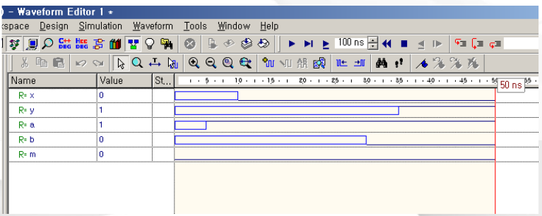

*Lecture 05, Slide 38 — Waveform of the initial statement example*

The waveform window lists the signals x, y, a, b, and m. Each signal is unknown (`X`) until it is first assigned, and then it takes its assigned value: m is 0 from the start, a becomes 1 at 5 ns, x becomes 0 at 10 ns, b becomes 0 at 30 ns, y becomes 1 at 35 ns, and the simulation stops at the 50 ns marker.

> **[Programming Languages]** Each `initial` or `always` block behaves like an independent **process** (or thread) in a concurrent program, and the simulator interleaves them according to simulated time. Unlike threads in an operating system, however, the ordering is deterministic with respect to time: statements scheduled at different times always execute in time order. Statements scheduled at the **same** time in different blocks may execute in any order, which is the source of the race conditions that nonblocking assignments (Section 10.5) are designed to avoid.

### 10.3 The always Statement

**Syntax:**

```verilog
always @ (event)
begin
  // code describing the hardware operation
end
```

**Characteristics of the `always` statement:**

- An `always` block **must have an event** (or a delay) that controls when it runs.
- Signals assigned inside an `always` block must be declared as **`reg`**.

**Points to note when using `always` for a combinational circuit (as stated on the slide):**

- An `@(event signal)` must be present.
- All signals supplied to the combinational circuit must appear in the `@(event signal)` list.
- Signals assigned in the `always` block must be declared as `reg` or `integer` (the operation of `always` can be thought of as a kind of register).
- Inside the `always` block, nonblocking assignments (`<=`) are used.

**Point to note when using `always` for a sequential circuit:**

- If it is used without an `@(event signal)`, the block must contain an expression that generates an event (such as a delay `#10`); otherwise the block loops forever at time 0.

**Several `always` blocks** may be used in one module; they all run concurrently.

> **Note:** The slide's guideline for combinational circuits recommends nonblocking assignments, but a later slide (Section 10.5) states the rule that is followed in standard practice: use **blocking assignments (`=`) for combinational logic** and **nonblocking assignments (`<=`) for sequential logic**. For exams, follow the instructor's statement; in practice, the standard rule avoids simulation and synthesis mismatches. The requirement that **every input** of combinational logic appears in the event list is essential: a missing signal makes the simulation behave like a latch, which differs from the synthesized hardware. Writing `@*` includes all inputs automatically.

### 10.4 Examples of always Blocks

**Example 1: 4-bit adder with `always`.**

```verilog
module ADD_4bit(out, in1, in2);
  input  [3:0] in1, in2;   // input ports
  output [4:0] out;        // output port

  reg    [4:0] out;        // assigned a changed value in the always block

  always @(in1, in2)
  begin
    out = in1 + in2;
  end
endmodule
```

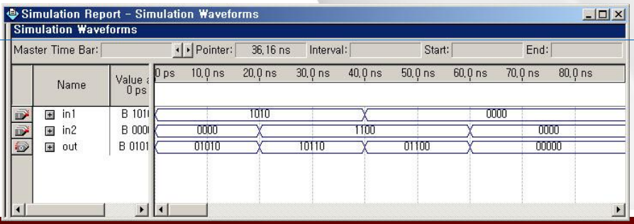

*Lecture 05, Slide 41 — Simulation waveform of the 4-bit adder*

The block runs whenever `in1` or `in2` changes. The waveform shows four successive intervals:

| in1 | in2 | out = in1 + in2 |
|:---:|:---:|:---------------:|
| 1010 (10) | 0000 (0) | 01010 (10) |
| 1010 (10) | 1100 (12) | 10110 (22) |
| 0000 (0) | 1100 (12) | 01100 (12) |
| 0000 (0) | 0000 (0) | 00000 (0) |

The output is 5 bits wide so that the carry of the addition (as in 10 + 12 = 22) is not lost.

**Example 2: clock generator.**

- An `always` block executes the statements in the block **repeatedly, forever**.
- In behavioral modeling, an `always` block with no condition is an **infinite loop**.

```verilog
module clock_test;
  reg clock;

  initial clock = 1'b0;          // the clock starts at 0
  always #10 clock = ~clock;     // invert the clock every 10 time units
  initial #50 $finish;           // stop the simulation at 50
endmodule
```

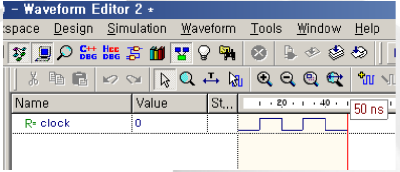

*Lecture 05, Slide 42 — Waveform of the clock generator*

The `always` block waits 10 time units, inverts the clock, and repeats. The clock is therefore 0 from 0 to 10, 1 from 10 to 20, 0 from 20 to 30, 1 from 30 to 40, and 0 from 40 to 50, where the simulation stops: a square wave with a period of 20 time units. This is the standard way to generate a clock in a test bench.

**Example 3: edge events.** The event condition of an `always` block is most often a clock edge.

```verilog
always @(posedge clock)   // the block runs only at the rising edge of clock
always @(negedge clock)   // the block runs only at the falling edge of clock
// the block operates on the event inside the parentheses
```

- A **rising edge** (`posedge`) is a transition from 0 to 1, and a **falling edge** (`negedge`) is a transition from 1 to 0.
- An `always @(posedge clock)` block describes **edge-triggered flip-flops**: the signals assigned in it change only at the rising clock edge.

### 10.5 Blocking and Nonblocking Assignments

Inside `initial` and `always` blocks, there are two kinds of **procedural assignments**.

| Assignment | Operator | Execution Within a Block |
|:-----------|:--------:|:-------------------------|
| **Blocking** | `=` | Sequential: each assignment completes before the next statement starts. |
| **Nonblocking** | `<=` | Parallel: all right-hand sides are evaluated first, and the left-hand sides are updated together afterward. |

**Example with delays:**

```verilog
module blocking;                  module nonblocking;
  reg x, y, z;                      reg x, y, z;
  initial begin                     initial begin
    x = 1'b0; y = 1'b0; z = 1'b0;     x = 1'b0; y = 1'b0; z = 1'b0;
    x = #10 1'b1;                     x <= #10 1'b1;
    y = #15 1'b1;                     y <= #15 1'b1;
    z = 1'b1;                         z <= 1'b1;
  end                               end
  initial #50 $finish;              initial #50 $finish;
endmodule                         endmodule
```

Here `x = #10 1'b1` is an **intra-assignment delay**: the right side is evaluated, and the assignment happens 10 time units later.

| Signal | Blocking Version | Nonblocking Version |
|:------:|:-----------------|:--------------------|
| x | Becomes 1 at time 10 | Becomes 1 at time 10 |
| y | Becomes 1 at time 25 (waits for x's assignment to finish, then 15 more) | Becomes 1 at time 15 (scheduled at time 0, independently) |
| z | Becomes 1 at time 25 (after y's assignment finishes) | Becomes 1 at time 0 (no delay) |

In the blocking version, each statement **blocks** the next one until it finishes, so the delays add up. In the nonblocking version, all three assignments are scheduled at time 0 and complete independently.

**Blocking assignment (`=`) in detail.**

- "One assignment finishes, and then the next assignment is performed."
- That is, the circuit operation differs depending on the order in which the statements are written, so blocking assignments are **unsuitable for sequential circuits**.

| | [1] | [2] |
|:-|:----|:----|
| Code | `always @(posedge CLK) begin C = B; B = A; A = D; end` | `always @(posedge CLK) begin A = D; C = B; B = A; end` |
| Initial values | A = 5, B = 3, C = 10, D = 2 | A = 5, B = 3, C = 10, D = 2 |
| Result | **A = 2, B = 5, C = 3, D = 2** | **A = 2, B = 2, C = 3, D = 2** |
| Remark | | The result of A = D affects B = A |

Trace of [1]: C = B gives C = 3; B = A gives B = 5; A = D gives A = 2. Trace of [2]: A = D gives A = 2; C = B gives C = 3; B = A now reads the **new** A, giving B = 2. Merely reordering the statements changed the circuit.

**Nonblocking assignment (`<=`) in detail.**

- In an `always` block, all right-hand sides of the assignments are completely processed first, and then the values are assigned to the left-hand sides **all at once**.
- That is, the circuit operates independently of the order in which the statements are written, so nonblocking assignments are **suitable for sequential circuits**.

| | [1] | [2] |
|:-|:----|:----|
| Code | `always @(posedge CLK) begin C <= B; B <= A; A <= D; end` | `always @(posedge CLK) begin A <= D; C <= B; B <= A; end` |
| Initial values | A = 5, B = 3, C = 10, D = 2 | A = 5, B = 3, C = 10, D = 2 |
| Result | **A = 2, B = 5, C = 3, D = 2** | **A = 2, B = 5, C = 3, D = 2** |
| Remark | The right-hand values B, A, D are processed, then assigned to the left sides at once | The right-hand values D, B, A are processed, then assigned to the left sides at once |

Both orders give the same result, because every right side reads the **old** values (B = 3, A = 5, D = 2) before any register changes. This is exactly how real flip-flops behave: all flip-flops sample their inputs at the same clock edge.

> **Note:** The slide declares A, B, C, and D as `wire [3:0]`. A signal assigned inside an `always` block must be declared `reg`, so in working code these should be `reg [3:0] A, B, C, D;`.

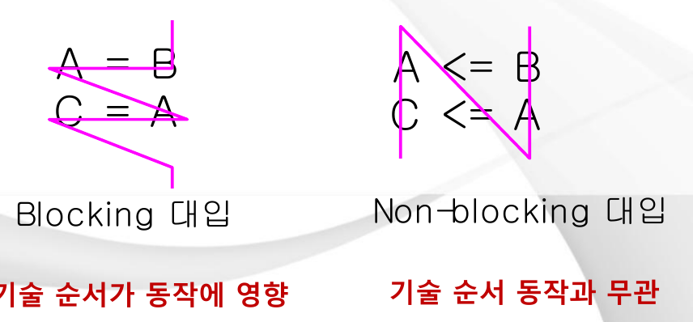

*Lecture 05, Slide 47 — Difference between blocking and nonblocking assignments*

- **Combinational circuits:** blocking (`=`).
- **Sequential circuits:** nonblocking (`<=`).
- In the figure, the blocking pair `A = B; C = A;` is read line by line (zigzag): C receives the **new** value of A, which is B. The description order affects the operation.
- In the nonblocking pair `A <= B; C <= A;`, both right sides are read first (the diagonal lines): C receives the **old** value of A. The description order is irrelevant to the operation.

> **Key Point:** With nonblocking assignments, `A <= B; C <= A;` describes **two flip-flops in series** (a shift register): on each clock edge, the value moves one stage. With blocking assignments, the same lines would make C equal to B immediately, collapsing the two stages into one.

> **[Programming Languages]** A nonblocking assignment has **two-phase** semantics, similar to computing all new values from a snapshot of the old state and then committing them together. Ordinary programming languages have only the blocking form, which is why a swap in C needs a temporary variable, whereas in Verilog `a <= b; b <= a;` swaps two registers correctly.

### 10.6 The if Statement

**1. When there is one statement to execute for each condition:**

```verilog
// one condition
if (condition) true_statement;

// two branches
if (condition) true_statement;
else           false_statement;

// three or more branches
if (condition)      true_statement;
else if (condition) true_statement;
else if (condition) true_statement;
else                default_statement;
```

**2. When there are several statements to execute for a condition:** the statements must be enclosed by `begin` and `end`.

```verilog
if (condition)
  begin
    true_statement1;
    true_statement2;
  end
else
  begin
    false_statement;
  end
```

An `if-else if` chain checks the conditions **in order**, so the first condition has the highest priority.

### 10.7 Example: A Counter That Cycles Through 2, 3, 4, 7, 8, 10, 11

```verilog
module counter_test(clock, reset, b);       // a counter driven by events
  input        clock, reset;
  output [3:0] b;
  reg    [3:0] b;

  always @(posedge clock or negedge reset)
    begin
      if (!reset)
        b = 2;                              // if reset = 0, then b = 2
      else
        begin
          if (b == 4)       b = 7;
          else if (b == 8)  b = 10;
          else if (b == 11) b = 2;
          else              b = b + 1;
        end
    end
endmodule
```

**How it works:**

- The block runs at every rising edge of `clock` and at every falling edge of `reset`.
- When `reset` is 0, the counter is forced to 2.
- Otherwise, at each rising clock edge, the counter normally adds 1, but it jumps from 4 to 7, from 8 to 10, and from 11 back to 2.

| Clock Edge | b Before | b After |
|:----------:|:--------:|:-------:|
| 1 | 2 | 3 |
| 2 | 3 | 4 |
| 3 | 4 | 7 |
| 4 | 7 | 8 |
| 5 | 8 | 10 |
| 6 | 10 | 11 |
| 7 | 11 | 2 |

> **Note:** The slide labels the event line with the comment "synchronous," but because `negedge reset` is in the event list, the counter is reset as soon as `reset` falls, without waiting for a clock edge. This is an **asynchronous**, active-low reset. Also, because this is a sequential circuit, standard practice would write the assignments as nonblocking (`b <= b + 1;`); with a single register assigned in the block, both forms simulate the same way.

### 10.8 The case Statement

- When there are many conditions, `case` can be used more simply than `if`.
- Instead of checking true or false conditions, `case` selects the statement to execute according to the **value** of an expression.

```verilog
case (expression)
  value1  : statement1;
  value2  : statement2;
  value3  : statement3;
  default : statement4;
endcase
```

If two or more statements are executed for a value, they are enclosed by `begin` and `end`:

```verilog
case (expression)
  value1 :
    begin
      statement1;
      statement2;
    end
  value2 :
    begin
      statement1;
      statement2;
    end
  default : statement1;
endcase
```

The `default` branch is executed when no other value matches. In combinational logic it should always be present (or all values should be covered), so that the output is assigned in every case.

### 10.9 Comparing case and if: A 4x1 Multiplexer

A 4x1 multiplexer selects one of four 4-bit inputs according to a 2-bit select signal.

**With `if`:**

```verilog
module if_mux(a, b, c, d, x, sel);
  input  [3:0] a, b, c, d;
  input  [1:0] sel;
  output [3:0] x;
  reg    [3:0] x;

  always @(a or b or c or d or sel)
    begin
      if (sel == 2'b00)      x = a;
      else if (sel == 2'b01) x = b;
      else if (sel == 2'b10) x = c;
      else if (sel == 2'b11) x = d;
    end
endmodule
```

**With `case`:**

```verilog
module case_mux(a, b, c, d, x, sel);
  input  [3:0] a, b, c, d;
  input  [1:0] sel;
  output [3:0] x;
  reg    [3:0] x;

  always @(a or b or c or d or sel)
    begin
      case (sel)
        2'b00 : x = a;
        2'b01 : x = b;
        2'b10 : x = c;
        2'b11 : x = d;
      endcase
    end
endmodule
```

- Both modules describe the same multiplexer, and both list all five inputs in the event list.
- The `case` version is shorter and reads like a truth table. A synthesis tool typically builds a parallel multiplexer from `case`, while an `if-else if` chain implies a priority structure (although here the conditions are mutually exclusive, so the result is the same).

### 10.10 The function Statement

A `function` packages a calculation that is used repeatedly, like a function in software.

```verilog
function [range] function_name;
  // input declarations
  // processing statements
endfunction
```

**Rules:**

- If the range of the return value is not specified, the function returns **1 bit**.
- The return value is returned through the **function name**: the result is assigned to a variable with the same name as the function.
- To use two or more statements in the body, they must be enclosed in a `begin ... end` block.
- Local variables declared in a function are temporary and are synthesized as wires.
- A function definition must be inside a module, and it **cannot contain timing statements** (such as `#` delays or `@` events).
- A function cannot call a `task` (a procedure used in sequential processing), whereas a task can call a function.
- `reg`, `parameter`, and `integer` declarations are allowed in a function.

**Input declarations:**

- The inputs are declared **right after the function name**, in the form `input [range] input_variable, ..., input_variable;`.
- The `[range]` is used only for vectors.
- In a function call, the arguments are passed to the function's input variables **in the order in which the inputs are declared**.

**Calling a function:**

- Form: `net = function_name(argument, ..., argument);`
- The argument names in the module do not need to match the input names in the function; they correspond **by order**.
- The output is assigned to the function name, and there is **only one output** (a bit or a vector).
- Using the concatenation operator `{ }`, several outputs can be bundled into one vector and returned together.

**Example: XOR implemented with a function.**

```verilog
/* XOR implemented with a "function" statement */
module EXOR (IN1, IN2, OUT);
  input  IN1, IN2;
  output OUT;

  function EXOR_FUNC;          // function name
    input IN1, IN2;
    if (IN1 ^ IN2)             // executed if (IN1 XOR IN2) is "1"
      EXOR_FUNC = 1;           // return through the function name
    else                       // executed if (IN1 XOR IN2) is "0"
      EXOR_FUNC = 0;           // return through the function name
  endfunction

  assign OUT = EXOR_FUNC(IN1, IN2);  // function call
endmodule
```

- The function `EXOR_FUNC` has no range, so it returns 1 bit.
- `assign OUT = EXOR_FUNC(IN1, IN2);` calls the function continuously, so `OUT` always equals the XOR of the inputs.

> **Note:** On the slide, the module header `module EXOR (IN1, IN2, OUT)` has no semicolon; it is added above. The slide also spells "function" as "fucntion" and "functuion" in the syntax template; these are typos.

---

<br>

## 11. Operators

The slide on operators first repeats the table of gate primitives (`and`, `or`, `nand`, `nor`, `xor`, `xnor`, `buf`, `not`, `bufif1`, `bufif0`, `notif1`, `notif0`) given in Section 8. The expression operators follow.

### 11.1 Arithmetic Operators

| Operator | Meaning |
|:--------:|:--------|
| `+` | Addition |
| `-` | Subtraction |
| `-` | Negation (unary minus) |
| `*` | Multiplication |
| `/` | Division |
| `%` | Remainder (modulus) |
| `**` | Power (exponentiation) |

- Operands of type `reg` and `wire` are treated as **unsigned**.
- If an operand contains an unknown (`x`) bit, the result is also unknown.

### 11.2 Relational and Equality Operators

| Operator | Meaning | Remarks |
|:--------:|:--------|:--------|
| `>` | Greater than | `reg` and `wire` are unsigned; `real` and `integer` are signed; if an operand contains an `x` bit, the result is unknown. |
| `<` | Less than | Same as above |
| `>=` | Greater than or equal to | Same as above |
| `<=` | Less than or equal to | Same as above |
| `==` | Equal | If either operand contains `x`, the result is always unknown (`x`). |
| `!=` | Not equal | Same as above |
| `===` | True if A === B (case equality) | Compares exactly bit by bit, even when the operands contain `z` or `x`. |
| `!==` | True if A !== B (case inequality) | Same as above |

- `4'b10x0 == 4'b10x0` is `x` (unknown), but `4'b10x0 === 4'b10x0` is 1 (true), because `===` treats `x` and `z` as ordinary symbols to compare.
- `<=` is both the "less than or equal" operator and the nonblocking assignment operator; the meaning is determined by the context.

### 11.3 Logical and Shift Operators

**Logical operators** treat each operand as a single true (nonzero) or false (zero) value.

| Operator | Meaning | Example |
|:--------:|:--------|:--------|
| `&&` | Logical AND | `if (A && B) ...` |
| `\|\|` | Logical OR | `if (A \|\| B) ...` |
| `!` | Logical NOT | `if (!A) ...` |

**Shift operators** move the bits of a vector.

| Operator | Meaning | Example (8 bits) |
|:--------:|:--------|:-----------------|
| `>>` | Shift right | `1011_0011 >> 1` gives `0101_1001` |
| `<<` | Shift left | `1011_0011 << 1` gives `0110_0110` |

Bits shifted out are lost, and the vacated positions are filled with 0. The underscore in `1011_0011` is only a visual separator.

### 11.4 Bitwise Operators

Bitwise operators apply the operation to **each pair of corresponding bits**.

| Operator | Meaning | Remarks |
|:--------:|:--------|:--------|
| `~` | NOT on each bit | |
| `&` | AND on each bit | |
| `\|` | OR on each bit | |
| `^` | XOR on each bit | |
| `^~`, `~^` | XNOR on each bit | |
| `<<` | `a << b`: shifts a left by b bits | |
| `>>` | `a >> b`: shifts a right by b bits | |
| `>>>` | `a >>> b`: shifts a right by b bits (arithmetic) | If a is a signed type, the vacated bits are filled with the sign bit of a, so that the sign of a does not change. |
| `<<<` | `a <<< b`: shifts a left by b bits (arithmetic) | Same as above (see the note below) |

> **Note:** The slide writes the shift rows as "a<b"; the intended expressions are `a << b`, `a >> b`, `a >>> b`, and `a <<< b`. Also, the sign-filling rule applies only to the arithmetic **right** shift `>>>`. The arithmetic left shift `<<<` always fills the vacated low-order bits with 0, exactly like `<<`. For example, with `reg signed [7:0] a = -8;` (1111_1000), `a >>> 1` is 1111_1100 (-4), while `a >> 1` is 0111_1100 (124).

### 11.5 Reduction Operators

A **unary reduction** operator applies the operation to **all bits of one operand** and produces a **1-bit** result.

| Operator | Meaning |
|:--------:|:--------|
| `&` | ANDs all bits of the operand into a 1-bit result |
| `\|` | ORs all bits of the operand into a 1-bit result |
| `^` | XORs all bits of the operand into a 1-bit result |
| `~&` | NANDs all bits of the operand into a 1-bit result |
| `~\|` | NORs all bits of the operand into a 1-bit result |

```verilog
reg [3:0] v;
reg a, b;
v = 4'b1101;
a = &v;      // a = 1 & 1 & 0 & 1 = 0
b = |v;      // b = 1 | 1 | 0 | 1 = 1
```

- The reduction AND `&v` is 1 only if every bit of v is 1; it answers "are all bits 1?"
- The reduction OR `|v` is 1 if any bit is 1; it answers "is v nonzero?"
- The reduction XOR `^v` gives the parity of v; for 1101 it is 1 ⊕ 1 ⊕ 0 ⊕ 1 = 1.

> **Note:** The slide writes the reduction NAND operator as `&~`; the correct Verilog operator is `~&`.

### 11.6 Concatenation and Conditional Operators

| Operator | Meaning |
|:--------:|:--------|
| `{ , }` | Joins the values of the operands on the left and right into one value (concatenation) |
| `? :` | `con ? a : b` gives a if con is true and b if it is false (conditional) |

**Concatenation examples:**

- `{a, b, c}`: joins a, b, and c into one longer value.
- `{a, 4'b1100}`: appends the 4 bits 1100 after a.

**Replication examples:** a number in front of braces repeats the contents.

- `{a, {3{b}}}` is the same as `{a, b, b, b}`.
- `{3{a, b}}` is the same as `{a, b, a, b, a, b}`.

The conditional operator describes a 2x1 multiplexer in one line: `assign y = sel ? d1 : d0;`.

### 11.7 Operator Precedence

From the highest priority (evaluated first) to the lowest:

| Priority | Operator | Description |
|:--------:|:---------|:------------|
| 1 (highest) | `[ ]` | Bit-select or part-select of a vector |
| 2 | `( )` | Parentheses |
| 3 | `!`, `~` | Logical NOT, bitwise NOT |
| 4 | `&`, `\|`, `~&`, `~\|`, `^`, `~^`, `^~` | Unary reduction operators |
| 5 | `+`, `-` | Unary sign |
| 6 | `{ }` | Concatenation |
| 7 | `*`, `/`, `%` | Multiplicative arithmetic |
| 8 | `+`, `-` | Additive arithmetic |
| 9 | `<<`, `>>` | Shift |
| 10 | `>`, `>=`, `<`, `<=` | Relational |
| 11 | `==`, `!=` | Logical equality and inequality |
| 12 | `&` | Bitwise AND |
| 13 | `^`, `^~`, `~^` | Bitwise XOR, XNOR |
| 14 | `\|` | Bitwise OR |
| 15 | `&&` | Logical AND |
| 16 | `\|\|` | Logical OR |
| 17 (lowest) | `? :` | Conditional |

> **Exam Tip:** When in doubt, use parentheses. For example, `a & b == c` is evaluated as `a & (b == c)`, because `==` has higher precedence than bitwise `&`, which is rarely what was intended.

> **[C Programming]** Most Verilog operators look exactly like C operators and have similar precedence. The differences are important: Verilog has the four-valued logic (0, 1, x, z) and therefore the extra operators `===` and `!==`; it has unary reduction operators (`&v`, `|v`, `^v`), which C lacks; it has concatenation `{ }` and replication; and it has no `++` or `+=` operators in classic Verilog-2001. As in C, `&&` and `!` are logical while `&` and `~` are bitwise, and mixing them up is a common bug.

---

<br>

## 12. Summary of a Verilog Module

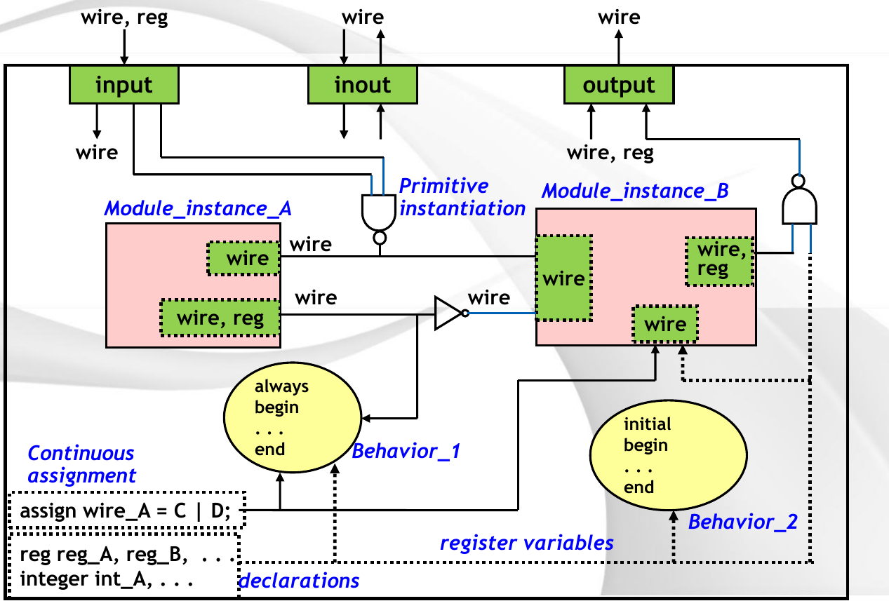

*Lecture 05, Slide 66 — Summary of the elements of a Verilog HDL module*

The figure summarizes what can appear inside a module and which data types are allowed where.

- **Ports:**
  - An `input` port can be driven from outside by a `wire` or a `reg`, but inside the module it is a `wire`.
  - An `output` port can be a `wire` or a `reg` inside the module, but outside it connects to a `wire`.
  - An `inout` port is a `wire` on both sides.
- **Module instances** (`Module_instance_A`, `Module_instance_B`): their outputs must connect to `wire`s; inside each instance, the same port rules apply again.
- **Primitive instantiation:** built-in gates (such as the NAND and the inverter in the figure) connected by `wire`s.
- **Continuous assignment:** `assign wire_A = C | D;` drives a `wire`.
- **Behaviors:** `always` blocks (Behavior_1) and `initial` blocks (Behavior_2) assign values to **register variables** (`reg`).
- **Declarations:** `reg reg_A, reg_B, ...;` and `integer int_A, ...;`.

> **Key Point:** The single most useful rule: a signal assigned by `assign` or driven by an instance output must be a **`wire`**, and a signal assigned inside `always` or `initial` must be a **`reg`**.

---

<br>

## 13. Test Bench

### 13.1 Purpose of a Test Bench

- A **test bench** is Verilog code that describes **simulation patterns (input stimulus)** for the purpose of verifying a circuit designed in Verilog HDL.
- The test bench constructs are part of the official IEEE standard.
- Therefore the same test bench can be used in common by other simulators.

A test bench is a module with **no ports**. It instantiates the design under test, drives its inputs with `reg` signals, observes its outputs with `wire` signals, and uses system tasks to print or stop.

### 13.2 Main System Tasks and Functions

| Task / Function | Description |
|:----------------|:------------|
| `$stop` | Pauses (suspends) the simulation. |
| `$finish` | Terminates the simulation completely. |
| `$display` | Prints variables, expressions, values, and strings **once**, when it is executed. |
| `$monitor` | Prints like `$display`, but it is executed again **every time one of the printed variables changes**. |
| `$monitoroff` | Suspends the execution of `$monitor`. |
| `$monitoron` | Resumes the execution of `$monitor`. |
| `$strobe` | Similar to `$display`, but it always executes **last** in the current time step. |
| `$time` | A system function that returns the current simulation time. |

> **Note:** The slide states that `$monitoron` suspends and `$monitoroff` resumes `$monitor`; this is reversed. As the names suggest, `$monitoroff` turns monitoring off and `$monitoron` turns it back on.

**Difference between `$display` and `$strobe`:** when several statements execute at the same simulation time, the order in which `$display` runs relative to them is not defined, so it may print values before they are updated. `$strobe` always runs after all other events of that time step, so it prints the final, settled values.

**Output formats of `$display`** (also used by `$monitor` and `$strobe`):

| Format | Output |
|:------:|:-------|
| `%d`, `%D` | Value in decimal |
| `%t`, `%T` | Time format |
| `%s`, `%S` | String |
| `%f`, `%F` | Real number |
| `%c`, `%C` | One character |
| `%h`, `%H` | Value in hexadecimal |
| `%o`, `%O` | Value in octal |
| `%b`, `%B` | Value in binary |
| `%m`, `%M` | Hierarchical name of the executing module |

### 13.3 A Complete Test Bench Example

The following test bench, which combines the elements of this lecture, verifies the half adder `HADD` of Section 9 by applying all four input combinations.

```verilog
`timescale 1ns / 1ns
module tb_HADD;            // a test bench has no ports
  reg  in1, in2;           // inputs to the design: driven by the test bench
  wire C, S;               // outputs from the design: observed

  HADD dut (.C(C), .S(S), .in1(in1), .in2(in2));   // design under test

  initial begin
    $monitor("time=%0t in1=%b in2=%b -> C=%b S=%b", $time, in1, in2, C, S);
    in1 = 0; in2 = 0;
    #10 in1 = 0; in2 = 1;
    #10 in1 = 1; in2 = 0;
    #10 in1 = 1; in2 = 1;
    #10 $finish;
  end
endmodule
```

Expected output, one line per change:

```plaintext
time=0 in1=0 in2=0 -> C=0 S=0
time=10 in1=0 in2=1 -> C=0 S=1
time=20 in1=1 in2=0 -> C=0 S=1
time=30 in1=1 in2=1 -> C=1 S=0
```

The printed values match the half adder truth table, which verifies the design. The same pattern of "instantiate, drive inputs over time, observe outputs" is used for every design in the labs.

---

<br>

## Summary

| Concept | Key Summary |
|:--------|:------------|
| Design flow | Specification → behavioral → RTL (HDL) → functional verification → synthesis → netlist → logical verification → place and route → layout → implementation. |
| FPGA | Basic cells of LUTs and D flip-flops; reprogrammable, ideal for prototyping; PROM, PLA, PAL, and CPLD are simpler programmable devices. |
| HDL advantages | Shorter design time, better quality, technology independence, lower cost, standardization, easier management. |
| Module | `module name(ports); ... endmodule`; header ends with `;`, `endmodule` does not; identifiers are case-sensitive. |
| Data types | Nets (`wire`, ...) connect; variables (`reg`, `integer`) store; values 0, 1, X, Z; constants `size'base value`. |
| Instantiation | Positional or named port mapping; parameters overridden with `#( )`. |
| Modeling styles | Gate level (primitives), RTL or dataflow (`assign`), behavioral (`initial`, `always`, `if`, `case`, `function`). |
| always | Needs an event; assigned signals are `reg`; `@*` or a complete event list for combinational logic; `posedge`/`negedge` for flip-flops. |
| Blocking vs. nonblocking | `=` executes in order (combinational); `<=` updates all at once (sequential). |
| Operators | Arithmetic, relational, equality (`==` vs. `===`), logical, bitwise, reduction, shift, concatenation, conditional, with a fixed precedence. |
| Test bench | A portless module that drives inputs and checks outputs with `$display`, `$monitor`, `$strobe`, `$time`, `$finish`. |

---

<br>

## Self-Check Questions

1. **Design Flow:** What is the difference between functional verification and logical verification in the design flow?

   > **Answer:** Functional verification simulates the RTL description with a test bench before synthesis, to check that the described behavior is correct. Logical verification simulates the gate-level netlist produced by synthesis with the same test bench, to check that synthesis preserved the behavior.

2. **FPGA:** How can an FPGA implement any Boolean function of four variables in one basic cell?

   > **Answer:** Each basic cell contains a look-up table (LUT). A 4-input LUT is a 16-bit memory addressed by the four inputs; by storing the 16 output values of the function's truth table, it implements any function of those four variables.

3. **wire vs. reg:** In a module, signal `y` is assigned with `assign y = a & b;` and signal `z` is assigned inside `always @*`. How must each be declared?

   > **Answer:** `y` is driven by a continuous assignment, so it must be a `wire`. `z` is assigned in an `always` block, so it must be declared `reg`, even though the logic it represents is combinational.

4. **Parameters:** What does `modXnor #(4, 5) G2 (y2_out, b2, c2);` mean?

   > **Answer:** It creates an instance named G2 of the module modXnor and overrides its parameters in declaration order: size = 4 and delay = 5. G2 is therefore a 4-bit XNOR whose output changes 5 time units after its inputs.

5. **initial Timing:** In an `initial` block containing `#5 a = 1; #25 b = 0;`, at what times are a and b assigned?

   > **Answer:** Delays inside one block accumulate, so a is assigned at 5 and b at 5 + 25 = 30 time units.

6. **Blocking vs. Nonblocking:** With A = 5, B = 3, C = 10, D = 2, what are the results of `A = D; C = B; B = A;` and of `A <= D; C <= B; B <= A;` at a clock edge?

   > **Answer:** Blocking: A = 2, then C = 3, then B reads the new A, so B = 2 (result A = 2, B = 2, C = 3). Nonblocking: all right sides use the old values, so A = 2, C = 3, and B = 5 (result A = 2, B = 5, C = 3).

7. **Equality Operators:** What is the difference between `==` and `===`?

   > **Answer:** `==` is the logical equality: if either operand contains x (or z), the result is x. `===` is the case equality: it compares the operands bit by bit including x and z, and always returns 0 or 1.

8. **Reduction Operators:** For `v = 4'b1101`, what are `&v`, `|v`, and `^v`?

   > **Answer:** `&v` = 1 & 1 & 0 & 1 = 0; `|v` = 1 | 1 | 0 | 1 = 1; `^v` = 1 ^ 1 ^ 0 ^ 1 = 1.

9. **Counter:** In the counter that cycles through 2, 3, 4, 7, 8, 10, 11, what happens when `reset` falls to 0 in the middle of a clock period, and why?

   > **Answer:** The counter is immediately set to 2, without waiting for the next clock edge, because `negedge reset` is in the event list of the `always` block. This is an asynchronous active-low reset.

10. **Test Bench:** What is the difference between `$display` and `$monitor`?

    > **Answer:** `$display` prints its arguments once, when the statement executes. `$monitor` is set up once and prints again automatically every time any of its arguments changes, until the simulation ends or `$monitoroff` is executed.

---
