# Lecture 06 — Design Tools: Quartus Prime and ModelSim

> **Last Updated:** 2026-10-08
>
> Digital Design, Mano and Ciletti - Ch 4

> **Learning Objectives**:
> 1. Describe the development environment of the course and the roles of Quartus Prime and ModelSim in the design flow
> 2. Download Quartus Prime Lite with the required device support, and install ModelSim-Intel FPGA Starter Edition
> 3. Create a ModelSim project and write a design file (a two-input AND gate) and its test bench in Verilog
> 4. Compile the source files and locate and fix compile errors from the error messages
> 5. Run a simulation, add signals to the wave window, and verify the design from the resulting waveform

---

## Table of Contents

- [1. Development Environment](#1-development-environment)
  - [1.1 Hardware and Software Environment](#11-hardware-and-software-environment)
  - [1.2 Software Used in the Course](#12-software-used-in-the-course)
- [2. Downloading Quartus Prime Lite](#2-downloading-quartus-prime-lite)
  - [2.1 Reaching the Download Page](#21-reaching-the-download-page)
  - [2.2 Selecting the Edition and Release](#22-selecting-the-edition-and-release)
  - [2.3 Selecting the Files](#23-selecting-the-files)
  - [2.4 The Download Manager](#24-the-download-manager)
- [3. Installing ModelSim](#3-installing-modelsim)
- [4. Creating a Project](#4-creating-a-project)
- [5. Writing the Design File](#5-writing-the-design-file)
  - [5.1 Creating a New Source File](#51-creating-a-new-source-file)
  - [5.2 Source Code of the AND Gate](#52-source-code-of-the-and-gate)
- [6. Adding the Test Bench File](#6-adding-the-test-bench-file)
  - [6.1 Creating the Test Bench File](#61-creating-the-test-bench-file)
  - [6.2 Source Code of the Test Bench](#62-source-code-of-the-test-bench)
- [7. Compiling](#7-compiling)
  - [7.1 Method 1: The Compile Menu](#71-method-1-the-compile-menu)
  - [7.2 Method 2: The Compile Button](#72-method-2-the-compile-button)
  - [7.3 Checking the Compile Result](#73-checking-the-compile-result)
- [8. Locating and Fixing Errors](#8-locating-and-fixing-errors)
- [9. Running a Simulation](#9-running-a-simulation)
  - [9.1 Starting the Simulation](#91-starting-the-simulation)
  - [9.2 Adding Signals to the Wave Window](#92-adding-signals-to-the-wave-window)
  - [9.3 Running and Reading the Waveform](#93-running-and-reading-the-waveform)
  - [9.4 The Same Flow as Commands](#94-the-same-flow-as-commands)
- [Summary](#summary)
- [Self-Check Questions](#self-check-questions)

---

<br>

## 1. Development Environment

### 1.1 Hardware and Software Environment

The development environment for the course consists of two parts.

- **Hardware environment:** a PC for design and simulation, and an FPGA board (the training kit) on which designs are verified in real hardware.
- **Software environment:** the design tools installed on the PC, described below.

### 1.2 Software Used in the Course

| Tool | Version Used in the Course | Role in the Design Flow |
|:-----|:---------------------------|:------------------------|
| **Quartus Prime Lite** | Quartus Prime Lite 18.1 | Intel's FPGA design software: it synthesizes the HDL design into gates, places and routes it for a specific FPGA, and programs the board. |
| **ModelSim** (Starter Edition) | ModelSim 10.5b (ModelSim-Intel FPGA Starter Edition) | An HDL simulator: it compiles Verilog source files and simulates them with a test bench, which corresponds to **functional verification** in the design flow. |

The ModelSim installation is described in Section 3, and the rest of the lecture uses ModelSim to simulate a simple design.

> **Note:** Quartus Prime and ModelSim-Intel FPGA run only on **Windows and Linux**; there is no macOS version. On a Mac, they must be run on a separate Windows PC, a Windows virtual machine, or a lab computer. In releases of Quartus Prime after 21.1, ModelSim-Intel FPGA was replaced by **Questa-Intel FPGA Starter Edition**, which has an almost identical interface and command set.

---

<br>

## 2. Downloading Quartus Prime Lite

### 2.1 Reaching the Download Page

1. Go to **www.intel.com**.
2. Sign up for an account; after signing in, Quartus Prime Lite Software can be downloaded **free of charge**.
3. In the top menu, select **Support → Downloads & Drivers**.
4. Under **FPGA Downloads and Drivers**, select **Downloads**.

The slides show the Intel home page with the **Support** menu and the **My Intel** (account) and search buttons highlighted, and then the Support menu in which **Downloads & Drivers** and **FPGA Downloads and Drivers → Downloads** are selected.

### 2.2 Selecting the Edition and Release

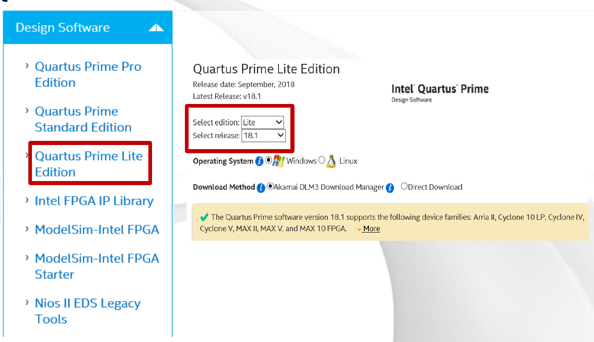

*Figure 1. Selecting Quartus Prime Lite Edition, release 18.1 (slide 7)*

- The **Design Software** list offers Quartus Prime Pro Edition, Quartus Prime Standard Edition, **Quartus Prime Lite Edition**, Intel FPGA IP Library, ModelSim-Intel FPGA, ModelSim-Intel FPGA Starter, and Nios II EDS Legacy Tools. Select **Quartus Prime Lite Edition**.
- Set **Select edition: Lite** and **Select release: 18.1** (released September 2018).
- Choose the **Operating System** (Windows or Linux) and the **Download Method** (Akamai DLM3 Download Manager or Direct Download).
- Version 18.1 of Quartus Prime Lite supports the device families Arria II, Cyclone 10 LP, Cyclone IV, Cyclone V, MAX II, MAX V, and MAX 10.

| Edition | Characteristics |
|:--------|:----------------|
| Pro | For the largest, newest FPGA families; requires a paid license. |
| Standard | Supports a wide range of devices; requires a paid license. |
| **Lite** | Free; supports the low-cost device families listed above, which is sufficient for education. |

### 2.3 Selecting the Files

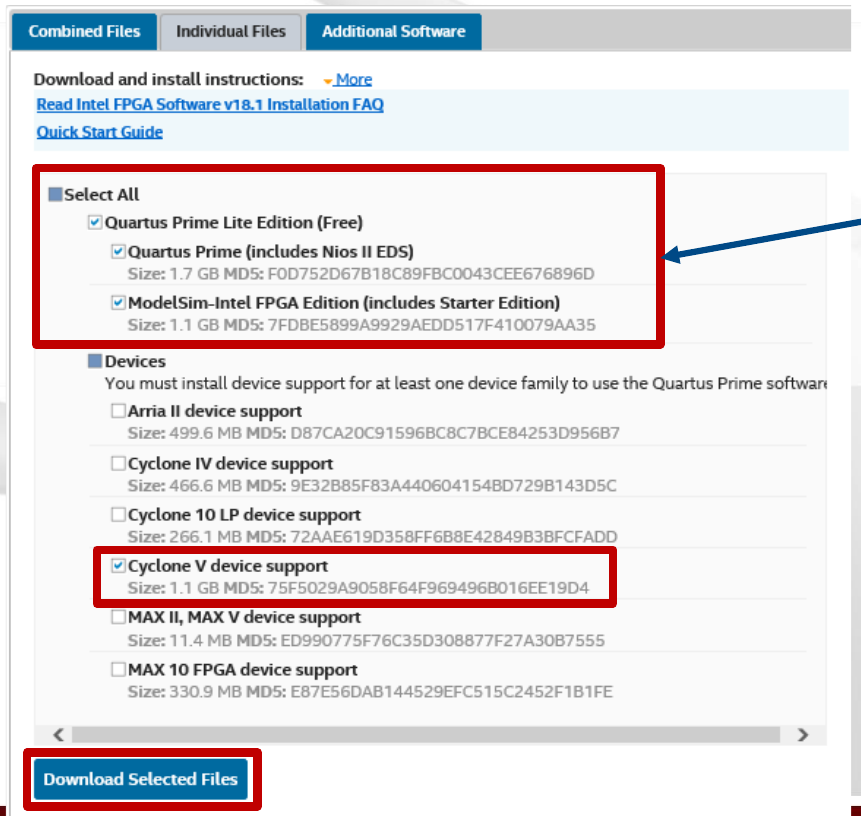

*Figure 2. Selecting the files to download in the Individual Files tab (slide 8)*

In the **Individual Files** tab, check the following and click **Download Selected Files**.

| Item | Size | Description |
|:-----|-----:|:------------|
| Quartus Prime (includes Nios II EDS) | 1.7 GB | The main design software. |
| ModelSim-Intel FPGA Edition (includes Starter Edition) | 1.1 GB | The simulator; **it can be downloaded together with Quartus**. |
| Cyclone V device support | 1.1 GB | Device data for the Cyclone V family. |

- Under **Devices**, at least one device family must be installed to use the Quartus Prime software. The slide selects **Cyclone V**; the other families (Arria II, Cyclone IV, Cyclone 10 LP, MAX II/MAX V, MAX 10) are not needed.
- **Nios II EDS** (Embedded Design Suite) is the software development kit for Nios II, a processor that Intel provides as a design block to be placed inside an FPGA.

### 2.4 The Download Manager

- When the Akamai download method is selected for the first time, a dialog asks to install the **Akamai NetSession Interface**: click the installer download link, run the downloaded installer, and the download resumes in the browser window when the installation is complete.
- The **Akamai DLM3 Download Manager** then downloads the selected files (3 files, 3.95 GB in total in the slide's example) and shows "Download complete! You can begin the installation process."

---

<br>

## 3. Installing ModelSim

The following steps install ModelSim from the installer file **ModelSimSetup-18.1.0.625-windows.exe**.

1. **Run the installer** by double-clicking it. The setup wizard for "ModelSim - Intel FPGA Edition or Starter Edition 10.5b (Quartus Prime 18.1.0.625)" opens; click **Next**.
2. **Select ModelSim - Intel FPGA Starter Edition.** No license is required for the Starter Edition, while the Intel FPGA Edition requires a license.

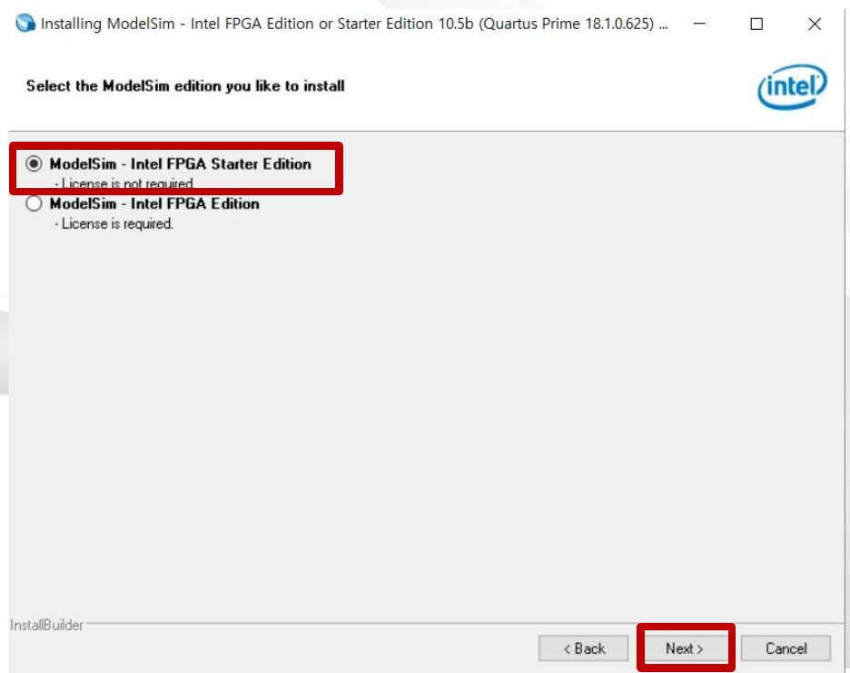

*Figure 3. Selecting the Starter Edition, which requires no license (slide 12)*

3. **Accept the license agreement** ("I accept the agreement") and click **Next**.
4. **Set the installation directory.** If possible, do not change it and keep the default environment (C:\intelFPGA\18.1).

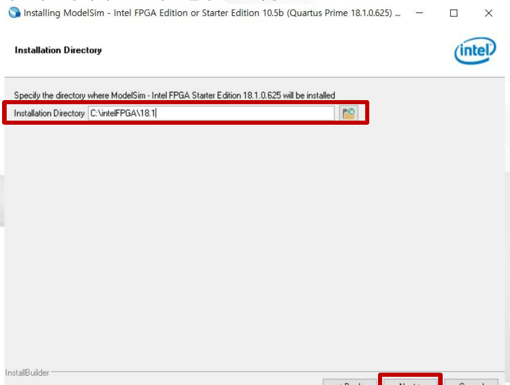

*Figure 4. Keeping the default installation directory (slide 14)*

5. On the **Summary** page, click **Next** to install. A progress bar shows the installation.
6. Click **Finish** to complete the installation.
7. **Check the installation:** in the Windows Start menu, find **Intel FPGA 18.1.0.625 → ModelSim - Intel FPGA Starter Edition** and click it to run.

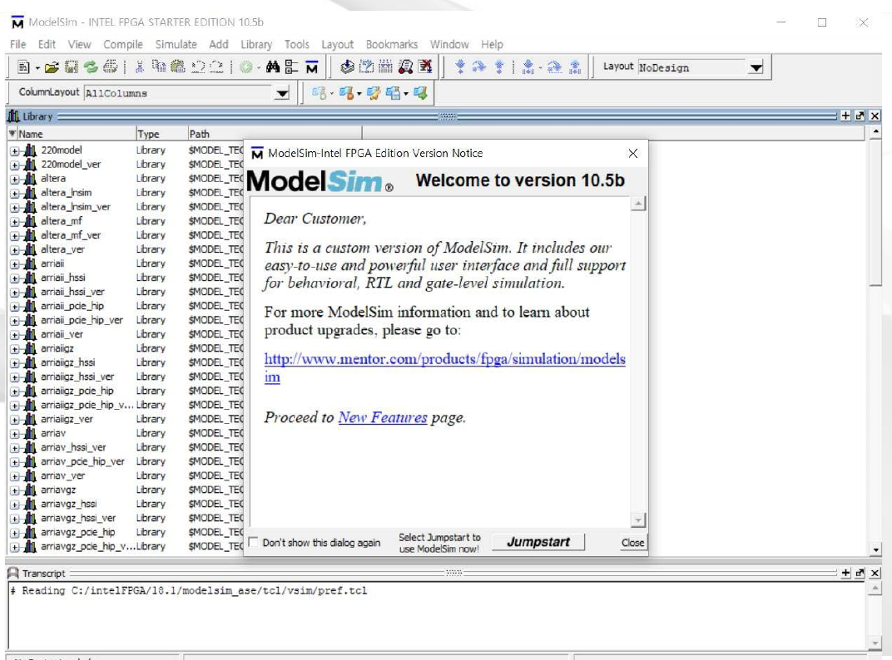

*Figure 5. ModelSim main window at startup (slide 18)*

The main window shows the **Library** pane, which lists the precompiled simulation libraries for Intel FPGA families (220model, altera, arriaii, and so on), and the **Transcript** pane at the bottom, where messages appear and commands can be typed. A welcome dialog ("Welcome to version 10.5b") also appears at the first start.

> **Note:** On Slide 11 (the first page of the installer), the red highlight is drawn around the **Cancel** button, but the step continues with **Next**, as on the following slides.

---

<br>

## 4. Creating a Project

A **project** groups the source files of one design together with its settings.

**Step 1. Start ModelSim and create a project.**

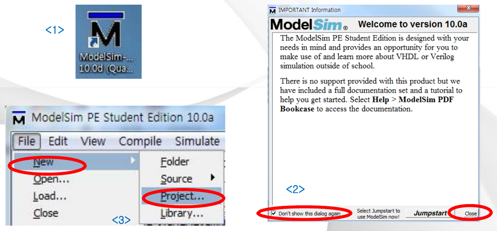

*Figure 6. Starting ModelSim and selecting File, New, Project (slide 19)*

- <1> Run ModelSim from its desktop or Start menu icon.
- <2> In the welcome dialog, check **"Don't show this dialog again"** and click **Close**.
- <3> Select **File → New → Project**.

The screenshots on this slide come from an older ModelSim version (PE Student Edition 10.0a), but the menus are the same in version 10.5b.

**Step 2. Set the project properties.**

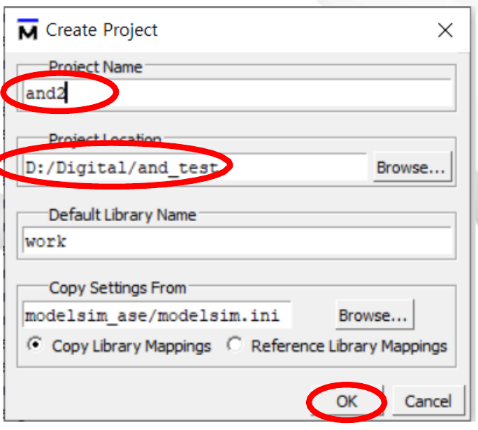

*Figure 7. The Create Project dialog (slide 20)*

- **Project Name:** and2.
- **Project Location:** the directory in which the project is saved (for example, D:/Digital/and_test).
- **Default Library Name:** keep **work**. The work library is the directory in which ModelSim stores the compiled form of every design unit; the simulator loads designs from it.
- **Copy Settings From:** keep the default modelsim.ini with **Copy Library Mappings**.
- Click **OK**.

**Step 3. Add source files to the project.**

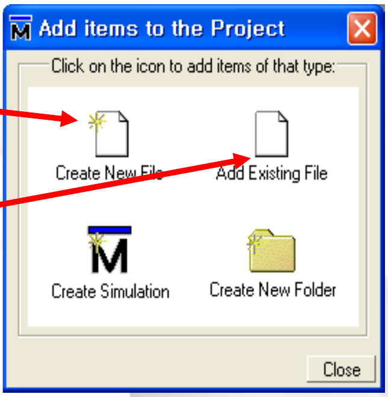

*Figure 8. The Add items to the Project dialog (slide 21)*

| Option | Meaning |
|:-------|:--------|
| **1. Create New File** | Creates a new source file while making the project. The source code must be written from scratch. |
| **2. Add Existing File** | Adds a source file that has already been created. There is no need to write the source code again. |
| Create Simulation | Saves a simulation configuration (which design to simulate and with which options). |
| Create New Folder | Creates a folder to organize the files of the project. |

---

<br>

## 5. Writing the Design File

### 5.1 Creating a New Source File

**Step 1.** Select **Create New File**, enter the **File Name** and2, choose **Verilog** for "Add file as type," keep the folder **Top Level**, and click **OK**. The Verilog file extension **.v** is added automatically.

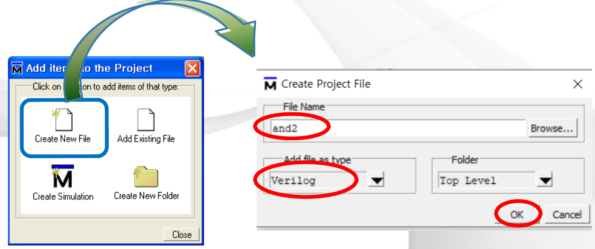

*Figure 9. Creating the Verilog file and2 (slide 22)*

**Step 2.** The file **and2.v** appears in the **Project** pane. Its **Status** is "?", which means that the file has not been compiled yet; the **Type** is Verilog and the compile **Order** is 0.

**Step 3.** Right-click the created source file and select **Edit**, or double-click the file. An editor opens on the right, where the code is written.

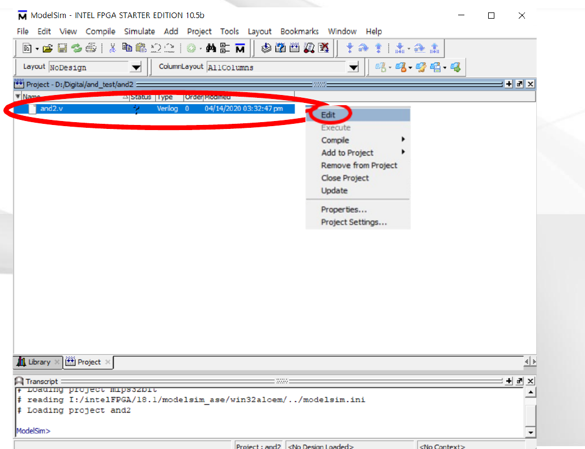

*Figure 10. Opening the source file with Edit (slide 24)*

### 5.2 Source Code of the AND Gate

```verilog
module and2(x, y, s);
input x, y;
output s;

assign s=x&y;

endmodule
```

- `module and2(x, y, s);` declares a module named and2 with three ports.
- `input x, y;` and `output s;` declare the directions of the ports.
- `assign s=x&y;` continuously drives s with x AND y (dataflow modeling).
- `endmodule` ends the module, without a semicolon.

After writing the code, **save** the file with the save button in the toolbar.

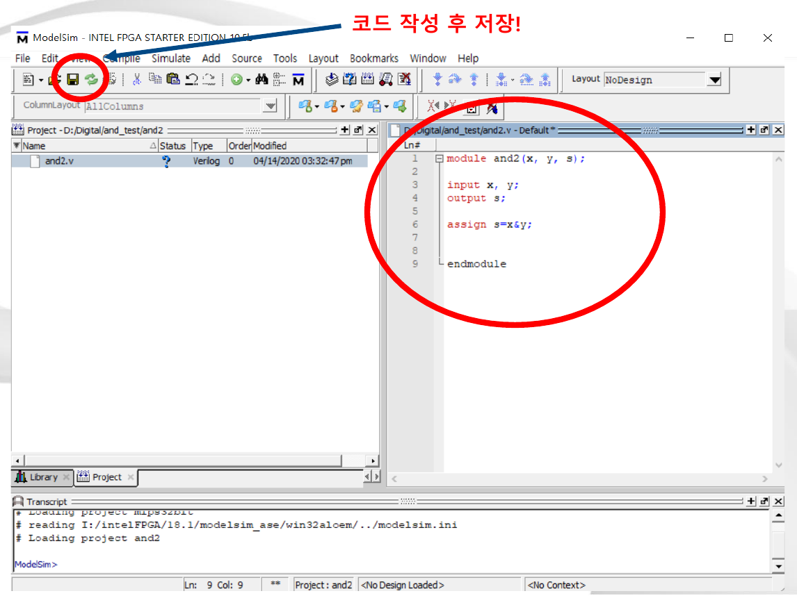

*Figure 11. Saving the file after writing the code (slide 27)*

---

<br>

## 6. Adding the Test Bench File

### 6.1 Creating the Test Bench File

**Step 1.** Right-click in the Project pane and select **Add to Project → New File**.

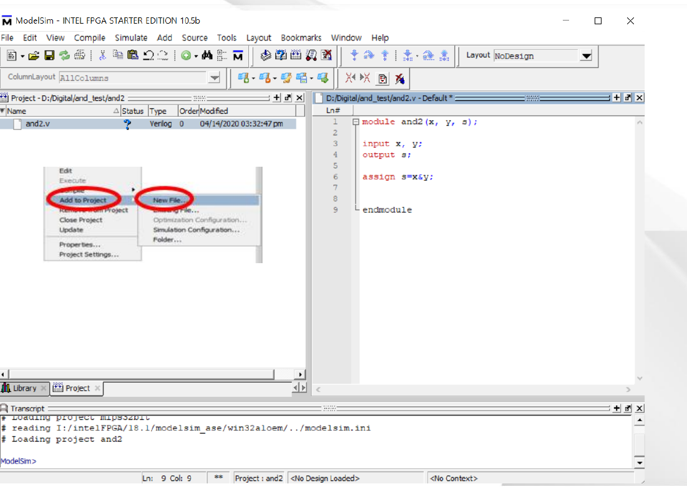

*Figure 12. Selecting Add to Project, New File (slide 28)*

**Step 2.** Create a new source file with the **File Name** tb_and2. The project now contains two files: and2.v (Order 0) and tb_and2.v (Order 1).

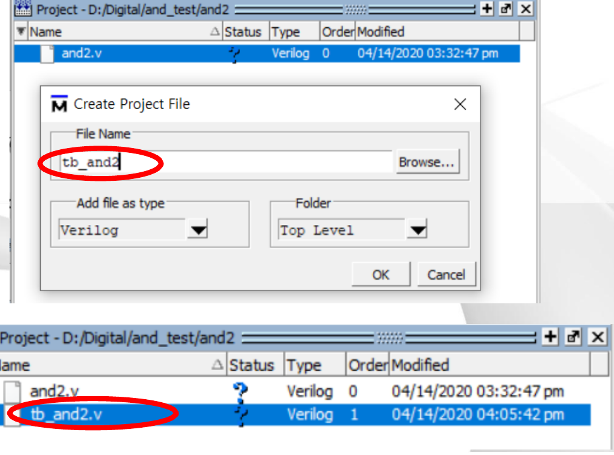

*Figure 13. Creating the test bench file tb_and2 (slide 29)*

### 6.2 Source Code of the Test Bench

```verilog
//test bench : and2
`timescale 1ns/1ns
module tb_and2();
reg x, y;
wire s;

and2 u0(.x(x), .y(y), .s(s));

initial
begin
x=0; y=0;
#250; x=0; y=1;
#250; x=1; y=0;
#250; x=1; y=1;
end

endmodule
```

**Line-by-line explanation:**

| Code | Meaning |
|:-----|:--------|
| `` `timescale 1ns/1ns `` | The time unit is 1 ns and the precision is 1 ns, so `#250` means 250 ns. |
| `module tb_and2();` | The test bench is a module with **no ports**. |
| `reg x, y;` | The inputs of the design are driven by the test bench, so they are `reg` (assigned in an `initial` block). |
| `wire s;` | The output of the design is only observed, so it is a `wire`. |
| `and2 u0(.x(x), .y(y), .s(s));` | Instantiates the design under test, named u0, with **named port mapping**. |
| `initial begin ... end` | Applies the four input combinations, one every 250 ns. |

The resulting input sequence is:

| Time (ns) | x | y | Expected s = x AND y |
|:---------:|:-:|:-:|:--------------------:|
| 0 to 250 | 0 | 0 | 0 |
| 250 to 500 | 0 | 1 | 0 |
| 500 to 750 | 1 | 0 | 0 |
| 750 onward | 1 | 1 | 1 |

Write the code and **save** the file, as for the design file.

> **[Software Engineering]** A test bench plays the same role as a **unit test** in software engineering: it isolates one module (the design under test), supplies inputs, and checks the outputs against the expected values. Keeping the design and its test bench in separate files makes it possible to rerun the same test after every change, which is the hardware equivalent of regression testing.

---

<br>

## 7. Compiling

Compiling checks the syntax of the Verilog files and stores their compiled form in the work library. Both the design file and the test bench must be compiled before simulation.

### 7.1 Method 1: The Compile Menu

1. Select the file to compile and right-click it.
2. Select **Compile → Compile Selected**.
3. Check that the status of the file changes from **"?"** to a green **check mark**.

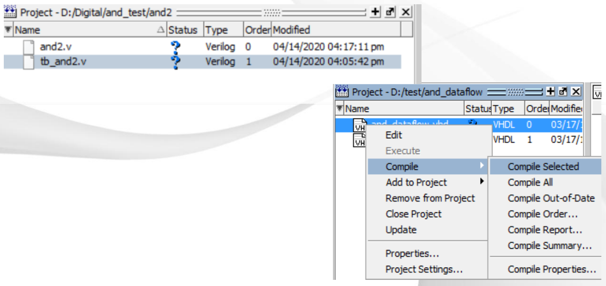

*Figure 14. Compiling with Compile, Compile Selected (slide 32)*

The Compile submenu also offers **Compile All** (all files in the project), **Compile Out-of-Date** (only files changed since the last compilation), and **Compile Order** (the order in which files are compiled).

### 7.2 Method 2: The Compile Button

Select the file to compile and click the **Compile** shortcut button in the toolbar.

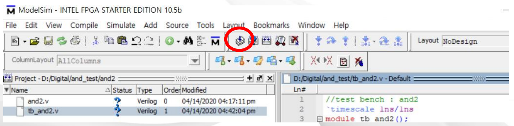

*Figure 15. The Compile shortcut button in the toolbar (slide 33)*

### 7.3 Checking the Compile Result

The result is printed in the **Transcript** pane.

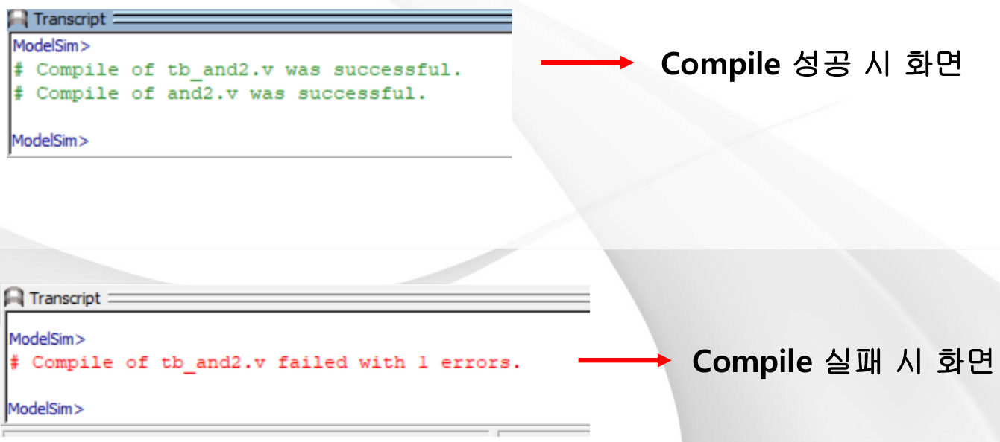

*Figure 16. Transcript messages for a successful and a failed compilation (slide 34)*

- **Successful compilation:** green messages such as `# Compile of tb_and2.v was successful.` and `# Compile of and2.v was successful.`
- **Failed compilation:** a red message such as `# Compile of tb_and2.v failed with 1 errors.`

---

<br>

## 8. Locating and Fixing Errors

**Step 1. Turn on the compiler output.** Right-click in the Project pane, select **Project Settings**, check **Display compiler output**, and click **OK**. (It is recommended to uncheck it again later, once the error messages are no longer needed.) In the Project pane, a file that failed to compile is marked with a red **X**, while a successful file has a green check mark.

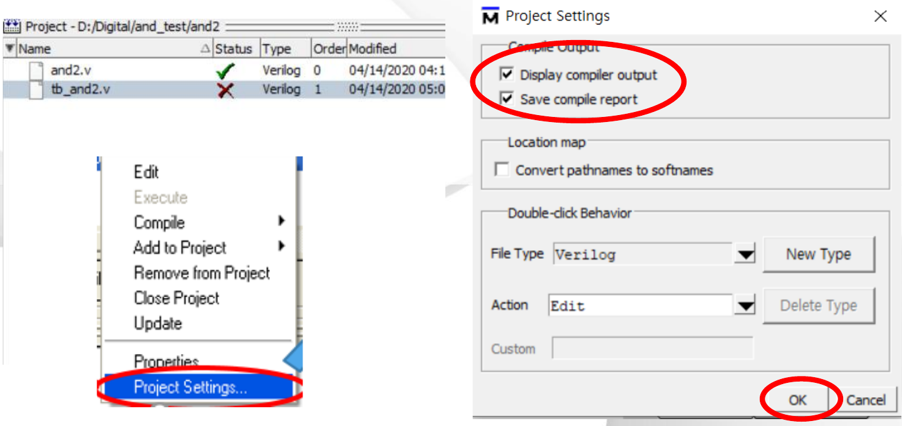

*Figure 17. Enabling Display compiler output in Project Settings (slide 35)*

**Step 2. Read the error message.** When a compile error occurs, double-click the red error message in the Transcript. A window titled "Unsuccessful Compile" shows the details.

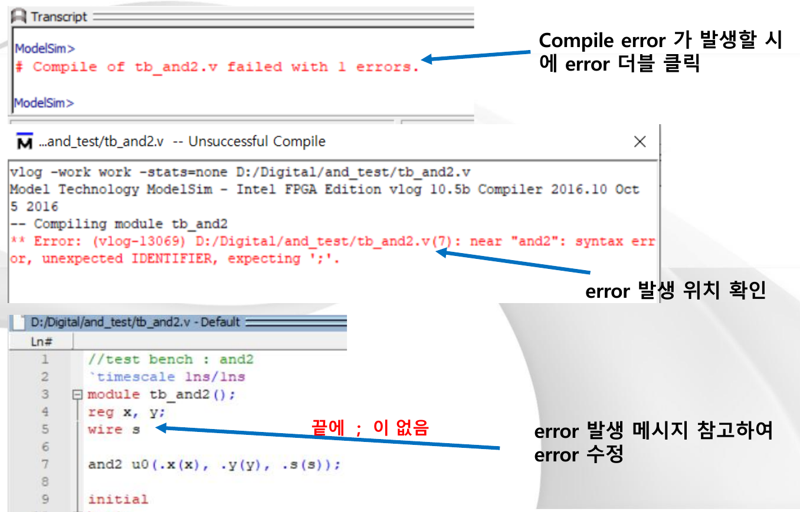

*Figure 18. Locating the error from the compiler message and correcting the code (slide 36)*

```plaintext
vlog -work work -stats=none D:/Digital/and_test/tb_and2.v
Model Technology ModelSim - Intel FPGA Edition vlog 10.5b Compiler 2016.10 Oct 5 2016
-- Compiling module tb_and2
** Error: (vlog-13069) D:/Digital/and_test/tb_and2.v(7): near "and2": syntax error, unexpected IDENTIFIER, expecting ';'.
```

- `vlog` is ModelSim's Verilog compiler, and `-work work` means that the result is stored in the work library.
- The error is reported at **line 7**, near the word "and2": the compiler found an identifier where it expected a semicolon.
- **Step 3. Correct the error with the help of the message.** The actual mistake is on **line 5**: `wire s` has **no semicolon at the end**. Add the semicolon, save, and compile again.

> **Exam Tip:** A missing semicolon is reported at the **next** token, because the compiler only notices that the statement did not end when it reads the following word. When the reported line looks correct, always check the line **before** it.

---

<br>

## 9. Running a Simulation

### 9.1 Starting the Simulation

**Step 1.** Select **tb_and2**, then choose **Simulate → Start Simulation**, or click the Start Simulation button in the toolbar.

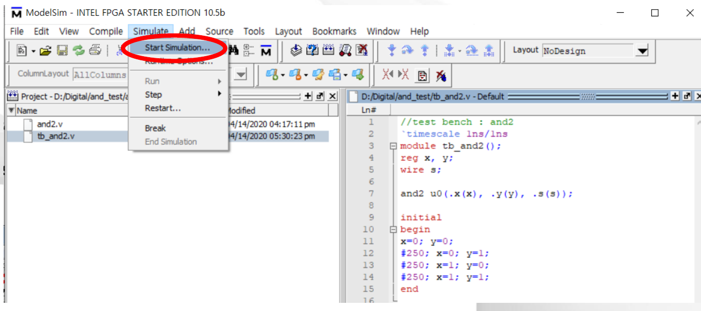

*Figure 19. Selecting Simulate, Start Simulation (slide 37)*

**Step 2.** In the **Design** tab of the Start Simulation dialog, expand the **work** library, select **tb_and2**, change the **Resolution** to **ns**, and click **OK**. The Design Unit(s) field then shows work.tb_and2.

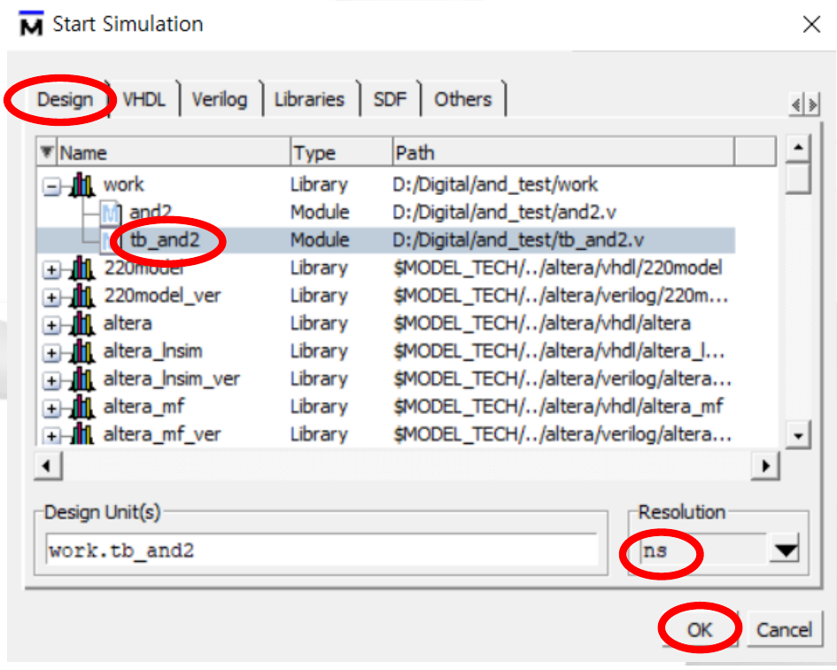

*Figure 20. Selecting tb_and2 in the Design tab and setting the resolution to ns (slide 38)*

> **Key Point:** The module to simulate is the **test bench** (tb_and2), not the design (and2). The test bench is the top of the simulation hierarchy: it contains the design as the instance u0 and supplies its inputs. Simulating and2 alone would leave its inputs undriven.

**Step 3.** ModelSim switches to the simulation layout.

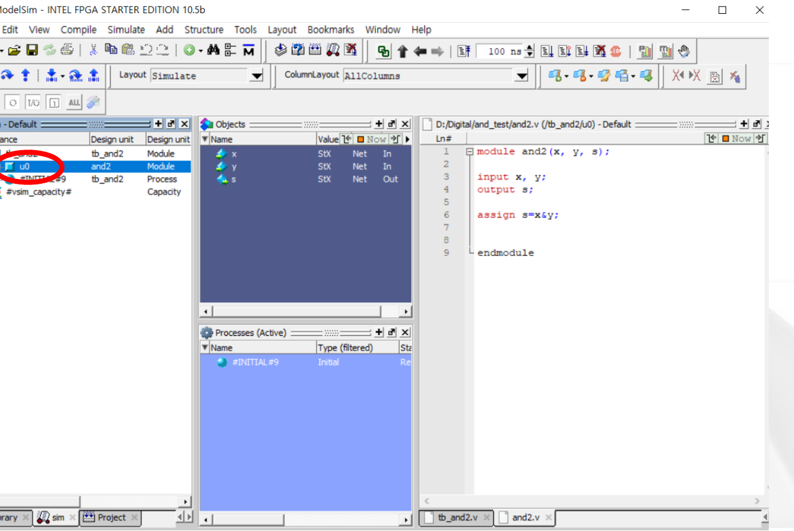

*Figure 21. The simulation layout after loading tb_and2 (slide 39)*

- The **sim** pane shows the instance hierarchy: tb_and2 contains the instance **u0** (design unit and2) and the process #INITIAL#9 (the `initial` block that starts on line 9 of the test bench).
- The **Objects** pane shows the signals of the selected instance: x and y (Net, In) and s (Net, Out). Their values are **StX** (strong unknown), because the simulation has not run yet.
- The source window shows and2.v.

### 9.2 Adding Signals to the Wave Window

**Step 4.** Right-click the instance **u0** and click **Add Wave** (shortcut Ctrl+W).

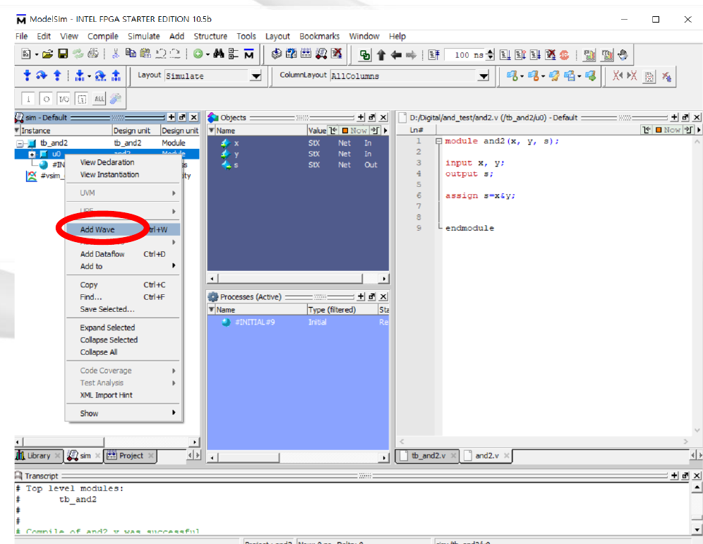

*Figure 22. Adding the signals of u0 to the wave window (slide 40)*

**Step 5.** A **Wave** window is created, listing /tb_and2/u0/x, /tb_and2/u0/y, and /tb_and2/u0/s. No waveform is drawn yet, because the simulation time is still 0 ns.

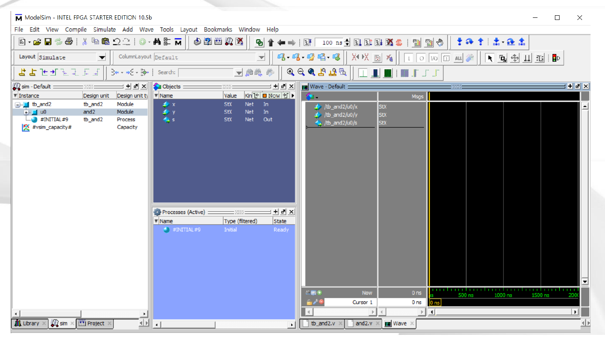

*Figure 23. The wave window before running the simulation (slide 41)*

### 9.3 Running and Reading the Waveform

**Step 6. Run.**

- Click the **run** button in the toolbar. Each click advances the simulation by the **run length** shown in the box next to it (100 ns by default), and this time can be changed.
- Alternatively, type the command directly in the Transcript (script) window, for example `run 1000ns`.

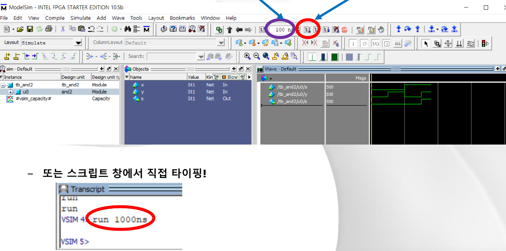

*Figure 24. Running the simulation from the toolbar or with the run command (slide 42)*

Since the last input change of the test bench happens at 750 ns, the simulation must run for more than 750 ns to show all four cases; `run 1000ns` covers them in one step.

**Step 7. Check the result.** The result of the AND gate can be confirmed in the wave window.

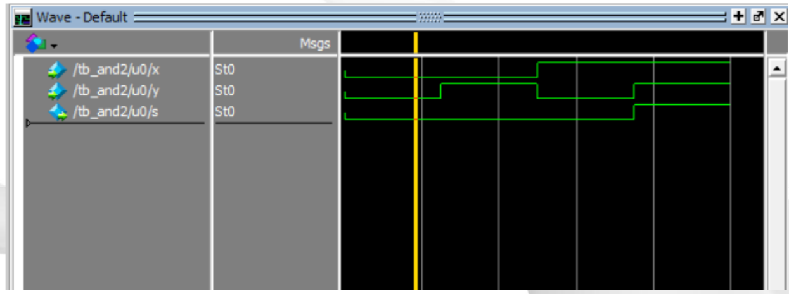

*Figure 25. Simulation result of the AND gate (slide 43)*

| Time (ns) | x | y | s |
|:---------:|:-:|:-:|:-:|
| 0 to 250 | 0 | 0 | 0 |
| 250 to 500 | 0 | 1 | 0 |
| 500 to 750 | 1 | 0 | 0 |
| 750 to 1000 | 1 | 1 | 1 |

- y rises at 250 ns, x rises at 500 ns, y falls at 500 ns and rises again at 750 ns.
- The output **s is high only from 750 ns**, the only interval in which both x and y are 1. The waveform matches the AND truth table, so the design is verified.
- The value **St0** or **St1** in the Msgs column means a strong 0 or a strong 1, that is, a signal actively driven to that value.

### 9.4 The Same Flow as Commands

Every step performed with the menus above can also be typed in the Transcript window. Using commands is faster when the same simulation must be repeated after each change.

```plaintext
vlib work
vlog and2.v tb_and2.v
vsim -t ns work.tb_and2
add wave /tb_and2/u0/*
run 1000ns
```

| Command | Effect |
|:--------|:-------|
| `vlib work` | Creates the work library (a project does this automatically). |
| `vlog and2.v tb_and2.v` | Compiles both Verilog files into the work library. |
| `vsim -t ns work.tb_and2` | Loads the test bench for simulation with a time resolution of ns. |
| `add wave /tb_and2/u0/*` | Adds all signals of the instance u0 to the wave window. |
| `run 1000ns` | Simulates for 1000 ns. |

---

<br>

## Summary

| Concept | Key Summary |
|:--------|:------------|
| Tools | Quartus Prime Lite 18.1 (synthesis, place and route, FPGA programming) and ModelSim-Intel FPGA Starter Edition 10.5b (simulation); Windows and Linux only. |
| Download | intel.com → Support → Downloads & Drivers → FPGA Downloads; Lite edition, release 18.1; Quartus Prime + ModelSim + Cyclone V device support. |
| Installation | Starter Edition (no license), default directory C:\intelFPGA\18.1. |
| Project | File → New → Project; name, location, work library; add files with Create New File or Add Existing File. |
| Design file | and2.v: `assign s = x & y;` |
| Test bench | tb_and2.v: portless module, `reg` inputs, `wire` output, instance u0, `initial` block with `#250` steps. |
| Compile | Compile Selected or the toolbar button; "?" becomes a check mark; errors appear in red in the Transcript. |
| Errors | Enable Display compiler output, double-click the error, read the line number, and also check the previous line. |
| Simulation | Simulate the test bench, Add Wave, run (for example `run 1000ns`), and compare the waveform with the truth table. |

---

<br>

## Self-Check Questions

1. **Tool Roles:** What are the roles of ModelSim and Quartus Prime in the design flow?

   > **Answer:** ModelSim is a simulator: it compiles the Verilog code and simulates it with a test bench, which is functional verification. Quartus Prime is the FPGA design software: it synthesizes the design into gates, places and routes it on a specific FPGA, and programs the board.

2. **Device Support:** Why must a device family such as Cyclone V be downloaded together with Quartus Prime?

   > **Answer:** Quartus Prime needs the device data of at least one FPGA family to synthesize and place a design for that chip. The Lite edition can be used only after support for at least one family has been installed.

3. **Test Bench Types:** In tb_and2, why are x and y declared as `reg` while s is declared as `wire`?

   > **Answer:** x and y are assigned by the test bench inside an `initial` block, so they must be `reg`. s is driven by the output of the instance u0, and a signal driven by an instance output must be a `wire`.

4. **Compile Error:** The compiler reports a syntax error at line 7 near "and2", but line 7 looks correct. Where is the mistake likely to be?

   > **Answer:** The mistake is probably on the line before, here line 5 (`wire s` without a semicolon). The compiler only detects the missing semicolon when it reads the next token, "and2", on line 7.

5. **Simulation Target:** Which module must be selected in Start Simulation, and why?

   > **Answer:** The test bench tb_and2 must be selected, because it is the top of the simulation: it instantiates the design and drives its inputs. Simulating and2 alone would leave its inputs undriven (unknown).

6. **Waveform:** In the result waveform, when is s equal to 1, and what does this confirm?

   > **Answer:** s is 1 only from 750 ns to 1000 ns, when x = 1 and y = 1. In the other three intervals s is 0, so the waveform matches the AND truth table and confirms that the design is correct.

---
